# 图片索引

本文档包含本书所有原文图片，按章节分类。

## 图片列表

### 封面与前言

- 
- 
- 
- 

### 第1章 - 背景

- 
- 
- 
- 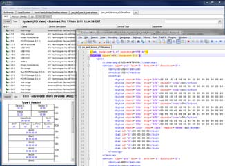
- 

### 第2章 - PCIe架构概述

- 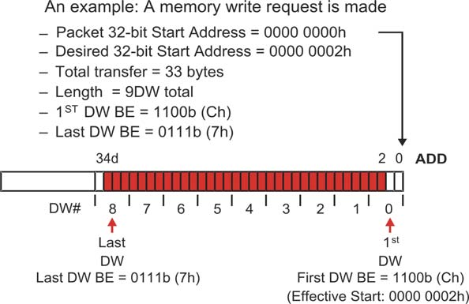
- 
- 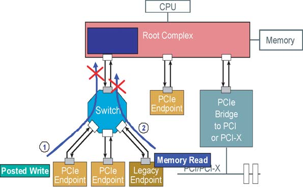
- 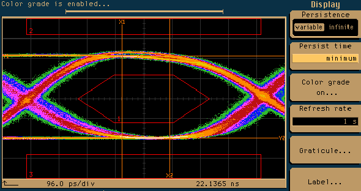
- 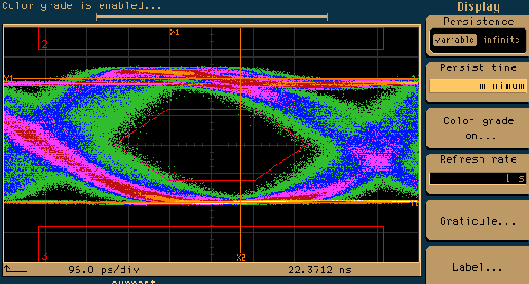
- 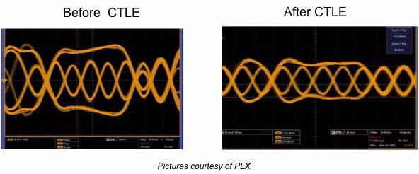
- 
- 
- 
- 
- 
- 
- 
- 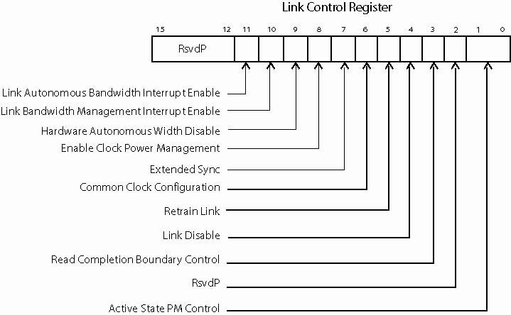
- 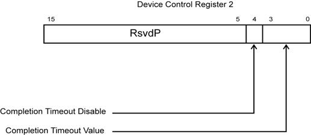
- 
- 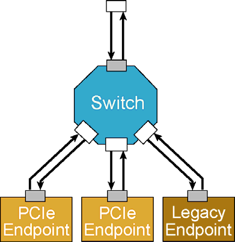
- 

### 第3章 - 配置概述

- 
- 
- 
- 
- 

### 第4章 - 地址空间与事务路由

- 
- 
- 
- 
- 

### 第5章 - TLP元素

- 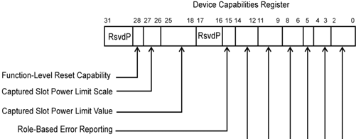
- 
- 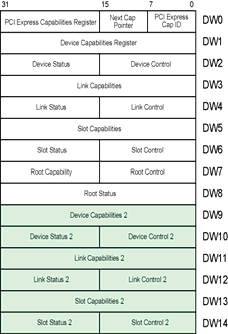
- 
- 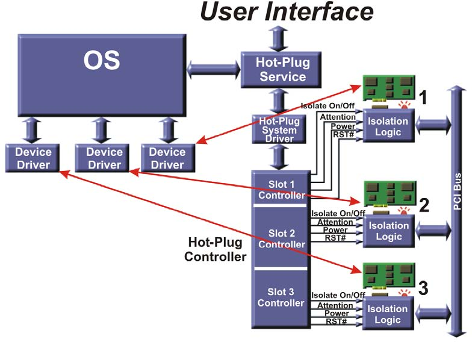
- 
- 

### 第6章 - 流量控制

- 
- 
- 
- 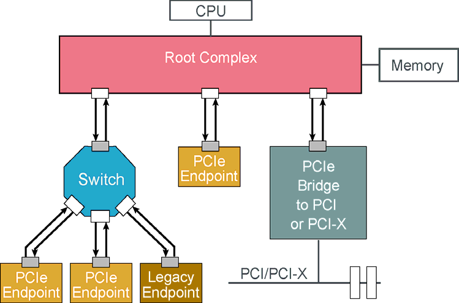

### 第7章 - 服务质量

- 
- 
- 

### 第8章 - 事务排序

- 
- 

### 第9章 - DLLP元素

- 
- 
- 

### 第10章 - Ack/Nak协议

- 
- 
- 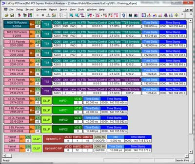

### 第11章 - 物理层逻辑 Gen1/Gen2

- 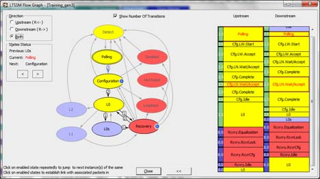
- 
- 
- 
- 

### 第12章 - 物理层逻辑 Gen3

- 
- 
- 
- 
- 

### 第13章 - 物理层电气特性

- 
- 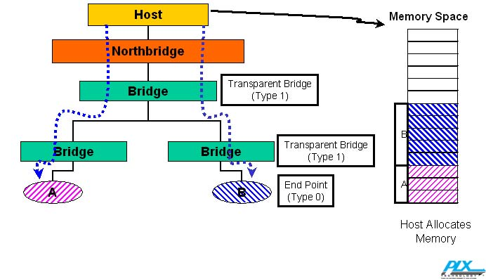
- 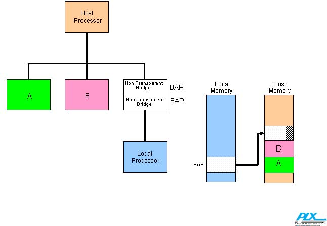
- 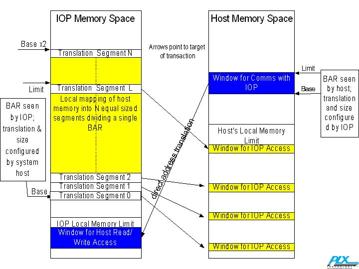

### 第14章 - 链路初始化与训练

- 
- 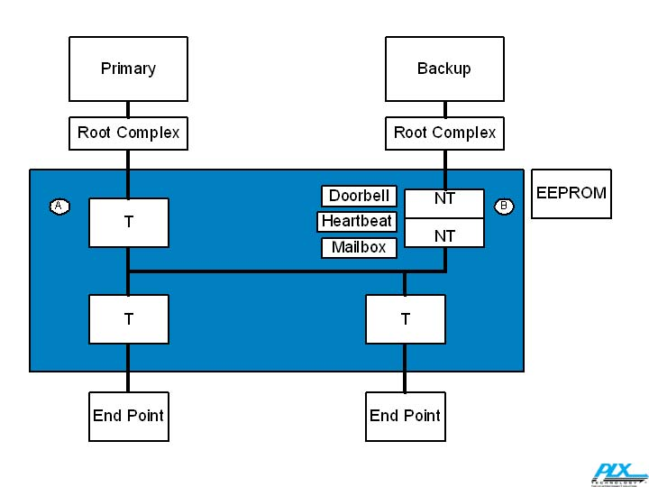
- 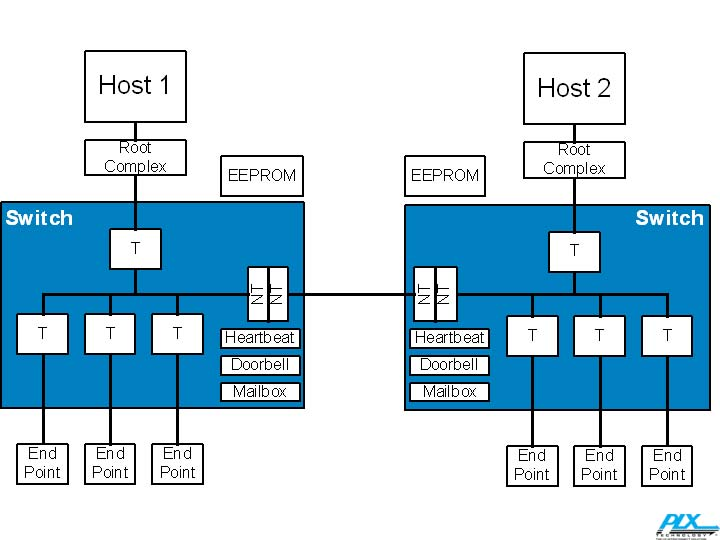
- 
- 

### 第15章 - 错误检测与处理

- 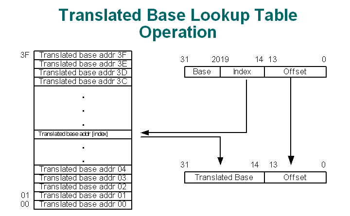
- 
- 

### 第16章 - 电源管理

- 
- 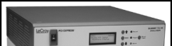
- 

### 第17章 - 中断支持

- 
- 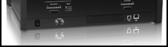
- 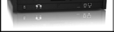

### 第18章 - 系统复位

- 
- 
- 

### 第19章 - 热插拔与电源预算

- 
- 
- 

### 附录

- 
- 
- 
- 
- 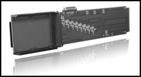
- 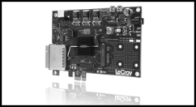
- 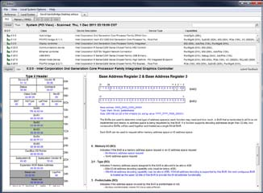
- 
- 
- 
