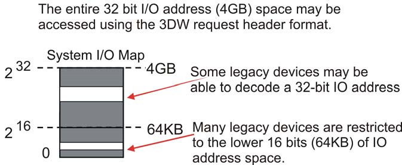
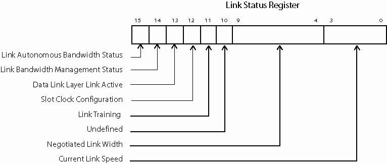
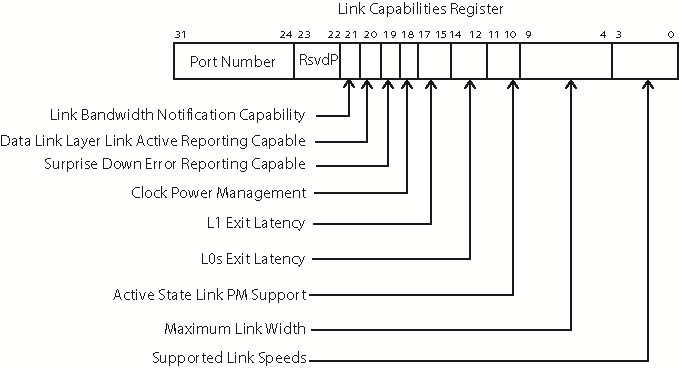
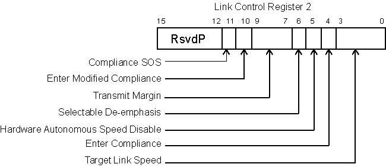
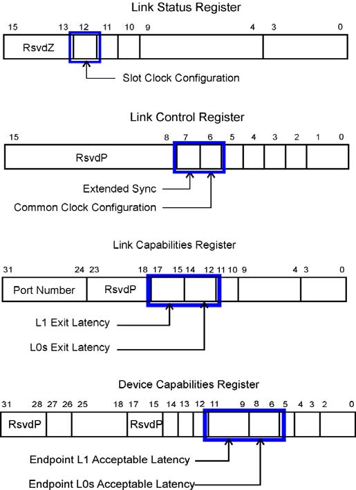

# 第2章：PCIe 架构概述

## PCI Express 简介

PCI Express（PCIe）代表了与其前代并行总线模型的重大转变。作为串行总线，它与早期的串行设计（如 InfiniBand 或 Fibre Channel）有更多共同点，但在软件上仍保持与 PCI 的完全向后兼容。

与许多高速串行传输一样，PCIe 使用双向连接，能够同时发送和接收信息。所使用的模型称为**双工（Dual-Simplex）连接**，因为每个接口都有一个单工发送路径和一个单工接收路径。由于允许双向同时传输，两个设备之间的通信路径在技术上属于全双工，但规范使用"双工"这个术语，因为它更准确地描述了实际存在的通信通道。

两个设备之间路径的术语称为**链路（Link）**，由一个或多个发送和接收对组成。这样的一对称为**通道（Lane）**，规范允许链路由 1、2、4、8、12、16 或 32 个通道组成。通道数量称为**链路宽度（Link Width）**，表示为 x1、x2、x4、x8、x16 和 x32。关于在给定设计中使用多少通道的权衡是直接的：更多通道会增加链路带宽，但也会增加成本、空间需求和功耗。

## 软件向后兼容性

PCIe 最重要的设计目标之一是与 PCI 软件向后兼容。鼓励从已安装在现有系统中的设计迁移需要两件事：首先，需要有令人信服的改进来激励考虑改变；其次，需要最小化改变的成本、风险和工作量。在计算机中帮助第二个因素的常见方法是在新模型中保持为旧模型编写的软件的可行性。为了在 PCIe 中实现这一点，PCI 使用的所有地址空间都被保留下来，要么保持不变，要么简单地扩展。内存、IO 和配置空间对软件仍然可见，并且编程方式与以前完全相同。因此，多年前为 PCI 编写的软件（BIOS 代码、设备驱动程序等）今天仍然可以与 PCIe 设备一起工作。配置空间已大幅扩展以包含许多支持新功能的新寄存器，但旧寄存器仍然存在，并且仍然可以以常规方式访问。

## 串行传输

### 速度需求

当然，串行模型必须比并行设计运行得快得多才能实现相同的带宽，因为它一次只能发送一位。然而，这已被证明并不困难，在过去 PCIe 已在 2.5 GT/s 和 5.0 GT/s 下可靠工作。之所以能够实现这些以及更高的速度（8 GT/s），是因为串行模型克服了并行模型的缺点。

### 克服问题

回顾一下，有几个问题限制了并行总线的性能：

1. **飞行时间（Flight Time）**：信号从发送器到接收器所需的时间。飞行时间必须小于时钟周期，否则模型将无法工作。
2. **时钟偏移（Clock Skew）**：时钟在发送器和接收器到达时间的差异。
3. **信号偏移（Signal Skew）**：给定时钟所需的所有信号到达时间的差异。

PCIe 等串行传输如何解决这些问题？

- 首先，飞行时间成为非问题，因为将数据锁存到接收器的时钟实际上内置于数据流中，不需要外部参考时钟。因此，时钟周期多小或信号到达接收器需要多长时间都无关紧要，因为时钟与数据同时到达。
- 出于同样的原因，没有时钟偏移，因为锁存时钟是从数据流中恢复的。
- 最后，由于每个通道只发送一个数据位，通道内的信号偏移被消除。如果使用多通道设计，信号偏移问题会重新出现，但接收器会自动纠正这一点，可以修复大量的偏移。

### 带宽

PCIe 支持的高速和宽链路的组合可以产生一些令人印象深刻的带宽数字：

**表 2-1：PCIe 各代各种链路宽度的聚合带宽**

| 链路宽度 | x1 | x2 | x4 | x8 | x12¹ | x16 | x32 |
|---------|----|----|----|----|------|-----|-----|
| Gen1 带宽 (GB/s) | 0.5 | 1 | 2 | 4 | 6 | 8 | 16 |
| Gen2 带宽 (GB/s) | 1 | 2 | 4 | 8 | 12 | 16 | 32 |
| Gen3 带宽 (GB/s) | 2 | 4 | 8 | 16 | 24 | 32 | 64 |

> ¹ **注意**: x12 链路宽度在 PCIe 3.0 及以后版本中已被弃用，主要用于早期与 InfiniBand 兼容的实现。

### PCIe 带宽计算

计算上表中包含的带宽数字：

- **Gen1 PCIe 带宽** = (2.5 Gb/s × 2 个方向) / 每符号 10 位 = 0.5 GB/s
- **Gen2 PCIe 带宽** = (5.0 Gb/s × 2 个方向) / 每符号 10 位 = 1.0 GB/s
- **Gen3 PCIe 带宽** = (8.0 Gb/s × 2 个方向) / 每字节 8 位 = 2.0 GB/s

注意，在 Gen1 和 Gen2 的计算中，我们除以每符号 10 位而不是每字节 8 位，因为 Gen1 和 Gen2 协议要求在数据包传输之前使用 8b/10b 编码方案对数据包字节进行编码。在 Gen3 速度下，数据包不是 8b/10b 编码的，而是使用 128b/130b 编码。

### 差分信号

每个通道使用**差分信号（Differential Signaling）**，发送同一信号的正负版本（D+ 和 D-）。这会使引脚数量翻倍，但与单端信号相比有两个明显的优势，这对高速信号很重要：

1. **改进的抗噪声能力**：差分接收器获取两个信号，从正电压中减去负电压以找到它们之间的差异并确定位值。由于配对信号位于每个设备的相邻引脚上，并且它们的走线也必须彼此非常靠近布线以保持适当的传输线阻抗，因此影响一个信号的任何因素也会以大约相同的量和方向影响另一个信号。接收器查看它们之间的差异，噪声并没有真正改变这种差异，因此结果是影响信号的大多数噪声不会影响接收器准确区分位的能力。

2. **降低信号电压**

### 无公共时钟

如前所述，PCIe 链路不需要公共时钟，因为它使用**源同步（Source-Synchronous）模型**，这意味着发送器向接收器提供用于锁存传入数据的时钟。PCIe 链路不包含转发时钟。相反，发送器使用 8b/10b 编码将时钟嵌入数据流中。然后接收器从数据流中恢复时钟并使用它来锁存传入数据。

在接收器中，**PLL 电路（锁相环，Phase-Locked Loop）**将传入的位流作为参考时钟，并将其时序或相位与它用指定频率创建的输出时钟的时序进行比较。根据该比较的结果，输出时钟的频率会增加或减少，直到获得匹配。此时 PLL 被称为已锁定，输出（恢复）时钟频率与用于传输数据的时钟完全匹配。PLL 持续调整恢复时钟，因此影响发送器时钟频率的温度或电压变化将始终得到快速补偿。

关于时钟恢复需要注意的一件事是，PLL 确实需要输入上的转换才能进行相位比较。如果长时间没有数据转换，PLL 可能开始偏离正确频率。为了防止这个问题，8b/10b 编码的设计目标之一是确保位流中不超过 5 个连续的 1 或 0。

### 基于数据包的协议

从并行传输转向串行传输大大减少了传输数据所需的引脚数量。PCIe 与大多数其他基于串行的协议一样，通过消除并行总线中通常存在的大多数边带控制信号来进一步减少引脚数量。但是，如果没有指示正在接收的信息类型的控制信号，接收器如何解释传入的位？PCIe 中的所有事务都以称为**数据包（Packet）**的已定义结构发送。接收器找到数据包边界，并且知道预期的模式，解码数据包结构以确定它应该做什么。

## 链路与通道

如前所述，两个 PCIe 设备之间的物理连接称为**链路（Link）**，由一个或多个**通道（Lane）**组成。每个通道由一个差分发送和接收信号对组成。一个通道足以满足设备之间的所有通信，不需要其他信号。

### 可扩展性能

然而，使用更多通道将提高链路的性能，这取决于其速度和链路宽度。例如，使用多个通道会增加每个时钟可以发送的位数，从而提高带宽。如表 2-1 所示，规范支持的通道数量包括最多 32 通道的 2 的幂。还支持 x12 链路，这可能是为了支持 InfiniBand（一种早期串行设计）使用的 x12 链路宽度。允许每个链路有各种链路宽度，使平台设计人员能够在成本和性能之间做出适当的权衡，根据通道数量轻松扩展或缩小。

### 灵活的拓扑选项

由于使用的速度非常高，链路必须是**点对点（Point-to-Point）**连接，而不是像 PCI 那样的共享总线。由于链路因此只能连接两个接口，因此需要一种扩展连接的方法来构建非平凡系统。这在 PCIe 中通过使用**交换机（Switches）**和**桥接器（Bridges）**来实现，允许在构建系统拓扑时具有灵活性——系统中元素之间的连接集。

## 一些定义

### 根复合体（Root Complex）

CPU 与 PCIe 总线之间的接口可能包含多个组件（处理器接口、DRAM 接口等），甚至可能包含多个芯片。这个组统称为**根复合体（Root Complex，RC 或 Root）**。RC 位于 PCI 倒树拓扑的"根"，代表 CPU 与系统的其余部分通信。规范没有完全定义它，而是给出了必需和可选功能的列表。广义上讲，根复合体可以理解为系统 CPU 与 PCIe 拓扑之间的接口，PCIe 端口在配置空间中标记为"根端口（Root Ports）"。

### 交换机和桥接器

**交换机（Switches）**提供扩展或聚合功能，允许更多设备连接到单个 PCIe 端口。它们充当数据包路由器，根据地址或其他路由信息识别给定数据包需要采取的路径。

**桥接器（Bridges）**提供与其他总线（如 PCI 或 PCI-X，甚至另一个 PCIe 总线）的接口。有时称为"前向桥接器"，允许将旧的 PCI 或 PCI-X 卡插入新系统。相反的类型或"反向桥接器"允许将新的 PCIe 卡插入旧的 PCI 系统。

### 原生 PCIe 端点和传统 PCIe 端点

**端点（Endpoints）**是 PCIe 拓扑中不是交换机或桥接器的设备，充当总线上事务的发起者和完成者。它们位于树拓扑分支的底部，只实现单个**上游端口（Upstream Port）**（面向根）。相比之下，交换机可能有多个**下游端口（Downstream Ports）**，但只能有一个上游端口。

为旧总线（如 PCI-X）操作设计但现在具有 PCIe 接口的设备在配置寄存器中将自己标识为"**传统 PCIe 端点（Legacy PCIe Endpoints）**"。它们使用新 PCIe 设计中禁止的东西，如 IO 空间和对 IO 事务或锁定请求的支持。相比之下，"**原生 PCIe 端点（Native PCIe Endpoints）**"将是从头开始设计的 PCIe 设备，而不是将 PCIe 接口添加到旧 PCI 设备设计中。原生 PCIe 端点设备是内存映射设备（MMIO 设备）。

### 软件兼容性特征

保持与旧软件兼容性的一种方法是端点和桥接器的配置头与 PCI 保持不变。一个区别是桥接器现在通常聚合到交换机和根中，但旧软件不知道这种区别，仍然只会简单地将它们视为桥接器。

### 系统示例

**低成本 PCIe 系统**：面向消费者台式机等低成本应用的 PCIe 系统示例实现了几个 PCIe 端口以及几个附加卡插槽，但基本架构与旧式 PCI 系统没有太大区别。

**服务器 PCIe 系统**：高端服务器系统显示了系统中内置的其他网络接口。在 PCIe 的早期，有人考虑过使其能够作为可以替代那些旧模型的网络运行。毕竟，如果 PCIe 基本上是其他网络协议的简化版本，它不能满足所有需求吗？由于各种原因，这个概念从未真正获得太多动力，基于 PCIe 的系统仍然通常使用其他传输连接到外部网络。

## 设备层简介

PCIe 定义了分层架构。这些层可以被认为是逻辑上分为独立操作的两部分，因为它们每个都有用于出站流量的发送侧和用于入站流量的接收侧。分层方法对硬件设计人员有一些优势，因为如果逻辑仔细分区，通过更改现有设计的一层而保持其他层不受影响，可以更容易地迁移到新版本的规范。

设备层包括：

### 设备核心/软件层

核心实现设备的主要功能。如果设备是端点，它可能包含多达 8 个功能，每个功能实现其自己的配置空间。如果设备是交换机，交换机核心由数据包路由逻辑和用于实现此目标的内部总线组成。如果设备是根，根核心实现虚拟 PCI 总线 0，其上驻留所有芯片组嵌入式端点和虚拟桥接器。

### 事务层（Transaction Layer）

该层负责在发送侧创建**事务层数据包（TLP，Transaction Layer Packet）**并在接收侧解码 TLP。该层还负责**服务质量（QoS）**功能、**流量控制（Flow Control）**功能和**事务排序（Transaction Ordering）**功能。

### 数据链路层（Data Link Layer）

该层负责在发送侧创建**数据链路层数据包（DLLP，Data Link Layer Packet）**并在接收侧解码。该层还负责链路错误检测和纠正。此数据链路层功能称为 **Ack/Nak 协议**。

### 物理层（Physical Layer）

该层负责在发送侧创建**有序集（Ordered Sets）**数据包并在接收侧解码有序集数据包。该层处理要在链路上传输的所有三种类型的数据包（TLP、DLLP 和有序集）并处理从链路接收的所有类型的数据包。在发送侧，数据包由字节条带化逻辑、加扰器、8b/10b 编码器（与 Gen1/Gen2 协议相关）或 128b/130b 编码器（与 Gen3 协议相关）和数据包串行器处理。数据包最终以训练的链路速度在所有通道上差分时钟输出。在接收物理层，数据包处理包括串行接收差分编码位并转换为数字格式，然后反序列化传入的位流。这是以从 CDR（时钟和数据恢复）电路恢复的时钟导出的时钟速率完成的。接收到的数据包由弹性缓冲区、8b/10b 解码器（与 Gen1/Gen2 协议相关）或 128b/130b 解码器（与 Gen3 协议相关）、解扰器和字节反条带化逻辑处理。最后，物理层的**链路训练和状态状态机（LTSSM，Link Training and Status State Machine）**负责链路初始化和训练。

每个 PCIe 接口都支持这些层的功能，包括交换机端口。交换机端口是否需要实现所有层的问题经常出现，因为它通常只是转发数据包。答案是肯定的，原因是评估数据包内容以确定其路由需要查看数据包的内部细节，而这发生在事务层逻辑中。

原则上，每一层都与链路另一端设备中的相应层通信。上两层通过将一串位组织成数据包来实现这一点，创建接收端相应层可以识别的模式。数据包在到达或离开链路的过程中通过其他层转发。物理层也与另一设备中的该层直接通信，但方式不同。

## 各层详细功能

### 设备核心/软件层

这是设备的核心功能，例如网络接口或硬盘控制器。这在 PCIe 规范中未被定义为层，但可以这样考虑，因为它位于事务层之上，并且将是所有请求的源或目的地。它为事务层的发送侧提供请求，包括事务类型、地址、要传输的数据量等信息。当传入数据包被接收时，它也是从事务层转发上来的信息的目的地。

### 事务层（Transaction Layer）

响应软件层的请求，事务层生成出站数据包。它还检查入站数据包并将其中包含的信息转发到软件层。它支持非发布事务的分割事务协议，并将入站完成与先前发送的出站非发布请求相关联。

该层处理的事务使用 **TLP（事务层数据包）**，可以分为四类请求：

1. **内存（Memory）**
2. **IO（Input/Output）**
3. **配置（Configuration）**
4. **消息（Messages）**

前三者在 PCI 和 PCI-X 中已经支持，但消息是 PCIe 的新类型。事务定义为向目标设备传递命令的请求数据包，与目标发送回的任何完成数据包的组合。

**表 2-2：PCI Express 请求类型**

| 请求类型 | 非发布或发布 |
|---------|-------------|
| 内存读取 | 非发布 |
| 内存写入 | 发布 |
| 内存读取锁定 | 非发布 |
| IO 读取 | 非发布 |
| IO 写入 | 非发布 |
| 配置读取（类型 0 和类型 1） | 非发布 |
| 配置写入（类型 0 和类型 1） | 非发布 |
| 消息 | 发布 |

请求还分为两类，如表右栏所示：**非发布（Non-Posted）**和**发布（Posted）**。

- **非发布请求**：请求者发送一个数据包，完成者应该生成一个完成数据包作为响应。例如，任何读取请求都是非发布的，因为请求的数据需要在完成中返回。
- **发布请求**：目标设备不向请求者返回完成 TLP。内存写入和消息是发布的。发布事务提高了性能，因为请求者不必等待回复或承担完成的开销。

### TLP（事务层数据包）基础

**表 2-3：PCI Express TLP 类型**

| TLP 数据包类型 | 缩写名称 |
|--------------|---------|
| 内存读取请求 | MRd |
| 内存读取请求 - 锁定访问 | MRdLk |
| 内存写入请求 | MWr |
| IO 读取 | IORd |
| IO 写入 | IOWr |
| 配置读取（类型 0 和类型 1） | CfgRd0, CfgRd1 |
| 配置写入（类型 0 和类型 1） | CfgWr0, CfgWr1 |
| 消息请求（无数据） | Msg |
| 消息请求（有数据） | MsgD |
| 完成（无数据） | Cpl |
| 完成（有数据） | CplD |
| 完成（无数据）- 与锁定内存读取请求相关 | CplLk |
| 完成（有数据）- 与锁定内存读取请求相关 | CplDLk |

TLP 源于发送器的事务层并终止于接收器的事务层。数据链路层和物理层在数据包通过发送器层移动时添加部分，然后在接收器验证这些部分是否在链路上正确传输。

#### TLP 数据包组装

当数据包在链路上发送时，完成 TLP 的各个部分的说明显示了数据包的不同部分是在每一层中添加的。为了更容易识别数据包的构造方式，TLP 的不同部分用颜色编码以指示哪一层负责它们：红色表示事务层，蓝色表示数据链路层，绿色表示物理层。

设备核心发送组装 TLP 核心部分所需的信息到事务层。每个 TLP 都有一个头，尽管有些（如读取请求）不包含数据。可选的**端到端 CRC（ECRC）**字段可以计算并附加到数据包。

对于传输，TLP 的核心部分被转发到数据链路层，该层负责附加序列号和另一个称为**链路 CRC（LCRC）**的 CRC 字段。LCRC 由相邻接收器用于检查错误并将该检查的结果报告回发送器。

最后，结果数据包被转发到物理层，其中其他字符被添加到数据包以让接收器知道要期待什么。对于 PCIe 的前两代，这些是添加到数据包开头和结尾的控制字符。对于第三代，不再使用控制字符，但附加了其他位到块中，提供有关数据包的所需信息。然后对数据包进行编码并使用链路的所有可用通道差分传输。

#### TLP 数据包拆解

当相邻接收器看到传入的 TLP 位流时，它需要识别并删除添加的部分以恢复发送器核心逻辑请求的原始信息。物理层将验证是否存在正确的起始和结束字符或其他字符并删除它们，将 TLP 的其余部分转发到数据链路层。该层首先检查 LCRC 和序列号错误。如果没有发现错误，它会从 TLP 中删除这些字段并将其转发到事务层。

### 非发布事务

#### 普通读取

内存读取请求示例显示从端点到系统内存发送的内存读取请求。任何内存读取请求的重要部分是目标地址。内存请求的地址可以是 32 位或 64 位，并确定数据包路由。当根解码请求并识别数据包中的地址以系统内存为目标时，它获取请求的数据。为了将数据返回给请求者，根端口的事务层创建尽可能多的完成，以将所有请求的数据传递给请求者。

完成数据包还包含将它们定向回请求者的路由信息，请求者在其原始请求中包含其返回地址以供此目的使用。此"返回地址"只是为 PCI 定义的请求者的设备 ID，是三个事物的组合：其在系统中的 PCI 总线号、该总线上的设备号以及该设备内的功能号。此总线、设备和功能号信息（有时缩写为 BDF）是完成将用于返回原始请求者的路由信息。

#### 锁定读取

锁定内存读取旨在支持所谓的**原子读-修改-写（Atomic Read-Modify-Write）**操作，这是一种处理器用于测试和设置信号量等任务的不可中断事务类型。当测试和设置正在进行时，不能对信号量进行其他访问，否则可能会产生竞争条件。为了防止这种情况，处理器使用锁定指示器（例如并行前端总线上的单独引脚），阻止总线上的其他事务，直到锁定事务完成。

作为一点历史，在 PCI 的早期，规范编写者预期 PCI 实际上会取代处理器总线的情况。因此，PCI 规范中包含了处理器需要在总线上执行的操作的支持，例如锁定事务。然而，PCI 很少以这种方式使用，最终，大部分处理器总线支持被删除。但是，锁定周期保留了下来以支持一些特殊情况，PCIe 将此机制向前推进以支持传统。也许为了加快迁移远离其使用，新的 PCIe 设备被禁止接受锁定请求；只有自我标识为传统设备的设备才合法。锁定请求通过拓扑路由使用目标内存地址，最终到达传统端点。当数据包通过沿途的每个路由设备（称为服务点）时，数据包的出口端口被锁定，意味着在该路径解锁之前不允许其他数据包进入该方向。

#### IO 和配置写入

IO 写入事务类似于锁定请求，IO 周期也只能合法地针对传统端点。请求通过交换机基于 IO 地址路由，直到到达目标端点。当完成者接收请求时，它接受数据并返回一个不带数据的单个完成数据包，确认接收到数据包。完成中的状态字段将报告是否发生错误。

### 发布写入

#### 内存写入

内存写入始终是发布的，从不接收完成。一旦发送请求，请求者就不会等待任何反馈就继续下一个请求，不花费时间或带宽返回完成。因此，发布写入比非发布请求更快更高效，并提高系统性能。数据包通过系统使用其目标内存地址路由到完成者。一旦链路成功发送请求，该链路上的事务就完成了，可用于其他数据包。

#### 消息写入

与其他请求不同，消息有几种可能的路由方法，消息内的字段指示要使用哪种类型。例如，一些消息是发布写入请求，针对特定完成者，其他是从根广播到所有端点，还有一些从端点发送的自动路由到根。消息在 PCIe 中有助于实现降低引脚数量的设计目标。它们消除了 PCI 用于报告中断、电源管理事件和错误等事情的边带信号的需要，因为它们可以通过正常数据路径以数据包形式报告该信息。

### 服务质量（QoS）

PCIe 从一开始就设计为能够支持对时间敏感的事务，用于流式音频或视频等应用，其中数据交付必须及时才能有用。这被称为提供**服务质量（QoS，Quality of Service）**，通过添加一些东西来实现：

1. 每个数据包通过设置其中的 3 位字段（称为**流量类（TC，Traffic Class）**）由软件分配优先级。通常，为数据包分配编号较高的 TC 预期会给它在系统中更高的优先级。
2. 为每个端口构建多个缓冲区，称为**虚拟通道（VC，Virtual Channels）**，数据包根据其 TC 放入适当的缓冲区。
3. 由于端口现在有多个缓冲区，在给定时间可用于传输的数据包，需要仲裁逻辑在 VC 之间进行选择。
4. 交换机必须在给定输出端口的 VC 之间选择竞争输入端口。这称为**端口仲裁（Port Arbitration）**，可以是硬件分配或软件可编程的。

### 事务排序

在 VC 内，数据包通常按照它们到达的相同顺序流过，但此一般规则有例外。PCI Express 协议继承了 PCI 事务排序模型，包括对 PCI-X 架构添加的宽松排序情况的支持。这些排序规则保证使用相同流量类的数据包以正确的顺序通过拓扑路由，防止潜在的死锁或活锁条件。

### 流量控制

串行传输使用的典型协议要求发送器仅在接收器有足够的缓冲区空间接收时才向其邻居发送数据包。这减少了总线上性能浪费的事件，如 PCI 允许的断开和重试，从而从传输中移除了这类问题。在 PCIe 中，此报告使用 **DLLP（数据链路层数据包）**完成。

## 数据链路层

该逻辑负责链路管理并执行三个主要功能：TLP 错误纠正、流量控制和某些链路电源管理。

### DLLP（数据链路层数据包）

DLLP 在链路上两个相邻设备的数据链路层之间传输。事务层甚至不知道这些数据包，它们只在相邻设备之间传输，不会路由到其他地方。与 TLP 相比，它们很小（始终只有 8 字节），这很好，因为它们代表维护链路协议的开销。

#### DLLP 组装

DLLP 源于发送器的数据链路层并被接收器的数据链路层消耗。16 位 CRC 被添加到 DLLP 核心以在接收器检查错误。DLLP 内容被转发到物理层，该层将起始和结束字符附加到数据包（对于 PCIe 的前两代），然后对其进行编码并使用所有可用通道差分传输到链路上。

#### DLLP 拆解

当物理层接收 DLLP 时，位流被解码，起始和结束帧字符被删除。数据包的其余部分被转发到数据链路层，该层检查 CRC 错误，然后根据数据包采取适当的操作。数据链路层是 DLLP 的目的地，因此不会被转发到事务层。

### Ack/Nak 协议

错误纠正功能通过基于硬件的自动重试机制提供。LCRC 和序列号被添加到每个出站 TLP 并在接收器检查。发送器的**重放缓冲区（Replay Buffer）**保存已发送的每个 TLP 的副本，直到确认已在相邻设备接收到。该确认采用 **Ack DLLP（肯定确认）**的形式，由接收器发送，其中包含它看到的最后一个良好 TLP 的序列号。当发送器看到 Ack 时，它会将该序列号的 TLP 从重放缓冲区中清除，以及在该被确认的数据包之前发送的所有 TLP。

如果接收器检测到 TLP 错误，它会丢弃 TLP 并向发送器返回 **Nak**，然后发送器重播所有未确认 TLP，希望下次能有更好的结果。由于检测到的错误几乎都是瞬态事件，重播通常会纠正问题。此过程通常称为 **Ack/Nak 协议**。

## 物理层

### 概述

物理层是 PCIe 的最低层次层。TLP 和 DLLP 类型数据包都从数据链路层转发到物理层以在链路上传输，并在接收器转发到数据链路层。规范将物理层讨论分为两部分：逻辑部分和电气部分。

**逻辑物理层（Logical Physical Layer）**包含与准备数据包以在链路上进行串行传输以及为入站数据包反转该过程相关的数字逻辑。

**电气物理层（Electrical Physical Layer）**是物理层的模拟接口，连接到链路，由每个通道的差分驱动器和接收器组成。

### 物理层 - 逻辑

来自数据链路层的 TLP 和 DLLP 被时钟输入物理层的缓冲区，其中添加起始和结束字符以促进接收器检测数据包边界。由于起始和结束字符出现在数据包的两端，它们也称为"帧"字符。

在该层内，数据包的每个字节通过称为**字节条带化（Byte Striping）**的过程在所有用于链路的通道上分离。实际上，每个通道作为跨链路的独立串行路径运行，它们的数据都在接收器聚合在一起。每个字节被**加扰（Scrambled）**以减少传输线上的重复模式并减少链路上看到的 EMI（电磁干扰）。

对于 PCIe 的前两代（Gen1 和 Gen2 PCIe），8 位字符使用称为 **8b/10b 编码**的逻辑编码为 10 位"符号"。此编码为出站数据流增加了开销，但也增加了许多有用的特性。Gen3 物理层逻辑在 Gen3 速度传输时，不使用 8b/10b 编码对数据包字节进行编码。而是采用另一种称为 **128b/130b 编码**的编码方案，数据包字节被加扰传输。

接收器在训练的时钟速度下时钟输入数据包位。如果使用 8b/10b（在 Gen1 和 Gen2 模式下），数据包的串行位流使用反序列化器转换为 10 位符号，以便准备进行 8b/10b 解码。然而，在解码之前，符号通过**弹性缓冲区（Elastic Buffer）**，这是一种巧妙的设备，可以补偿两个连接设备的内部时钟之间的轻微频率差异。接下来，10 位符号流通过 8b/10b 解码器解码回正确的 8 位字符。Gen3 物理层逻辑在 Gen3 速度接收数据包的串行位流时，将使用已建立块锁定的反序列化器将其转换为字节流。字节流通过执行时钟容差补偿的弹性缓冲区。由于 Gen3 速度时钟的数据包不是 8b/10b 编码的，因此跳过 8b/10b 解码器阶段。所有通道上的 8 位字符被**解扰（De-scrambled）**，所有通道上的字节被**反条带化（Un-striped）**回单个字符流，最后恢复来自发送器的原始数据流。

### 链路训练和初始化

物理层的另一个职责是链路上的初始化和训练过程。在这个全自动过程中，采取几个步骤为正常操作准备链路，这涉及确定几个可选条件的状态。例如，链路宽度可以从一个通道到 32 个通道，并且可能有多个速度可用。训练过程将发现这些选项并经历状态机序列以解析最佳组合。在该过程中，检查或建立几件事以确保正确和最佳操作，例如：

- 链路宽度
- 链路数据速率
- **通道反转（Lane Reversal）**- 通道以相反顺序连接
- **极性反转（Polarity Inversion）**- 通道极性反向连接
- 每通道**位锁定（Bit Lock）**- 恢复发送器时钟
- 每通道**符号锁定（Symbol Lock）**- 在位流中找到可识别的位置
- 多通道链路内的**通道间去偏移（Lane-to-Lane De-skew）**

### 物理层 - 电气

链路上的物理发送器和接收器通过**交流耦合（AC-Coupled）**链路连接。术语"交流耦合"仅仅意味着电容器物理地位于设备之间的路径中，用于传递信号的高频（交流）分量，同时阻挡低频（直流）部分。许多串行传输使用这种方法，因为它允许发送器和接收器处的共模电压（正负版本信号交叉的级别）不同，意味着它们不需要具有相同的参考电压。

### 有序集

在设备之间发送的最后一种流量类型仅使用物理层。虽然接收器很容易识别，但此信息在技术上不是数据包形式，因为它没有起始和结束字符。相反，它被组织成称为**有序集（Ordered Sets）**的结构，源于发送器的物理层并终止于接收器的物理层。对于 Gen1 和 Gen2 数据速率，有序集以单个 COM 字符开头，后跟三个或更多其他字符，定义要发送的信息。有序集始终是 4 字节的倍数，在 Gen1/Gen2 操作模式下，有序集格式如上所述。在 Gen3 操作模式下，有序集格式与上述 Gen1/Gen2 不同。有序集始终在相邻设备处终止，不会通过 PCIe 结构路由。

有序集用于链路训练过程。它们还用于补偿发送器和接收器内部时钟之间的轻微差异，称为**时钟容差补偿（Clock Tolerance Compensation）**的过程。最后，有序集用于指示进入或退出链路上的低功耗状态。

## 协议回顾示例

此时，让我们通过使用示例来回顾整体链路协议，以说明从请求者发起内存读取请求直到从完成者获取请求数据所采取的步骤。

### 内存读取请求

对于讨论的第一部分，请求者的设备核心或软件层向事务层发送请求，包括以下信息：32 位或 64 位内存地址、事务类型、以双字计算的读取数据量、流量类、字节使能、属性等。

事务层使用此信息构建 **MRd TLP**。根据地址大小（32 位或 64 位）创建 3 DW 或 4 DW 头。此外，事务层将**请求者 ID（总线号、设备号、功能号）**添加到头中，以便完成者可以使用它来返回完成。TLP 被放入适当的虚拟通道缓冲区以等待其传输轮次。一旦选择了 TLP，流量控制逻辑确认相邻设备的接收缓冲区（VC）中有足够的可用空间，然后将内存读取请求 TLP 发送到数据链路层。

数据链路层向数据包添加 12 位序列号和 32 位 LCRC 值。带有序列号和 LCRC 的 TLP 副本存储在重放缓冲区中，数据包被转发到物理层。

在物理层中，起始和结束字符被添加到数据包，然后跨可用通道进行字节条带化、加扰和 8b/10b 编码。最后，位在每个通道上串行化并差分传输到链路的邻居。

完成者将传入的位流反序列化回 10 位符号并通过弹性缓冲区。10 位符号被解码回字节，所有通道上的字节被解扰和反条带化。检测并删除起始和结束字符。TLP 的其余部分被转发到数据链路层。

完成者的数据链路层检查接收到的 TLP 中的 LCRC 错误并检查序列号是否有缺失或乱序的 TLP。如果没有错误，它会创建一个包含与读取请求中使用的相同序列号的确认。计算 16 位 CRC 并附加到确认内容以创建 DLLP，该 DLLP 被发送回物理层，物理层添加适当的帧符号并将确认 DLLP 传输给请求者。

### 带数据的完成

对于讨论的后半部分，完成者设备核心/软件层向其事务层发送带数据的完成（CplD）请求，包括从原始内存读取请求复制的请求者 ID 和标签、事务类型、完成头内容的其他部分和请求的数据。

事务层使用此信息构建 CplD TLP，它始终具有 3 DW 头（它使用 ID 路由，从不需要 64 位地址）。它还将自己的完成者 ID 添加到头中。此数据包也被放入适当的 VC 发送缓冲区，一旦被选中，流量控制逻辑验证相邻设备有足够的空间接收此数据包，一旦确认，将数据包转发到数据链路层。

与之前一样，数据链路层向数据包添加 12 位序列号和 32 位 LCRC。带有序列号和 LCRC 的 TLP 副本存储在重放缓冲区中，数据包被转发到物理层。

与之前一样，物理层向数据包添加起始和结束字符，跨可用通道进行字节条带化、加扰和 8b/10b 编码。最后，CplD 数据包在所有通道上串行化并差分传输到邻居。

请求者将传入的串行位流转换回 10 位符号并通过弹性缓冲区。10 位符号被解码回字节、解扰和反条带化。检测并删除起始和结束字符，结果 TLP 被发送到数据链路层。

与之前一样，数据链路层检查接收到的 CplD TLP 中的 LCRC 错误并检查序列号是否有缺失或乱序的 TLP。如果没有错误，它会创建一个包含与 CplD TLP 使用的相同序列号的确认 DLLP。16 位 CRC 被添加到确认 DLLP 并发送回物理层，物理层添加适当的帧符号并将确认 DLLP 传输给完成者。

与此同时，请求者事务层在适当的虚拟通道缓冲区中接收 CplD TLP。可选地，事务层可以检查 ECRC 错误。如果没有错误，它将头内容和数据载荷（包括完成状态）转发到请求者软件层，完成。

---

## 术语表参考

本文档翻译参考了以下术语表：

- **PCIe** - PCI Express
- **TLP** - Transaction Layer Packet（事务层数据包）
- **DLLP** - Data Link Layer Packet（数据链路层数据包）
- **Root Complex** - 根复合体
- **Endpoint** - 端点
- **Switch** - 交换机
- **Bridge** - 桥接器
- **Lane** - 通道
- **Link** - 链路
- **Posted** - 发布
- **Non-Posted** - 非发布
- **QoS** - Quality of Service（服务质量）
- **VC** - Virtual Channel（虚拟通道）
- **TC** - Traffic Class（流量类）
- **ECRC** - End-to-End CRC（端到端 CRC）
- **LCRC** - Link CRC（链路 CRC）
- **LTSSM** - Link Training and Status State Machine（链路训练和状态状态机）

---

**来源**: MindShare PCI Express Technology 3.0, Chapter 2: PCIe Architecture Overview

**翻译日期**: 2026-03-17

---

## 本章图片附录

以下是本章相关的原文图片：

### 图2-1.双工链路.jpg

### 图2-2.单通道.jpg

### 图2-3.差分信号对.jpg

### 图2-4.差分信号.png

### 图2-5.简单PLL框图.png

### 图2-6.PCIe拓扑示例.jpg

### 图2-7.配置头.png

### 图2-8.PCIe地址空间.png

### 图2-9.PCIe设备层.png

### 图2-10.交换机端口层.png

### 图2-11.根复合体.png

### 图2-12.TLP组装.png

### 图2-13.TLP拆解.png

### 图2-14.非发布读取.png

### 图2-15.发布写入.png

### 图2-16.PCIe中断.jpg

### 图2-17.错误报告.png

### 图2-18.电源管理.jpg

