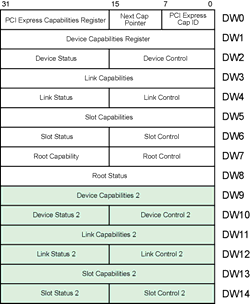
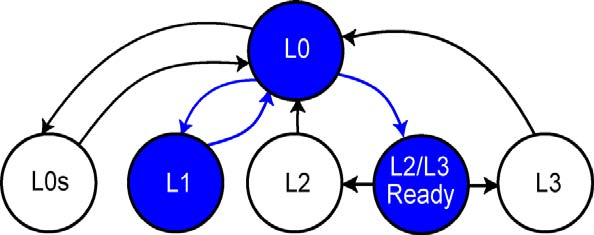

# 第3章：配置概述（Configuration Overview）

> 来源：《PCI Express Technology 3.0》
> 原文章节：Chapter 3: Configuration Overview

---

## 3.1 总线、设备和功能的定义（Definition of Bus, Device and Function）

### 3.1.1 PCIe总线（PCIe Buses）

PCIe采用分层拓扑结构，系统中的每个总线都由唯一的总线号（Bus Number）标识。根复合体（Root Complex）中的主机/PCI桥（Host/PCI Bridge）下游的第一个总线被分配为总线0。

### 3.1.2 PCIe设备（PCIe Devices）

每个PCIe总线可以连接最多32个设备，每个设备由设备号（Device Number，0-31）标识。在PCIe中，由于链路是点对点的，每个物理设备在链路的另一端总是设备0。

### 3.1.3 PCIe功能（PCIe Functions）

每个设备可以实现最多8个独立的功能（Function），每个功能由功能号（Function Number，0-7）标识。每个功能都有自己的配置寄存器空间，可以独立配置和操作。

**BDF（Bus/Device/Function）**：PCIe使用三元组（总线号、设备号、功能号）来唯一标识系统中的每个功能。

---

## 3.2 配置地址空间（Configuration Address Space）

早期的PC需要用户手动设置开关和跳线来为每个安装的卡分配资源，这经常导致内存、IO和中断设置冲突。随后的EISA和IBM PS/2系统首次实现了即插即用架构。PCI通过实现标准化配置寄存器扩展了这一功能，允许通用操作系统管理几乎所有系统资源。

### 3.2.1 PCI兼容空间（PCI-Compatible Space）

PCI为每个功能定义了专用的配置地址空间块。映射到配置空间的寄存器允许软件发现功能的存在、配置其正常操作以及检查功能状态。

PCI兼容配置空间包括每个功能的256字节：
- **前16个双字（64字节）**：配置头部（Configuration Header）
  - Type 0头部：用于非桥接功能（端点）
  - Type 1头部：用于桥接功能
- **剩余48个双字**：可选寄存器，包括PCI能力结构

对于PCIe功能，某些能力结构是必需的：
- PCIe能力（PCI Express Capability）
- 电源管理（Power Management）
- MSI和/或MSI-X

**图3-2：PCI兼容配置寄存器空间**


*原文图示：Type 0配置请求*


```
256字节配置寄存器空间（每个功能）
+--------------------------------------------------+
|  64字节PCI配置头部空间  |  192字节能力结构空间   |
+------------------------+-------------------------+

Type 0头部（端点）              Type 1头部（桥接器）
+--------+--------+--------+   +--------+--------+--------+
|  设备ID  |  厂商ID  | 00h  |   |  设备ID  |  厂商ID  | 00h  |
+--------+--------+--------+   +--------+--------+--------+
|   状态   |   命令   | 04h  |   |   状态   |   命令   | 04h  |
+--------+--------+--------+   +--------+--------+--------+
| 修订ID | 类代码 | 08h  |   | 修订ID | 类代码 | 08h  |
+--------+--------+--------+   +--------+--------+--------+
| BIST | 头部类型 | 延迟定时器 | 缓存行大小 | 0Ch  |
+---------------------------+   +--------+--------+--------+
|      基址寄存器0 (BAR0)      |   |  基址寄存器0 (BAR0)   |
+---------------------------+   +--------+--------+--------+
|      基址寄存器1 (BAR1)      |   |  基址寄存器1 (BAR1)   |
+---------------------------+   +--------+--------+--------+
|      基址寄存器2 (BAR2)      |   | 次总线号 | 主总线号 | 18h  |
+---------------------------+   +--------+--------+--------+
|      基址寄存器3 (BAR3)      |   | 从属总线号 | 次延迟定时器 | 1Ch  |
+---------------------------+   +--------+--------+--------+
|      基址寄存器4 (BAR4)      |   |  内存基址/限制寄存器   |
+---------------------------+   +--------+--------+--------+
|      基址寄存器5 (BAR5)      |   | 可预取内存基址/限制   |
+---------------------------+   +--------+--------+--------+
|    CardBus CIS指针        |   | 可预取内存基址高32位   |
+---------------------------+   +--------+--------+--------+
|   子系统厂商ID  |          |   | 可预取内存限制高32位   |
+---------------------------+   +--------+--------+--------+
|   扩展ROM基址寄存器        |   | IO限制高16位 | IO基址高16位 |
+---------------------------+   +--------+--------+--------+
|   子系统ID    |  保留      |   |   保留   | 能力指针 | 34h  |
+---------------------------+   +--------+--------+--------+
|   保留   |  能力指针  | 34h |   |   扩展ROM基址寄存器    |
+---------------------------+   +--------+--------+--------+
| 最大延迟 | 最小授权 | 中断引脚 | 中断线 | 3Ch |   | 桥控制 | 中断引脚 | 中断线 |
+---------------------------+   +--------+--------+--------+
```

### 3.2.2 扩展配置空间（Extended Configuration Space）

当PCIe被引入时，原有的256字节配置区域没有足够的空间容纳所有需要的新能力结构。因此，配置空间的大小从每个功能256字节扩展到4KB，称为扩展配置空间。

- **960个双字（3840字节）扩展配置区域**
- 只能通过增强配置机制访问
- 对遗留PCI软件不可见
- 包含PCIe的额外可选扩展能力寄存器，如：
  - 高级错误报告（Advanced Error Reporting）
  - 虚拟通道（Virtual Channels）
  - 设备序列号（Device Serial Number）
  - 电源预算（Power Budgeting）

**图3-3：每个PCIe功能的4KB配置空间**


*原文图示：Type 1配置请求*


```
配置头部字节
+----+----+----+----+
| 3  | 2  | 1  | 0  |
+----+----+----+----+

偏移000h
+-------------------+
|     厂商ID        | 00h
+-------------------+
|     状态  |  命令  | 01h
+-------------------+
| 修订ID |  类代码  | 02h
+-------------------+
| BIST |头部类型|延迟定时器|缓存行大小| 03h
+-------------------+
|    基址寄存器0     | 04h
+-------------------+
|    基址寄存器1     | 05h
+-------------------+
|    基址寄存器2     | 06h
+-------------------+
|    基址寄存器3     | 07h
+-------------------+
|    基址寄存器4     | 08h
+-------------------+
|    基址寄存器5     | 09h
+-------------------+
|   CardBus CIS指针  | 10h
+-------------------+
|   子系统厂商ID     | 11h
+-------------------+
|   子系统ID        | 12h
+-------------------+
|   扩展ROM基址      | 13h
+-------------------+
|   能力指针  | 保留  | 14h
+-------------------+
|   保留   | 中断引脚 | 中断线 | 15h
+-------------------+

偏移040h-0FFh：PCI设备特定和新能力寄存器集

偏移100h-FFFh：PCIe扩展配置寄存器空间（960个双字）
- PCIe能力结构必须在此寄存器空间中实现
- 仅可通过PCIe增强配置访问机制访问
```

---

## 3.3 主机到PCI桥配置寄存器（Host-to-PCI Bridge Configuration Registers）

### 3.3.1 概述

主机到PCI桥的配置寄存器不必使用前面提到的两种配置机制访问。相反，它通常作为内存地址空间中的设备特定寄存器实现，平台固件知道其位置。但其配置寄存器布局和用法必须遵循PCI 2.3规范定义的标准Type 0模板。

### 3.3.2 只有根复合体能发送配置请求

规范规定，只有根复合体（Root Complex）才被允许发起配置请求。它充当系统处理器的联络人，将请求注入到 fabric 中，并将完成包传递回来。发起配置事务的能力被限制为通过根复合体的处理器，以避免如果任何设备都能更改其他设备配置可能导致的混乱。

由于只有根复合体能发起这些请求，它们也只能向下游移动，这意味着不允许对等（peer-to-peer）配置请求。请求根据目标设备的ID进行路由，即其BDF（拓扑中的总线号、该总线上的设备号以及设备内的功能号）。

---

## 3.4 生成配置事务（Generating Configuration Transactions）

处理器通常无法直接执行配置读写请求，因为它们只能生成内存和IO请求。这意味着根复合体需要将某些访问转换为配置请求以支持此过程。配置空间可以使用以下两种机制之一访问：

1. **遗留PCI配置机制**：使用IO间接访问
2. **增强配置机制**：使用内存映射访问

### 3.4.1 遗留PCI机制（Legacy PCI Mechanism）

PCI规范定义了一种IO间接方法，用于指示系统（根复合体或其等效物）执行PCI配置访问。当时，主流的PC处理器（Intel x86）仅设计为寻址64KB的IO地址空间。到定义PCI时，这个有限的IO空间已经变得非常拥挤，只剩下几个地址范围可用：0800h-08FFh和0C00h-0CFFh。因此，将所有可能功能的配置寄存器直接映射到IO空间是不可行的。

同时，内存地址空间的大小也有限，将所有配置空间映射到内存地址空间也被认为不是一个好的解决方案。因此，规范编写者选择了一种常用的解决方案：使用间接地址映射。为此，一个寄存器保存目标地址，而第二个寄存器保存进出目标的数据。对地址寄存器的写入，随后对数据寄存器的读取或写入，会导致对目标功能正确内部地址的单个读取或写入事务。

PCI兼容机制在根复合体的主机桥中使用两个32位IO端口：
- **配置地址端口**：IO地址0CF8h-0CFBh
- **配置数据端口**：IO地址0CFCh-0CFFh

访问功能的PCI兼容配置寄存器的方法是：
1. 首先将目标总线、设备、功能和双字号写入配置地址端口，在此过程中设置其使能位
2. 其次，向配置数据端口发送1、2或4字节的IO读取或写入

根复合体中的主机桥将指定的目标总线与桥下游存在的总线范围进行比较。如果目标总线在该范围内，桥将发起配置读取或写入请求（取决于对配置数据端口的IO访问是读取还是写入）。

#### 配置地址端口（Configuration Address Port）

配置地址端口仅在处理器对端口执行完整的32位写入时才锁存信息，如图3-4所示，从端口的32位读取返回其内容。

**图3-4：0CF8h处的配置地址端口**



*原文图示：配置空间布局*


```
位31  位30-24  位23-16  位15-11  位10-8  位7-2  位1-0
+----+--------+--------+--------+-------+------+------+
| 1  |  保留   | 总线号  | 设备号  | 功能号 | 寄存器 | 0  0 |
+----+--------+--------+--------+-------+------+------+
         |               |         |       |      |
         |               |         |       |      +-- 始终为0
         |               |         |       +--------- 寄存器指针（64个双字）
         |               |         +----------------- 目标功能号（0-7）
         |               +--------------------------- 目标设备号（0-31）
         +------------------------------------------- 目标总线号（0-255）
+----------------------------------------------------- 使能配置空间映射（1=使能）
```

- **位[1:0]**：硬连线只读，读取时必须返回零。位置是双字对齐的，不允许字节特定偏移。
- **位[7:2]**：标识目标功能PCI兼容配置空间中的目标双字（也称为寄存器号）。此机制仅限于兼容配置空间（即功能配置空间的前64个双字）。
- **位[10:8]**：标识目标设备内的目标功能号（0-7）。
- **位[15:11]**：标识目标设备号（0-31）。
- **位[23:16]**：标识目标总线号（0-255）。
- **位[30:24]**：保留，必须为零。
- **位[31]**：必须设置为1b以启用将后续对配置数据端口的IO访问转换为配置访问。如果位31为零，并且向配置数据端口发送IO读取或写入，则该事务被视为普通IO请求。

#### 总线比较和数据端口使用（Bus Compare and Data Port Usage）

根复合体内的主机桥实现了次级总线号（Secondary Bus Number）寄存器和从属总线号（Subordinate Bus Number）寄存器。次级总线号是桥正下方总线的总线号。从属总线号是位于桥下游的目标总线号。

在单根复合体系统中，桥可能有一个硬连线为0的次级总线号寄存器，一个复位强制为0的读/写寄存器，或者它可能只是隐式地知道第一个可访问的总线将是总线0。

当请求出现时，桥评估目标总线号是否在下级总线号范围内，从次级总线号的值到从属总线号（含）。如果目标总线与次级总线匹配，则该总线成为目标，请求作为Type 0配置请求传递。当设备看到Type 0请求时，它们知道该总线上的本地设备是目标设备（而不是从属下游总线上的设备）。

如果目标总线大于桥的次级总线号，但小于或等于桥的从属总线号，请求将作为Type 1配置请求转发到桥的次级总线。Type 1配置访问被理解为：即使请求必须跨越此总线，它也不针对此总线上的设备。相反，请求将由该总线上的某个桥转发下游，该桥的次级和从属总线号范围包含目标总线号。因此，只有桥接设备才关注Type 1配置请求。

**图3-5：单根系统（Single-Root System）**


*原文图示：BAR配置*


```
处理器
   |
   v
+-----------------+
|   根复合体       |
|   总线0         |
| 主=0 次=1 从=9  |
+--------+--------+
         |
    +----+----+
    |         |
设备0       设备1
虚拟P2P     虚拟P2P
次=1        次=5
从=4        从=9
    |         |
总线1       总线5
    |         |
设备0       设备0
虚拟P2P     虚拟P2P
主=1        主=5
次=2        次=6
从=4        从=9
    |         |
总线2       总线6
    |         |
虚拟P2P     +----+----+----+
主=2        |    |    |    |
次=3        v    v    v    v
从=3       总线7 总线8 总线9
    |       |     |     |
总线3     设备0   设备0   设备0
    |     功能0   功能0   功能0
设备0
功能0
功能1
```

### 3.4.2 多主机系统（Multi-Host System）

如果有多个根复合体（参见图3-6），配置地址和数据端口可以在它们各自的主机/PCI桥中重复的相同IO地址处实现。为了防止争用，只有一个桥响应处理器对配置端口的访问。

1. 当处理器发起对配置地址端口的IO写入时，主机桥被配置为只有一个主动参与事务。
2. 在枚举期间，软件发现并编号活动桥下的所有总线。完成后，它使非活动主机桥使能，并为其分配一个已在活动桥分配范围之外的总线号，然后继续枚举过程。两个主机桥都能看到请求，但由于它们具有不重叠的总线号，它们只响应适当的总线号请求，因此没有冲突。
3. 此后对配置地址端口的访问进入两个主机桥，随后对配置数据端口的读取或写入访问仅被作为目标总线网关的主机/PCI桥接受。此桥响应处理器的事务，另一个忽略它。
   - 如果目标总线是次级总线，桥将访问转换为Type 0配置访问。
   - 否则，它将其转换为Type 1配置访问。

**图3-6：多根系统（Multi-Root System）**

```
处理器A <---------> 处理器B
    |                  |
    v                  v
+----------------+  +----------------+
|   根复合体A     |  |   根复合体B     |
|   次=0 从=9    |  |   次=64 从=65  |
+-------+--------+  +-------+--------+
        |                   |
   设备0 设备1          设备0
   虚拟P2P 虚拟P2P       虚拟P2P
   次=1    次=5          次=65
   从=4    从=9          从=65
        |                   |
   总线1 总线5          总线65
        |                   |
   设备0 设备0          设备0
   虚拟P2P 虚拟P2P       功能0
   次=2    次=6
   从=4    从=9
        |
   总线2
        |
   虚拟P2P
   次=3
   从=3
        |
   总线3
        |
   设备0
   功能0
   功能1
```

### 3.4.3 增强配置访问机制（Enhanced Configuration Access Mechanism）

当规范编写者为PCI-X和后来的PCIe选择如何访问配置空间时，有两个考虑因素。首先，每个功能的256字节空间限制了希望在其中放置专有信息的供应商，以及需要更多标准化能力结构空间的未来规范编写者。为了解决这个问题，空间简单地从每个功能256字节扩展到4KB。

其次，开发PCI时很少有使用多处理器系统。当只有一个CPU且只运行一个线程时，旧模型需要两步才能生成一次访问这一事实不是问题。但使用多核、多线程CPU的新机器给IO间接模型带来了问题，因为没有什么可以阻止多个线程同时尝试访问配置空间。因此，如果没有某些锁定语义，两步模型将不再工作。

为了解决这个问题，规范编写者决定采用不同的方法。与其尝试节省地址空间，他们将创建一个单步、不可中断的过程，通过将所有配置空间映射到内存地址中。这允许单个命令序列，因为在指定地址范围内的一个内存请求将在总线上生成一个配置请求。

现在的权衡是地址大小。为所有可能的实现映射每个功能4KB需要分配256MB的内存地址空间。在这方面，今天的区别是现代架构通常支持36到48位物理内存地址空间。对于这些内存地址空间大小，256MB是微不足道的。

为了处理这种映射，每个功能的4KB配置空间在256MB内存地址空间内以4KB对齐的地址开始，该空间专门用于配置访问，地址位现在携带关于哪个功能被目标的信息（参见表3-1）。

**表3-1：增强配置机制内存映射地址范围**

| 内存地址位字段 | 描述 |
|---------------|------|
| A[63:28] | 256MB对齐基地址的上位（用于增强配置机制的256MB内存映射地址范围）。基地址分配方式是实现特定的。它由系统固件（通常通过ACPI表）提供给操作系统。 |
| A[27:20] | 目标总线号（0-255） |
| A[19:15] | 目标设备号（0-31） |
| A[14:12] | 目标功能号（0-7） |
| A[11:2] | A[11:2]此范围可以寻址1024个双字之一，而遗留方法仅限于只能寻址64个双字之一。 |
| A[1:0] | 定义访问大小和字节使能设置。 |

#### 一些规则（Some Rules）

如果访问跨越双字地址边界（跨越两个相邻的内存双字），根复合体不需要支持对增强配置内存空间的访问。它们也不需要支持某些处理器类型用于原子或不间断命令序列的总线锁定协议。除非知道根复合体确实支持它们，否则软件在访问配置空间时应避免这两种情况。

---

## 3.5 配置请求（Configuration Requests）

桥可以生成两种请求类型（Type 0或Type 1）以响应配置访问。使用的类型取决于目标总线号是否与桥的次级总线号匹配，如下所述。

### 3.5.1 Type 0配置请求

如果目标总线号与次级总线号匹配，Type 0配置读取或写入被转发到次级总线：

1. 该总线上的设备检查设备号以查看其中哪个是目标设备。注意，外部链路上的端点始终是设备0。
2. 选定的设备检查功能号以查看设备内选择了哪个功能。
3. 选定的功能使用寄存器号字段在其配置空间中选择目标双字，并使用首双字字节使能字段选择所选双字内要读取或写入的字节。

**图3-7：Type 0配置读取和写入请求头部格式**

```
Type 0配置读取
+----+----+----+----+
| +0 | +1 | +2 | +3 |
+----+----+----+----+
字节0:
| 格式 | 类型 | 保留 | TC | 保留 | 属性 | AT | 长度 |
| 000  |00100 | 0 0 | 0 0 | 0 | 0 0 | 00 | 0 0 0 0 0 0 0 0 0 0 |
+----+----+----+----+
字节4:
| 请求者ID | 标签 | 末BE | 首DW BE |
| 总线 设备 功能 | 0000 | 0000 | 0001 |
+----+----+----+----+
字节8:
| 总线号 | 设备号 | 功能号 | 保留 | 寄存器号 | 保留 |
|       |       |       | 0 0 |         | 0 0 |
+----+----+----+----+

Type 0配置写入
+----+----+----+----+
| +0 | +1 | +2 | +3 |
+----+----+----+----+
字节0:
| 格式 | 类型 | 保留 | TC | 保留 | 属性 | AT | 长度 |
| 010  |00100 | 0 0 | 0 0 | 0 | 0 0 | 00 | 0 0 0 0 0 0 0 0 0 0 |
+----+----+----+----+
字节4:
| 请求者ID | 标签 | 末BE | 首DW BE |
| 总线 设备 功能 | 0000 | 0000 | 0001 |
+----+----+----+----+
字节8:
| 总线号 | 设备号 | 功能号 | 保留 | 寄存器号 | 保留 |
|       |       |       | 0 0 |         | 0 0 |
+----+----+----+----+
```

### 3.5.2 Type 1配置请求

当桥看到目标总线号与其次级总线号不匹配但在其次级和从属总线号范围内的配置访问时，它将数据包作为Type 1请求转发到其次级总线。非桥设备（端点）知道忽略Type 1请求，因为目标位于不同的总线上，但看到它的桥将对目标总线号与下游总线范围进行相同的比较。

- 如果目标总线与桥的次级总线匹配，数据包从Type 1转换为Type 0并传递到次级总线。该总线上的本地设备然后按前述方式检查数据包头部。
- 如果目标总线不是桥的次级总线但在其范围内，数据包作为Type 1请求转发到桥的次级总线。

**图3-8：Type 1配置读取和写入请求头部格式**

```
Type 1配置读取
+----+----+----+----+
| +0 | +1 | +2 | +3 |
+----+----+----+----+
字节0:
| 格式 | 类型 | 保留 | TC | 保留 | 属性 | AT | 长度 |
| 000  |00101 | 0 0 | 0 0 | 0 | 0 0 | 00 | 0 0 0 0 0 0 0 0 0 0 |
+----+----+----+----+
字节4:
| 请求者ID | 标签 | 末BE | 首DW BE |
| 总线 设备 功能 | 0000 | 0000 | 0001 |
+----+----+----+----+
字节8:
| 总线号 | 设备号 | 功能号 | 保留 | 寄存器号 | 保留 |
|       |       |       | 0 0 |         | 0 0 |
+----+----+----+----+

Type 1配置写入
+----+----+----+----+
| +0 | +1 | +2 | +3 |
+----+----+----+----+
字节0:
| 格式 | 类型 | 保留 | TC | 保留 | 属性 | AT | 长度 |
| 010  |00101 | 0 0 | 0 0 | 0 | 0 0 | 00 | 0 0 0 0 0 0 0 0 0 0 |
+----+----+----+----+
字节4:
| 请求者ID | 标签 | 末BE | 首DW BE |
| 总线 设备 功能 | 0000 | 0000 | 0001 |
+----+----+----+----+
字节8:
| 总线号 | 设备号 | 功能号 | 保留 | 寄存器号 | 保留 |
|       |       |       | 0 0 |         | 0 0 |
+----+----+----+----+
```

---

## 3.6 示例配置访问

### 3.6.1 PCI兼容配置访问示例

**图3-9：示例配置读取访问**

```
处理器
   |
   v
+------------------------+
| 根复合体                |
| 总线=0 从属=10          |
| 主机/PCI桥              |
+--------+---------------+
         |
    +----+----+
    |         |
设备0       设备1
虚拟P2P     虚拟P2P
主=0        主=0
次=1        次=5
从=4        从=10
    |         |
总线1       总线5
    |         |
设备0       设备0
虚拟P2P     虚拟P2P
主=1        主=5
次=2        次=6
从=4        从=10
    |         |
总线2       总线6
    |         |
虚拟P2P     +----+----+----+
主=2        |    |    |    |
次=3        v    v    v    v
从=3       总线7 总线8 总线9
    |       |     |     |
总线3     设备0   设备0   设备0
    |     功能0   功能0   功能0
设备0
功能0
功能1

总线4
|
设备0
功能0

PCI Express
PCI桥
|
总线8
|
PCI设备
PCI设备
PCI设备
设备1     设备2     设备3
功能0     功能0     功能0

总线9
设备0
功能0

总线10
设备0
功能0
```

为了说明使用遗留CF8h/CFCh机制生成配置请求的概念，考虑以下x86汇编代码示例，它将导致根复合体从总线4、设备0、功能0、寄存器0（厂商ID）执行2字节读取：

```asm
mov  dx,0CF8h        ; 设置dx = 配置地址端口地址
mov  eax,80040000h   ; 使能=1, 总线4, 设备0, 功能0, 双字0
out  dx,eax          ; IO写入以设置地址端口
mov  dx,0CFCh        ; 设置dx = 配置数据端口地址
in   ax,dx           ; 从配置数据端口读取2字节
```

执行流程：
1. `out`指令从处理器生成IO写入，目标为根复合体主机桥中的配置地址端口（0CF8h）。
2. 主机桥将配置地址端口中指定的目标总线号（4）与下游存在的总线范围（0到10）进行比较。目标总线落在范围内，因此桥为下一个配置请求的目的地做好准备。
3. `in`指令从处理器生成IO读取事务，目标为根复合体主机桥中的配置数据端口。这是对配置数据端口前两个位置的2字节读取。
4. 由于目标总线不是总线0，主机/PCI桥在总线0上发起Type 1配置读取。
5. 总线0上的所有设备锁存事务请求，并看到它是Type 1配置请求。结果，根复合体中的两个虚拟PCI到PCI桥都将Type 1请求中的目标总线号与每个桥下游的总线范围进行比较。
6. 目标总线（4）在左侧桥下游的总线范围内，因此它将数据包传递到其次级总线，但作为Type 1请求，因为目标总线与次级总线号不匹配。
7. 交换机上的上游端口接收数据包并将其传递到上游PCI到PCI桥。
8. 桥确定目标总线位于其下方，但不是针对其次级总线，因此它将数据包作为Type 1请求传递到总线2。
9. 总线2上的两个桥都接收Type 1请求数据包。右侧桥确定目标总线其次级总线号匹配。
10. 桥将配置读取请求传递到总线4，但转换为Type 0配置读取请求，因为数据包已到达目标总线（目标总线号与次级总线号匹配）。
11. 总线4上的设备0接收数据包并解码目标设备、功能和寄存器号字段，以在其配置空间中选择目标双字。
12. 首双字字节使能字段中的位0和1被置位，因此该功能在完成包中返回其前两个字节（本例中为厂商ID）。完成包使用从Type 0请求数据包获得的请求者ID字段路由到主机桥。
13. 读取数据的两个字节被传递给处理器，从而完成"in"指令的执行。厂商ID被放入处理器的AX寄存器。

### 3.6.2 增强配置访问示例

以下x86代码示例导致根复合体从总线4、设备0、功能0、寄存器0（厂商ID）执行读取。在此之前，主机桥必须已被分配基地址值。此示例假设增强配置内存映射范围的256MB对齐基地址为E0000000h：

```asm
mov ax,[E0400000h]   ; 内存映射配置读取
```

地址解析：
- 地址位63:28指示整体增强配置地址范围的256MB对齐基地址的上36位（本例中为00000000 E0000000h）。
- 地址位27:20选择目标总线（本例中为4）。
- 地址位19:15选择总线上的目标设备（本例中为0）。
- 地址位14:12选择设备内的目标功能（本例中为0）。
- 地址位11:2选择所选功能配置空间内的目标双字（本例中为0）。
- 地址位1:0定义所选双字内的起始字节位置（本例中为0）。

处理器从内存位置E0400000h发起2字节内存读取，这被根复合体中的主机桥锁存。主机桥识别地址与为配置指定的区域匹配，并生成功能0、设备0、总线4的前两个字节的配置读取请求。其余操作与上一节描述的相同。

---

## 3.7 枚举——发现拓扑（Enumeration - Discovering the Topology）

系统复位或上电后，配置软件必须扫描PCIe fabric 以发现机器拓扑并了解 fabric 的填充情况。在此之前，如图3-10所示，软件唯一可以确定的是将有一个主机/PCI桥，并且总线号0将在该桥的次级侧。



*原文图示：配置空间访问*


**图3-10：启动时的拓扑视图**

```
处理器
   |
   v
+------------------------+
| 根复合体已分配总线号零  |
| 主机/PCI桥              |
| 总线0                   |
+--------+---------------+
         |
    +----+----+----+----+----+----+----+----+
    |    |    |    |    |    |    |    |    |
    ?    ?    ?    ?    ?    ?    ?    ?

剩余拓扑结构有待发现和编号
```

注意，桥设备的上游侧称为其主总线（primary bus），而下游侧称为其次级总线（secondary bus）。扫描PCI Express fabric以发现其拓扑的过程称为**枚举过程（enumeration process）**。

### 3.7.1 发现功能的存在或缺失

在处理器上执行的配置软件通常通过从厂商ID寄存器读取来发现功能的存在。PCI-SIG为每个供应商分配唯一的16位值，该值被硬连线到该供应商设计的每个功能的厂商ID寄存器中。通过读取系统中所有可能的总线、设备和功能号组合的此寄存器，枚举软件可以搜索整个拓扑以了解哪些设备存在。

这个过程相当简单，但可能出现两个问题：目标设备可能不存在，或者它可能存在但未准备好响应。下面描述处理这两种情况的方法。

#### 设备不存在（Device not Present）

在发现过程中可能发生几次目标设备实际上不存在于系统中的情况，当这种情况发生时，需要正确理解。在PCI中，配置读取请求会在总线上超时并生成主中止（Master Abort）错误条件。由于没有设备在驱动总线，所有信号都被上拉，总线上的数据位将被视为全1，这将成为看到的数据值。结果厂商ID为FFFFh是保留的。如果枚举软件看到该读取结果，它就理解该设备不存在。由于这实际上不是错误条件，主中止在枚举过程中不会被报告为错误。

对于PCIe，对不存在设备的配置读取请求将导致目标设备上方的桥返回一个状态为UR（不支持的请求）的无数据完成。为了与遗留枚举模型向后兼容，当在枚举期间看到此完成时，根复合体向处理器返回全1（FFFFh）作为数据。注意，枚举软件依赖于在探测系统中功能存在时，对返回不支持的请求的配置读取请求接收全1的值。

重要的是避免意外报告此情况的错误。尽管此超时或UR结果在运行期间会被视为错误，但在枚举期间它是预期结果，不被视为错误。为了避免混淆，设备通常在稍后才会启用错误信号。

#### 设备未就绪（Device not Ready）

可能出现的另一个问题是目标设备存在但未准备好响应配置访问。由于设备准备访问所需的时间，配置存在时间考虑。如果数据速率为5.0 GT/s或更低，软件必须在复位后等待100ms才能发起配置请求。如果速率高于5.0 GT/s（Gen3速度），软件必须等待链路训练完成后100ms才能尝试此操作。对于更高速度需要更长延迟的原因是Gen3均衡过程在链路训练期间可能需要很长时间（大约50ms）。

按照PCI 2.3规范的定义，初始化时间（Trhfa - 从复位高到首次访问的时间）在RST#解除置位时开始，并在225个PCI时钟后完成。这相当于功能准备其首次配置访问的整整一秒，该值已作为1.0s（+50%/-0%）传承给PCIe。功能可以使用该时间通过从外部串行EEPROM加载内容来填充其配置寄存器，例如。这可能需要一段时间来加载，功能在完成之前无法成功访问。

在PCIe中，我们有同样的问题，但过程现在有些不同。首先，PCIe功能在暂时无法响应配置访问时，必须始终给出具有特定状态的完成，即**配置请求重试状态（Configuration Request Retry Status，CRS）**。此状态仅在响应配置请求时合法，如果在响应其他请求时看到，可以选择被视为畸形数据包错误。此响应仅在复位后一秒钟内有效，因为功能应该在那之前响应，如果它不愿意，可以被视为损坏。

根复合体处理CRS完成对配置读取请求的响应的方式是实现特定的，但系统复位后的时期除外。在此期间，根接下来会做什么有两个选项，基于其根控制寄存器中CRS软件可见性位的设置（见图3-11）：

- 如果位被设置且请求是对厂商ID寄存器两个字节的配置读取（如枚举访问为发现功能存在所做的那样），根必须为此寄存器向主机提供人工值0001h，以及此请求中任何附加字节的全1。此厂商ID不用于任何真实设备，将被软件解释为访问此设备可能存在长时间延迟的指示。
- 对于配置写入或任何其他配置读取，根必须自动重新发出配置请求作为新请求。

**图3-11：PCIe能力块中的根控制寄存器**

```
位15-5    位4              位3              位2                位1                位0
+--------+---------------+---------------+------------------+------------------+------------------+
| RsvdP  | CRS软件可见性 | PME中断使能   | 致命错误系统错误 | 非致命错误系统错误 | 可纠正错误系统错误 |
|        |    使能       |               |     使能         |      使能        |      使能        |
+--------+---------------+---------------+------------------+------------------+------------------+
```

### 3.7.2 确定功能是端点还是桥

枚举过程的关键部分是能够确定功能是桥还是端点。如图3-12所示，头部类型寄存器（配置空间头部中的偏移0Eh）的低7位标识功能的基本类别，定义了三个值：

- **0** = 不是桥（PCIe中的端点）
- **1** = PCI到PCI桥（缩写为P2P），连接两个总线
- **2** = CardBus桥（遗留接口，今天不常用）

在图3-1中，每个虚拟P2P中的头部类型字段（DW3，字节2）将返回值1，PCI Express到PCI桥（总线8，设备0）也是如此，而端点将返回头部类型0。

**图3-12：头部类型寄存器**

```
位7    位6-0
+----+--------------------------------+
|    |          头部类型              |
+----+--------------------------------+
      配置头部格式
      0 = 单功能设备
      1 = 多功能设备

头部类型值：
- 00h = 单功能端点
- 01h = 单功能桥
- 80h = 多功能端点
- 81h = 多功能桥
```

### 3.7.3 单根枚举示例

现在我们已经讨论了枚举过程中涉及的基本元素，让我们逐步完成该过程的示例。图3-13说明了总线和设备被枚举后的示例系统。

**图3-13：单根系统**

```
处理器
   |
   v
+------------------------+
| 根复合体                |
| 主机/PCI桥              |
| 总线0                   |
+--------+---------------+
         |
    +----+----+
    |         |
设备0       设备1
A虚拟P2P    B虚拟P2P
    |         |
总线1       总线5
    |         |
设备0       设备0
C虚拟P2P    F虚拟P2P
    |         |
总线2       总线6
    |         |
虚拟P2P     +----+----+----+
D           | G  | H  | I  |
    |       +----+----+----+
总线3       |    |    |    |
    |       v    v    v    v
设备0      总线7 总线8 总线9 总线10
功能0      |    |    |    |
功能1      设备0 设备0 设备0 设备0
           功能0 功能0 功能0 功能0

总线4
|
设备0
功能0

E虚拟P2P

J虚拟P2P

PCI Express
PCI桥
|
总线8
|
PCI设备
PCI设备
PCI设备
设备1     设备2     设备3
功能0     功能0     功能0
```

枚举过程：

1. 软件更新主机/PCI桥次级总线号为0，从属总线号为255。将其设置为最大值意味着在识别出所有下游总线号之前不需要再次更改。目前，总线0到255被标识为在下游。

2. 从设备0（桥A）开始，枚举软件尝试从总线0上32个可能设备中的每个设备的Function 0读取厂商ID。如果从总线0、设备0、功能0返回有效的厂商ID，则设备存在且至少包含一个功能。如果没有，继续探测总线0、设备1、功能0。

3. 本例中的头部类型字段（图3-12）包含值1（01h），表示这是PCI到PCI桥。头部类型寄存器中的多功能位（位7）为0，表示功能0是此桥中唯一的功能。

4. 现在软件找到了桥，执行一系列配置写入以设置桥的总线号寄存器如下：
   - 主总线号寄存器 = 0
   - 次级总线号寄存器 = 1
   - 从属总线号寄存器 = 255

5. 桥现在知道直接连接下游的总线号是1（次级总线号=1），其下游的最大总线号是255（从属总线号=255）。

6. 枚举软件必须执行深度优先搜索。在继续发现总线0上的其他设备/功能之前，它必须继续搜索总线1。

7. 软件读取总线1、设备0、功能0的厂商ID，本例中目标为桥C。返回有效的厂商ID，表示总线1、设备0、功能0存在。

8. 头部寄存器中的头部类型字段包含值1（0000001b），表示另一个PCI到PCI桥。与之前一样，位7为0，表示桥C是单功能设备。

9. 软件现在执行一系列配置写入以设置桥C的总线号寄存器如下：
   - 主总线号寄存器 = 1
   - 次级总线号寄存器 = 2
   - 从属总线号寄存器 = 255

10. 继续深度优先搜索，从总线2、设备0、功能0的厂商ID寄存器执行读取。本例假设桥D是总线2上的设备0、功能0。

11. 返回有效的厂商ID，表示总线2、设备0、功能0存在。

12. 头部寄存器中的头部类型字段包含值1（0000001b），表示这是PCI到PCI桥，位7为0，表示桥D是单功能设备。

13. 软件现在执行一系列配置写入以设置桥D的总线号寄存器如下：
    - 主总线号寄存器 = 2
    - 次级总线号寄存器 = 3
    - 从属总线号寄存器 = 255

14. 继续深度优先搜索，从总线3、设备0、功能0的厂商ID寄存器执行读取。

15. 返回有效的厂商ID，表示总线3、设备0、功能0存在。

16. 头部寄存器中的头部类型字段包含值0（0000000b），表示这是端点功能。由于这是端点而不是桥，它具有Type 0头部，下面没有PCI兼容总线。这次，位7为1，表示这是多功能设备。

17. 枚举软件对总线3、设备0的所有8个可能功能的厂商ID执行访问，并确定除了功能0外只有功能1存在。功能1也是端点（Type 0头部），因此此设备下面没有额外的总线。

18. 枚举软件继续在总线3上扫描以查找设备1-31上的有效功能，但没有找到任何其他功能。

19. 找到桥D下游的所有功能后，枚举软件更新桥D的从属总线号为3。然后它返回上一级（到总线2）并继续在该总线上扫描以查找有效功能。本例假设桥E是总线2上的设备1、功能0。

20. 返回有效的厂商ID，表示此功能存在。

21. 桥E的头部寄存器中的头部类型字段包含值1（0000001b），表示这是PCI到PCI桥，位7为0，表示单功能设备。

22. 软件现在执行一系列配置写入以设置桥E的总线号寄存器如下：
    - 主总线号寄存器 = 2
    - 次级总线号寄存器 = 4
    - 从属总线号寄存器 = 255

23. 继续深度优先搜索，从总线4、设备0、功能0的厂商ID寄存器执行读取。

24. 返回有效的厂商ID，表示此功能存在。

25. 头部寄存器中的头部类型字段包含值0（0000000b），表示这是端点设备，位7为0，表示这是单功能设备。

26. 枚举软件扫描总线4以查找设备1-31上的有效功能，但没有找到任何其他功能。

27. 到达此树分支的底部后，枚举软件更新该总线上方桥的从属总线号，本例中为E。然后它返回上一级（到总线2）并继续读取下一个设备（设备2）的厂商ID。本例假设总线2上的设备2-31未实现，因此在总线2上没有发现其他设备。

28. 枚举软件更新总线2上方桥（本例中为C）的从属总线号为4，并返回到前一条总线（总线1）尝试读取下一个设备（设备1）的厂商ID。本例假设桥B是总线0上的设备1、功能0。

29. 以与前面描述的相同方式，枚举软件发现桥B并执行一系列配置写入以设置桥B的总线号寄存器如下：
    - 主总线号寄存器 = 0
    - 次级总线号寄存器 = 5
    - 从属总线号寄存器 = 255

30. 然后发现桥F并执行一系列配置写入以设置其总线号寄存器如下：
    - 主总线号寄存器 = 5
    - 次级总线号寄存器 = 6
    - 从属总线号寄存器 = 255

31. 然后发现桥G并执行一系列配置写入以设置其总线号寄存器如下：
    - 主总线号寄存器 = 6
    - 次级总线号寄存器 = 7
    - 从属总线号寄存器 = 255

32. 在总线7、设备0、功能0发现单功能端点设备，因此桥G的从属总线号更新为7。

33. 然后发现桥H并执行一系列配置写入以设置其总线号寄存器如下：
    - 主总线号寄存器 = 6
    - 次级总线号寄存器 = 8
    - 从属总线号寄存器 = 255

34. 发现桥J并执行一系列配置写入以设置桥的总线号寄存器如下：
    - 主总线号寄存器 = 8
    - 次级总线号寄存器 = 9
    - 从属总线号寄存器 = 255

35. 发现总线9上的所有设备及其各自的功能，它们都不是桥，因此桥H和J的从属总线号更新为9。

36. 然后发现桥I并执行一系列配置写入以设置其总线号寄存器如下：
    - 主总线号寄存器 = 6
    - 次级总线号寄存器 = 10
    - 从属总线号寄存器 = 255

37. 在总线10、设备0、功能0发现单功能端点设备。

38. 由于软件已到达PCIe拓扑所需树结构的此分支底部，桥B、F和I的从属总线号寄存器更新为10，主机/PCI桥的从属总线号寄存器也是如此。

每个桥的主、次和从属总线号字段中编码的最终值可以在图3-9中找到。

### 3.7.4 多根枚举示例

**概述**

考虑图3-14中所示的多根系统。在此系统中，每个根复合体：
- 在相同的IO地址处实现配置地址端口和配置数据端口（基于x86的系统）
- 实现增强配置机制
- 包含主机/PCI桥
- 在配置软件已知的单独地址处实现次级总线号和从属总线号寄存器

在图示中，每个根复合体是一个芯片组成员，其中一个被指定为总线0的桥（主根复合体），而另一个被指定为总线255的桥（次根复合体）。

**图3-14：多根系统**

```
处理器A <---------> 处理器B
    |                  |
    v                  v
+----------------+  +----------------+
|   根复合体A     |  |   根复合体B     |
|   次=0 从=9    |  |   次=64 从=65  |
+-------+--------+  +-------+--------+
        |                   |
   设备0 设备1          设备0
   虚拟P2P 虚拟P2P       虚拟P2P
   次=1    次=5          次=65
   从=4    从=9          从=65
        |                   |
   总线1 总线5          总线65
        |                   |
   设备0 设备0          设备0
   虚拟P2P 虚拟P2P       功能0
   次=2    次=6
   从=4    从=9
        |
   总线2
        |
   虚拟P2P
   次=3
   从=3
        |
   总线3
        |
   设备0
   功能0
   功能1

总线4
|
设备0
功能0

总线6
|
+----+----+----+
|    |    |    |
v    v    v    v
总线7 总线8 总线9

设备0 设备0 设备0
功能0 功能0 功能0
```

**多根枚举过程**

在枚举图3-14中左侧树结构期间，次根复合体中的主机/PCI桥忽略所有配置访问，因为目标总线号不大于9。注意，虽然被检测和编号，但总线8没有连接设备。

一旦该枚举过程完成，枚举软件采取以下步骤来枚举次根复合体：

1. 枚举软件将次根复合体主机/PCI桥中的次级和从属总线号值更改为本例中的总线64。（值64和128通常用作多根系统中的起始总线号，但这只是软件约定。没有PCI或PCIe规则要求该配置。在本例中，从10开始次根复合体的总线号也没有问题。）

2. 枚举软件然后开始搜索总线64并发现连接到下游根端口的桥。

3. 执行一系列配置写入以设置其总线号寄存器如下：
   - 主总线号寄存器 = 64
   - 次级总线号寄存器 = 65
   - 从属总线号寄存器 = 255

4. 桥现在知道其下游侧直接连接的总线号是65（次级总线号=65），其最下游的总线号是65（从属总线号=65）。

5. 在总线65上发现设备0，只实现功能0，进一步搜索显示总线65上没有其他设备，因此搜索过程返回上一级总线。

6. 在总线64上继续枚举，没有发现其他设备，因此主机/PCI的从属总线号更新为65。

7. 这完成了枚举过程。

### 3.7.5 热插拔考虑（Hot-Plug Considerations）

在热插拔环境中，意味着可以在运行期间添加或移除附加卡的情况，图3-14中总线号8所示的情况可能会导致麻烦。如果系统已被枚举并正在运行，然后将具有桥的卡插入总线8，则桥需要为其次级和从属总线号分配总线号，这些总线号大于其主总线上的总线号，并且完全包含。原因是总线号必须位于新卡上方桥的次级和从属总线号范围内。

一种方法是分配总线8上桥所需的总线号，并将当前总线号9递增到比前一个总线号大一的号码，从而为新总线腾出空间。在运行期间调整总线号是可以做到的，但经验丰富的人说很难让它工作得很好。

有一个更简单的解决方案可以解决这个潜在问题：只要在发现未填充的插槽时留下总线号间隙。例如，当分配总线8但然后在其下方看到开放插槽时，给下一个发现的总线一个更高的号码，比如19而不是9，以便为这些附加情况轻松解决留下空间。然后，如果添加了带有桥的卡，新总线号可以分配为总线9而不会造成任何麻烦。在大多数情况下，留下总线号间隙不会成为问题，因为系统总共可以分配多达256个总线号。

---

## 3.8 MindShare Arbor：调试/验证/分析和学习软件工具

### 3.8.1 概述

MindShare Arbor是一种计算机系统调试、验证、分析和学习工具，允许用户读写任何内存、IO或配置空间地址。来自这些地址空间的数据可以以清晰且信息丰富的方式查看。

本书作者决定不在单个章节中包含所有配置寄存器的详细描述。相反，寄存器在相关的章节中描述。作为本书中配置寄存器空间描述章节的替代，MindShare Arbor是一种出色的参考学习工具，可以快速了解PCI、PCI-X和PCI Express设备中实现的配置寄存器和结构。所有寄存器和字段定义都是最新的PCI Express规范版本。

### 3.8.2 MindShare Arbor功能列表

- 包含PCIe 3.0规范中所有配置寄存器的描述
- 扫描系统中所有PCI可见功能的配置空间，并以易于阅读的格式显示这些寄存器中的每一个的描述
- 直接访问任何内存或IO地址
- 写入任何配置空间位置、内存地址或IO地址
- 以解码格式查看标准和非标准结构
  - 包含标准PCI、PCI-X和PCI Express结构的解码信息
  - 包含某些基于x86的结构和设备特定寄存器的解码信息
- 创建自己的基于XML的解码文件以驱动Arbor的显示
  - 为配置空间、内存地址空间和IO空间中的结构创建解码文件
- 保存系统扫描以供稍后查看或在其他系统上查看
  - 保存的系统扫描是基于XML的开放格式

即将推出或已经包含的新功能：
- 扫描之间的差异检查
- 扫描后处理以查找非法或非最佳设置
- 自动化脚本支持
- x86结构解码（MSR、分页、分段、中断表等）
- ACPI结构解码
- USB结构解码
- NVM Express结构解码

---

## 3.9 Linux内核实现参考

### 3.9.1 配置空间访问机制

Linux内核PCI子系统支持两种配置空间访问机制：

#### 传统PCI机制（x86）
```c
// drivers/pci/access.c
// 使用0xCF8/0xCFC端口访问配置空间（x86架构）
int pci_bus_read_config_dword(struct pci_bus *bus, unsigned int devfn, 
                              int pos, u32 *value)
{
    int res;
    unsigned long flags;
    u32 data = 0;
    
    pci_lock_config(flags);
    res = bus->ops->read(bus, devfn, pos, 4, &data);
    *value = data;
    pci_unlock_config(flags);
    return res;
}
```

#### 增强配置机制（ECAM）
```c
// drivers/pci/ecam.c
// 内存映射配置空间访问（ARM64等架构）
void __iomem *pci_ecam_map_bus(struct pci_bus *bus, unsigned int devfn,
                               int where)
{
    struct pci_config_window *cfg = bus->sysdata;
    unsigned int devfn_shift = cfg->ops->bus_shift - 8;
    unsigned int busn = bus->number;
    void __iomem *base;

    if (busn < cfg->busr.start || busn > cfg->busr.end)
        return NULL;

    busn -= cfg->busr.start;
    if (per_bus_mapping)
        base = cfg->winp[busn];
    else
        base = cfg->win + (busn << cfg->ops->bus_shift);
    return base + (devfn << devfn_shift) + where;
}
```

### 3.9.2 设备枚举实现

Linux内核使用深度优先搜索（DFS）算法进行PCI设备枚举：

```c
// drivers/pci/probe.c

/**
 * pci_scan_bridge_extend() - 扫描桥后的总线
 * 实现深度优先搜索算法
 */
static int pci_scan_bridge_extend(struct pci_bus *bus, struct pci_dev *dev,
                  int max, unsigned int available_buses,
                  int pass)
{
    // 读取桥的主/次/从属总线号
    pci_read_config_dword(dev, PCI_PRIMARY_BUS, &buses);
    primary = buses & 0xFF;
    secondary = (buses >> 8) & 0xFF;
    subordinate = (buses >> 16) & 0xFF;
    
    // Pass 0: 扫描已配置的桥
    // Pass 1: 配置未配置的桥
    if (!pass) {
        // 第一轮：扫描已配置的桥
        child = pci_add_new_bus(bus, dev, secondary);
        cmax = pci_scan_child_bus(child);
    } else {
        // 第二轮：分配新的总线号
        next_busnr = max + 1;
        child = pci_add_new_bus(bus, dev, next_busnr);
        max = pci_scan_child_bus_extend(child, available_buses);
        
        // 更新从属总线号
        pci_bus_update_busn_res_end(child, max);
        pci_write_config_byte(dev, PCI_SUBORDINATE_BUS, max);
    }
    
    return max;
}
```

### 3.9.3 CRS（Configuration Request Retry Status）处理

```c
// drivers/pci/probe.c

static void pci_enable_crs(struct pci_dev *pdev)
{
    u16 root_cap = 0;

    /* 如果支持CRS软件可见性，则启用 */
    pcie_capability_read_word(pdev, PCI_EXP_RTCAP, &root_cap);
    if (root_cap & PCI_EXP_RTCAP_CRSVIS)
        pcie_capability_set_word(pdev, PCI_EXP_RTCTL,
                     PCI_EXP_RTCTL_CRSSVE);
}
```

### 3.9.4 扩展配置空间检测

```c
// drivers/pci/probe.c

/**
 * pci_cfg_space_size - 获取PCI设备的配置空间大小
 * 
 * 普通PCI设备有256字节，PCI-X 2和PCIe设备有4096字节
 */
int pci_cfg_space_size(struct pci_dev *dev)
{
    // 检查是否支持扩展配置空间
    if (pci_is_pcie(dev))
        return pci_cfg_space_size_ext(dev);
    
    // 检查PCI-X Mode 2支持
    pos = pci_find_capability(dev, PCI_CAP_ID_PCIX);
    if (pos) {
        pci_read_config_dword(dev, pos + PCI_X_STATUS, &status);
        if (status & (PCI_X_STATUS_266MHZ | PCI_X_STATUS_533MHZ))
            return pci_cfg_space_size_ext(dev);
    }
    
    return PCI_CFG_SPACE_SIZE;  // 256字节
}
```

---

## 术语对照表

| 英文术语 | 中文翻译 |
|---------|---------|
| Configuration Space | 配置空间 |
| Root Complex | 根复合体 |
| Endpoint | 端点 |
| Bridge | 桥接器 |
| Bus | 总线 |
| Device | 设备 |
| Function | 功能 |
| Enumeration | 枚举 |
| BAR (Base Address Register) | 基址寄存器 |
| Vendor ID | 厂商ID |
| Device ID | 设备ID |
| Header Type | 头部类型 |
| Primary Bus | 主总线 |
| Secondary Bus | 次级总线 |
| Subordinate Bus | 从属总线 |
| Type 0 Configuration Request | Type 0配置请求 |
| Type 1 Configuration Request | Type 1配置请求 |
| Legacy PCI Mechanism | 遗留PCI机制 |
| Enhanced Configuration Mechanism | 增强配置机制 |
| Configuration Address Port | 配置地址端口 |
| Configuration Data Port | 配置数据端口 |
| CRS (Configuration Request Retry Status) | 配置请求重试状态 |
| Hot-Plug | 热插拔 |
| PCIe Capability Structure | PCIe能力结构 |
| Power Management | 电源管理 |
| MSI (Message Signaled Interrupts) | 消息信号中断 |
| MMIO (Memory-Mapped IO) | 内存映射IO |

---

## 3.9 Linux内核实现参考（平台特定补充）

### 3.9.1 飞腾PCIe EP配置空间实现

飞腾(Phytium)处理器的PCIe EP控制器实现了完整的PCIe配置空间，与本书介绍的配置空间结构完全对应。

#### 寄存器映射对照

| 本书字段 | 飞腾寄存器定义 | 偏移地址 | 说明 |
|----------|---------------|----------|------|
| Vendor ID | `PHYTIUM_PCI_VENDOR_ID` | 0x98 | 厂商标识 |
| Device ID | `PHYTIUM_PCI_DEVICE_ID` | 0x9a | 设备标识 |
| Revision ID | `PHYTIUM_PCI_REVISION_ID` | 0x9c | 版本号 |
| Class Code | `PHYTIUM_PCI_CLASS_DEVICE` | 0x9e | 设备类别 |
| Subsystem Vendor ID | `PHYTIUM_PCI_SUBSYS_VENDOR_ID` | 0xa0 | 子系统厂商 |
| Subsystem ID | `PHYTIUM_PCI_SUBSYS_DEVICE_ID` | 0xa2 | 子系统设备 |
| Interrupt Pin | `PHYTIUM_PCI_INTERRUPT_PIN` | 0xa8 | 中断引脚 |

**代码示例** - 配置空间写入实现：

```c
// 来自 drivers/pci/controller/pcie-phytium-ep.c
static int phytium_pcie_ep_write_header(struct pci_epc *epc, u8 fn,
                                        struct pci_epf_header *hdr)
{
    struct phytium_pcie_ep *priv = epc_get_drvdata(epc);
    
    // 写入Vendor ID和Device ID（对应3.2.1节配置头部）
    phytium_pcie_writew(priv, fn, PHYTIUM_PCI_VENDOR_ID, hdr->vendorid);
    phytium_pcie_writew(priv, fn, PHYTIUM_PCI_DEVICE_ID, hdr->deviceid);
    
    // 写入Revision ID（对应3.2.1节Revision ID字段）
    phytium_pcie_writeb(priv, fn, PHYTIUM_PCI_REVISION_ID, hdr->revid);
    
    // 写入Class Code（对应3.2.1节Class Code字段）
    phytium_pcie_writew(priv, fn, PHYTIUM_PCI_CLASS_DEVICE,
                        hdr->subclass_code | (hdr->baseclass_code << 8));
    
    // 写入子系统信息
    phytium_pcie_writew(priv, fn, PHYTIUM_PCI_SUBSYS_VENDOR_ID,
                        hdr->subsys_vendor_id);
    phytium_pcie_writew(priv, fn, PHYTIUM_PCI_SUBSYS_DEVICE_ID,
                        hdr->subsys_id);
    
    // 配置中断引脚（对应3.2.1节Interrupt Pin字段）
    tmp = phytium_pcie_readw(priv, fn, PHYTIUM_PCI_INTERRUPT_PIN);
    tmp = ((tmp & (~INTERRUPT_PIN_MASK)) | hdr->interrupt_pin);
    phytium_pcie_writew(priv, fn, PHYTIUM_PCI_INTERRUPT_PIN, tmp);
    
    return 0;
}
```

#### 与书中内容的对应

1. **配置空间访问机制**（对应3.5节）：
   - 书中介绍的Type 0配置请求，在飞腾实现中通过`phytium_pcie_writeb/writew/writel`函数完成
   - 这些函数内部实现了对EP内部配置寄存器的访问

2. **BDF寻址**（对应3.1.3节）：
   - 飞腾实现使用`fn`参数（Function Number）支持多功能设备
   - 与书中介绍的BDF（Bus/Device/Function）三元组对应

3. **MSI能力**（对应3.2.1节）：
   ```c
   #define PHYTIUM_PCI_INTERRUPT_PIN       0xa8
   #define  MSI_DISABLE                    (1 << 3)
   #define  MSI_NUM_MASK                   (0x7)
   #define  MSI_NUM_SHIFT                  4
   ```
   - 飞腾在Interrupt Pin寄存器中实现了MSI控制位
   - `MSI_NUM_MASK`和`MSI_NUM_SHIFT`对应书中介绍的MSI向量数量配置

### 3.9.2 Device Tree配置示例

飞腾PCIe EP在Device Tree中的配置：

```dts
ep0: ep@0x29030000 {
    compatible = "phytium,pcie-ep-1.0";
    reg = <0x0 0x29030000 0x0 0x10000>,    // 控制器寄存器
          <0x11 0x00000000 0x1 0x00000000>, // AXI接口区域
          <0x0 0x29101000 0x0 0x1000>;     // HPB寄存器
    reg-names = "reg", "mem", "hpb";
    max-outbound-regions = <3>;  // 最大outbound区域数
    max-functions = /bits/ 8 <1>; // 最大功能数
};
```

**与书中内容的对应**：
- `max-functions` 对应书中3.1.3节介绍的Function概念
- `max-outbound-regions` 对应书中4.2节介绍的地址转换窗口

### 3.9.3 实际应用建议

**调试技巧**：
1. 使用`lspci -vv`查看配置空间，验证与书中表3-1的一致性
2. 检查Vendor ID/Device ID是否正确写入（偏移0x98/0x9a）
3. 验证Class Code设置（偏移0x9e）

**开发参考**：
- 配置空间初始化参考`phytium_pcie_ep_write_header()`函数
- MSI配置参考`phytium_pcie_ep_set_msi()`函数
- 多功能设备支持参考`fn`参数的使用

---

*本文档由AI翻译自《PCI Express Technology 3.0》第3章，并补充了飞腾平台实现参考，仅供学习参考。*
