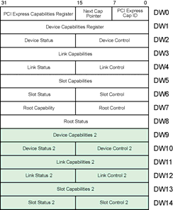
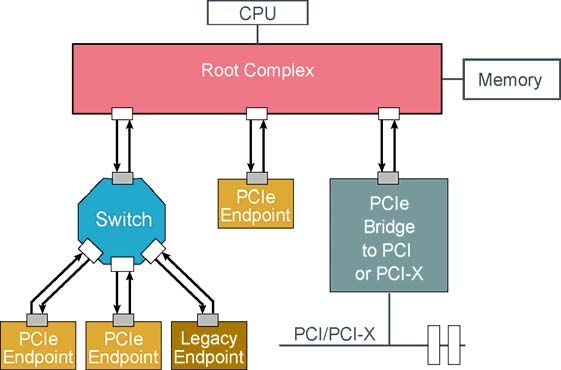

# 第4章：地址空间与事务路由

> 来源：《PCI Express Technology 3.0》
> 原文章节：Chapter 4: Address Space & Transaction Routing

---

## 4.1 地址空间概述

PCIe继承了PCI的三种地址空间模型，并进行了扩展以支持更高的性能和更大的地址范围。

### 4.1.1 PCIe地址空间类型

PCIe定义了三种独立的地址空间：

1. **内存空间（Memory Space）**
   - 用于内存映射I/O（MMIO）
   - 支持32位和64位地址
   - 主要的数据传输机制

2. **I/O空间（I/O Space）**
   - 用于遗留兼容性
   - 仅支持32位地址
   - 在原生PCIe设备中已弃用

3. **配置空间（Configuration Space）**
   - 用于设备配置和枚举
   - 每个功能4KB（256字节PCI兼容 + 3840字节扩展）
   - 只能通过配置事务访问

**图4-1：PCIe地址空间映射**



*原文图示：地址空间*


```
+------------------------+ 0xFFFFFFFFFFFFFFFF
|                        |
|   64位内存空间         | 可预取内存区域
|   (Prefetchable)       |
|                        |
+------------------------+ 
|                        |
|   64位内存空间         | 不可预取内存区域
|   (Non-Prefetchable)   |
|                        |
+------------------------+ 0x100000000 (4GB)
|                        |
|   32位内存空间         | 可预取内存区域
|   (Prefetchable)       |
|                        |
+------------------------+ 
|                        |
|   32位内存空间         | 不可预取内存区域
|   (Non-Prefetchable)   |
|                        |
+------------------------+ 0x00000000

+------------------------+ 0xFFFFFFFF
|   I/O空间              | 遗留I/O空间
|   (32位)               | 0x00000000 - 0xFFFFFFFF
+------------------------+ 

+------------------------+ 
|   配置空间             | 每个功能4KB
|   (4KB/功能)           | 256个总线 × 32设备 × 8功能
+------------------------+ 
```

### 4.1.2 地址空间特性对比

| 特性 | 内存空间 | I/O空间 | 配置空间 |
|-----|---------|---------|---------|
| 地址宽度 | 32/64位 | 32位 | 通过ID路由 |
| 主要用途 | 数据传输 | 遗留兼容 | 设备配置 |
| 缓存 | 可缓存 | 不可缓存 | 不可缓存 |
| 预取 | 支持 | 不支持 | 不支持 |
| 原生PCIe | 主要机制 | 已弃用 | 必需 |

---

## 4.2 基址寄存器（BAR）

### 4.2.1 BAR概述

**基址寄存器（Base Address Register, BAR）**是PCIe设备用来向系统软件报告其内存和I/O空间需求的机制。每个PCIe功能可以实现多达6个BAR（Type 0头部）。

**图4-2：BAR寄存器结构**



*原文图示：内存地址路由*


```
Bit 31/63                              Bit 3   Bit 2-1   Bit 0
+--------------------------------------+--------+---------+------+
|              基址（Base Address）      | 预取位 | 类型    | 空间 |
|                                      |        |         | 指示 |
+--------------------------------------+--------+---------+------+

Bit 0 - 空间指示器（Space Indicator）:
        0 = 内存空间
        1 = I/O空间

Bit 2:1 - 内存类型（仅内存BAR）:
        00 = 32位
        10 = 64位
        01 = 保留（1MB以下，PCI遗留）
        11 = 保留

Bit 3 - 预取位（Prefetchable）:
        0 = 不可预取
        1 = 可预取
```

### 4.2.2 BAR编程过程

BAR的编程遵循特定的协议，软件通过"写入全1再读取"的方式来确定BAR的大小：

**步骤1：读取原始值**
```
软件读取BAR寄存器，保存原始值
```

**步骤2：写入全1**
```
软件向BAR写入0xFFFFFFFF（32位）或0xFFFFFFFFFFFFFFFF（64位）
```

**步骤3：读取大小掩码**
```
软件再次读取BAR，获取大小掩码
- 低位的1表示可编程位（决定大小）
- 高位返回设备地址需求
```

**步骤4：恢复原始值**
```
软件将原始值写回BAR
```

**步骤5：编程基址**
```
软件分配适当大小的对齐地址，写入BAR
```

**图4-3：BAR大小探测示例**


*原文图示：IO地址路由*


```
示例：设备需要64KB内存空间

初始状态:
BAR = 0x00000000 (未初始化)

步骤2 - 写入全1:
BAR = 0xFFFFFFFF

步骤3 - 读取掩码:
BAR = 0xFFFF0000  <-- 低16位为1，表示64KB对齐需求
                     高16位保留

计算大小:
可编程位 = 16位
大小 = 2^16 = 64KB

步骤5 - 编程基址:
软件分配0xF0000000
BAR = 0xF0000000  <-- 设备现在响应0xF0000000-0xF000FFFF
```

### 4.2.3 可预取与不可预取内存

**可预取内存（Prefetchable Memory）**
- 允许推测性读取和缓存
- 读取无副作用（幂等）
- 通常用于帧缓冲区等
- 示例：显卡显存

**不可预取内存（Non-Prefetchable）**
- 读取可能有副作用
- 不能进行推测性访问
- 用于设备控制寄存器
- 示例：控制/状态寄存器

**图4-4：内存类型对比**


*原文图示：配置地址路由*


```
可预取内存访问:
CPU → 读取地址A → 可缓存 → 后续读取可能从缓存获取
     ↓
    允许预取A+1, A+2等

不可预取内存访问:
CPU → 读取地址A → 不缓存 → 每次必须访问设备
     ↓
    不允许预取（可能有副作用）
```

### 4.2.4 Linux内核BAR处理

```c
// drivers/pci/probe.c

/**
 * __pci_read_base - 读取PCI BAR
 * @dev: PCI设备
 * @type: BAR类型
 * @res: 资源缓冲区
 * @pos: 配置空间中BAR位置
 *
 * 返回1表示64位BAR，0表示32位BAR
 */
int __pci_read_base(struct pci_dev *dev, enum pci_bar_type type,
            struct resource *res, unsigned int pos)
{
    u32 l = 0, sz = 0, mask;
    u64 l64, sz64, mask64;

    // 读取原始值
    pci_read_config_dword(dev, pos, &l);
    
    // 写入全1以探测大小
    pci_write_config_dword(dev, pos, l | mask);
    pci_read_config_dword(dev, pos, &sz);
    
    // 恢复原值
    pci_write_config_dword(dev, pos, l);

    // 计算BAR大小
    sz64 = pci_size(l64, sz64, mask64);
    
    // 处理64位BAR
    if (res->flags & IORESOURCE_MEM_64) {
        pci_read_config_dword(dev, pos + 4, &l);
        pci_write_config_dword(dev, pos + 4, ~0);
        pci_read_config_dword(dev, pos + 4, &sz);
        pci_write_config_dword(dev, pos + 4, l);
        
        l64 |= ((u64)l << 32);
        sz64 |= ((u64)sz << 32);
    }
}

/**
 * pci_size - 计算BAR大小
 */
static u64 pci_size(u64 base, u64 maxbase, u64 mask)
{
    u64 size = mask & maxbase;
    if (!size)
        return 0;
    
    // 找到最低有效位
    size = size & ~(size-1);
    
    return size;
}
```

---

## 4.3 桥接器地址窗口

### 4.3.1 Base/Limit寄存器

PCIe桥接器（包括交换机端口）使用Base/Limit寄存器来定义其下游的地址范围。这些寄存器允许桥接器：
- 确定哪些事务需要向下游转发
- 配置地址转换和路由

**Type 1配置头部中的地址窗口寄存器：**

```
偏移0x20: 内存基址/限制寄存器（I/O基址/限制高16位）
偏移0x24: 可预取内存基址/限制寄存器
偏移0x28: 可预取内存基址高32位
偏移0x2C: 可预取内存限制高32位
偏移0x30: I/O基址/限制高16位
```

**图4-5：桥接器内存窗口**


*原文图示：消息路由*


```
上游端口                    桥接器                     下游总线
    |                          |                           |
    |  TLP (地址=X)            |                           |
    |------------------------->|                           |
    |                          | 检查X是否在Base/Limit内   |
    |                          |                           |
    |                          | 是: 转发到下游            |
    |                          | 否: 忽略                  |
    |                          |                           |
    |                          |------------------------->|

Base/Limit寄存器定义的范围:
+------------------+
|  内存窗口        |  <-- 内存基址/限制寄存器
|  (非可预取)      |
+------------------+
|  I/O窗口         |  <-- I/O基址/限制寄存器
+------------------+
|  可预取内存窗口  |  <-- 可预取内存基址/限制寄存器
+------------------+
```

### 4.3.2 地址窗口编程

桥接器的地址窗口通常在枚举过程中由系统软件配置：

1. **扫描下游设备**：发现所有设备的BAR
2. **计算总需求**：累加所有BAR的大小
3. **分配地址范围**：在系统地址空间中分配连续区域
4. **编程Base/Limit**：将范围写入桥接器寄存器

**图4-6：地址窗口分配示例**

```
系统地址空间:
0x00000000 --------------------------------------------------
          |                                                |
          |   其他系统内存                                  |
          |                                                |
0xE0000000 --------------------------------------------------
          |                                                |
          |   桥接器0窗口 (64MB)                           |
          |   Base=0xE0000000, Limit=0xE3FFFFFF            |
          |   +----------------------------------------+   |
          |   |  设备0 BAR0: 0xE0000000 (16MB)         |   |
          |   |  设备1 BAR0: 0xE1000000 (32MB)         |   |
          |   |  设备2 BAR0: 0xE3000000 (16MB)         |   |
          |   +----------------------------------------+   |
          |                                                |
0xE4000000 --------------------------------------------------
          |                                                |
          |   桥接器1窗口 (128MB)                          |
          |   Base=0xE4000000, Limit=0xEBFFFFFF            |
          |                                                |
0xEC000000 --------------------------------------------------
```

---

## 4.4 事务类型

### 4.4.1 发布式与非发布式事务

PCIe定义了两类事务：

**发布式事务（Posted Transactions）**
- 请求者发送TLP后不等待完成
- 提高总线效率
- 包括：内存写入、消息

**非发布式事务（Non-Posted Transactions）**
- 请求者必须等待完成TLP
- 包括：内存读取、I/O读写、配置读写

**图4-7：事务类型对比**

```
发布式写入:
请求者                    完成者
   |---- MWr TLP -------->|
   |                      |
   |  立即继续            |
   |  无需等待            |
   v                      v

非发布式读取:
请求者                    完成者
   |---- MRd TLP -------->|
   |                      |
   |<--- CplD TLP --------|
   |                      |
   v  必须等待完成        v
```

### 4.4.2 事务排序规则

PCIe继承了PCI的事务排序模型，确保数据一致性：

**排序规则（Strict Ordering）**
- 同一路径上的写入按顺序完成
- 读取操作按顺序完成
- 写入后读取需要等待写入完成

**宽松排序（Relaxed Ordering）**
- 允许某些事务乱序完成
- 需要软件确保正确性
- 提高性能但增加复杂性

**图4-8：事务排序示例**

```
严格排序:
请求者                    完成者
   |---- MWr A ---------->|
   |---- MWr B ---------->|
   |                      |
   |  B必须在A之后完成    |
   |                      |
   v                      v

宽松排序:
请求者                    完成者
   |---- MWr A ---------->|
   |---- MWr B ---------->|
   |                      |
   |  B可以在A之前完成    |
   |  (如果设置了RO位)    |
   |                      |
   v                      v
```

---

## 4.5 流量控制（Flow Control）

### 4.5.1 流量控制概述

PCIe使用基于信用的流量控制机制，确保接收器有足够缓冲区才发送数据：

**流量控制优点：**
- 消除PCI的重试和断开
- 提高总线效率
- 避免接收器溢出

### 4.5.2 流量控制机制

**初始化：**
1. 接收器向发送器报告可用缓冲区大小（信用）
2. 发送器维护信用计数器
3. 发送TLP时消耗相应信用

**信用更新：**
- 接收器处理TLP后释放缓冲区
- 发送FC DLLP更新信用
- 发送器增加信用计数器

**图4-9：流量控制机制**

```
发送器                  接收器
   |                      |
   |---- TLP ------------>|
   |    (消耗信用)        |
   |                      |
   |<--- FC DLLP ---------|
   |    (信用更新)        |
   |                      |
   |---- TLP ------------>|
   |    (有可用信用)      |
   |                      |
   v                      v

信用计数器:
初始: 信用 = 10
发送TLP: 信用 = 9
发送TLP: 信用 = 8
...
接收FC DLLP (+2): 信用 = 10
```

### 4.5.3 流量控制类型

PCIe为不同类型的事务维护独立的信用池：

| 信用类型 | 描述 | TLP类型 |
|---------|------|---------|
| Posted Header | 发布式头缓冲区 | MWr, Msg |
| Posted Data | 发布式数据缓冲区 | MWr, MsgD |
| Non-Posted Header | 非发布式头缓冲区 | MRd, IORd, IOWr, CfgRd, CfgWr |
| Non-Posted Data | 非发布式数据缓冲区 | IOWr, CfgWr |
| Completion Header | 完成头缓冲区 | Cpl, CplD |
| Completion Data | 完成数据缓冲区 | CplD |

---

## 4.6 事务路由

### 4.6.1 ID路由

**概述**

**ID路由**用于配置请求和完成TLP。它使用BDF（Bus/Device/Function）三元组来标识目标设备。

**ID路由中的关键TLP头字段**

如果接收的TLP中的类型字段指示要使用ID路由，则使用头中的ID字段（总线、设备、功能）来执行路由检查。有两种情况：使用3DW头的ID路由和使用4DW头的ID路由（仅在消息中可能）。

**端点：一次检查**

对于ID路由，端点只需将数据包头中的ID字段与其自己的BDF进行比较。每次在其链路上看到Type 0配置写入时，每个功能从TLP头的字节8-9"捕获"其自己的总线和设备号。捕获的总线和设备号信息应存储在哪里未指定，只是功能必须保存它。保存的总线和设备号在端点发起的TLP请求中用作请求者ID，以便该请求的完成者可以在完成数据包中包含请求者ID值。完成数据包中的请求者ID用于路由完成。

**交换机（桥接器）：每个端口两次检查**

对于ID路由的TLP，交换机端口首先检查它是否是预期目标，通过将TLP头中的目标ID与其自己的BDF进行比较。与端点一样，每个交换机端口每次在其上游端口检测到配置写入（Type 0）时捕获其自己的总线和设备号。如果TLP中的目标ID字段与交换机端口的ID一致，它就消耗该数据包。如果ID字段不匹配，它然后检查TLP是否针对此交换机端口下方的设备。它通过检查次要和下属总线号寄存器来执行此操作，以查看TLP中的目标总线号是否在此范围内（包括边界）。如果是，则TLP应向下游转发。

如果上游端口确定它接收的TLP是针对其下方某个设备的（因为目标总线号在其次要-下属总线号范围内），则它向下游转发，交换机的所有下游端口执行相同的检查。每个下游端口检查TLP是否针对它们。如果是，目标端口将消耗TLP，其他端口忽略它。如果不是，所有下游端口检查TLP是否针对其端口下方的设备。返回true的那个端口将TLP转发到其次要总线，其他下游端口忽略TLP。

在本节中，重要的是要记住交换机上的每个端口都是一个桥接器，因此有自己的配置空间和Type 1头。实际上，每个端口（每个P2P桥接器）都有自己的Type 1头，并在其端口看到TLP时执行相同的两次检查。

### 4.6.2 地址路由

#### 概述

**地址路由**用于内存和IO请求。它类似于PCI和PCI-X协议中用于内存和IO事务的路由方法。由于PCIe拓扑由点对点链路组成，而不是共享总线，因此设备需要知道它们下方存在哪些地址范围，以便它们可以确定哪些请求应该向下游转发。

#### 地址路由中的关键TLP头字段

TLP头中的地址字段用于确定数据包的目标。对于内存请求，地址可以是32位或64位。对于IO请求，地址始终为32位。

**端点地址检查**

对于地址路由，端点只需将数据包头中的地址与其BAR中编程的地址范围进行比较。如果地址落在其某个BAR的范围内，端点将接受该请求。

**交换机路由**

交换机必须检查传入TLP中的地址，以确定它是否针对其下方存在的地址范围。这是通过将TLP中的地址与交换机端口的Base/Limit寄存器中编程的地址范围进行比较来完成的。

**向下游传播的TLP（在主接口上接收）**

当交换机的上游端口从根复合体方向接收TLP时，它必须确定TLP是否针对交换机本身或交换机下方的某个设备。如果TLP针对交换机本身（即，地址匹配交换机的BAR之一），交换机将消耗该数据包。如果TLP不针对交换机，交换机检查地址是否在其次要-下属总线范围内配置的任何Base/Limit寄存器范围内。如果是，TLP将转发到适当的下游端口。

**向上游传播的TLP（在次接口上接收）**

当交换机的下游端口接收TLP时，它必须确定TLP是否针对交换机本身或其上游的设备。如果TLP针对交换机本身，交换机将消耗该数据包。如果TLP不针对交换机，它将向上游转发到根复合体。

### 4.6.3 隐式路由

#### 概述

**隐式路由**仅用于消息。在隐式路由中，既不使用地址也不使用ID来路由数据包；相反，数据包基于消息代码路由到拓扑中的已知位置。

#### 隐式路由中的关键TLP头字段

消息TLP在类型字段中有特定的编码，指示要使用的隐式路由类型。路由子字段（RRR）指示消息的路由方式：

- **000b - 路由到根复合体（Route to Root Complex）**
- **001b - 按地址路由（Route by Address）**
- **010b - 按ID路由（Route by ID）**
- **011b - 来自根复合体的广播（Broadcast from Root Complex）**
- **100b - 本地 - 在接收者处终止（Local - terminate at receiver）**
- **101b - 收集并路由到根复合体（Gather and route to Root Complex）**
- **110b - 保留（Reserved）**
- **111b - 保留（Reserved）**

**端点处理**

端点仅接受针对它们的消息。如果消息使用隐式路由到根复合体（000b），端点将向上游转发它。如果消息是从根复合体广播的（011b），端点将接受它。

**交换机处理**

交换机根据消息的路由代码处理消息：
- 对于路由到根复合体的消息，交换机向上游转发。
- 对于从根复合体广播的消息，交换机向下游转发到所有端口。
- 对于本地消息，交换机在接收端口处终止。

---

## 4.7 Linux内核路由实现

### 4.7.1 地址分配

```c
// drivers/pci/bus.c

/**
 * pci_bus_alloc_resource - 从父总线分配资源
 * @bus: PCI总线
 * @res: 要分配的资源
 * @size: 资源大小
 * @align: 对齐要求
 * @min: 最小地址
 * @type_mask: 资源类型标志
 */
int pci_bus_alloc_resource(struct pci_bus *bus, struct resource *res,
        resource_size_t size, resource_size_t align,
        resource_size_t min, unsigned long type_mask,
        resource_size_t (*alignf)(void *,
                      const struct resource *,
                      resource_size_t,
                      resource_size_t),
        void *alignf_data)
{
    // 尝试从64位区域分配
    if (res->flags & IORESOURCE_MEM_64) {
        rc = pci_bus_alloc_from_region(bus, res, size, align, min,
                       type_mask, alignf, alignf_data,
                       &pci_high);
        if (rc == 0)
            return 0;
    }
    
    // 回退到32位区域
    return pci_bus_alloc_from_region(bus, res, size, align, min,
                     type_mask, alignf, alignf_data,
                     &pci_32_bit);
}
```

### 4.7.2 桥窗口配置

```c
// drivers/pci/setup-bus.c

static void pci_setup_bridge_io(struct pci_bus *bus)
{
    struct pci_dev *bridge = bus->self;
    struct resource *res;
    
    // 配置I/O窗口
    res = bus->resource[0];  // I/O基址
    if (res) {
        pcibios_io_base = res->start;
        pci_write_config_dword(bridge, PCI_IO_BASE,
            ((res->start >> 8) & 0xF0) | ((res->end >> 8) & 0xF000));
    }
}

static void pci_setup_bridge_mmio(struct pci_bus *bus)
{
    struct pci_dev *bridge = bus->self;
    struct resource *res;
    
    // 配置内存窗口
    res = bus->resource[1];  // 内存基址
    if (res) {
        pci_write_config_word(bridge, PCI_MEMORY_BASE,
            (res->start >> 16) & 0xFFF0);
        pci_write_config_word(bridge, PCI_MEMORY_LIMIT,
            (res->end >> 16) & 0xFFF0);
    }
}
```

---

## 4.8 本章总结

本章详细介绍了PCI Express地址空间和事务路由的关键概念：

1. **三种地址空间**：PCIe支持配置空间、内存空间和IO空间。配置空间用于设备控制和状态报告；内存空间（MMIO）是访问设备寄存器的主要方法；IO空间仅用于遗留兼容性。

2. **BAR机制**：设备使用基址寄存器（BAR）向系统软件请求地址空间。软件通过向BAR写入全1然后读取来确定请求的大小和类型，然后编程分配的起始地址。

3. **Base/Limit寄存器**：桥接设备使用这些寄存器来了解其下游存在的地址范围，从而正确路由传入的TLP。

4. **三种路由方法**：
   - **地址路由**：用于内存和IO请求
   - **ID路由**：用于配置请求和完成
   - **隐式路由**：用于消息

5. **发布式与非发布式事务**：内存写入是发布式的（无需完成），而读取、IO和配置事务是非发布式的（需要完成）。

6. **可预取与不可预取内存**：可预取内存允许推测性读取缓存，而不可预取内存可能有读取副作用。

7. **流量控制**：基于信用的机制确保接收器有足够缓冲区才接收数据，消除了PCI的重试机制。

---

## 术语表参考

本章涉及的关键术语：

| 英文术语 | 中文翻译 |
|----------|----------|
| Address Space | 地址空间 |
| Base Address Register (BAR) | 基址寄存器 |
| Configuration Space | 配置空间 |
| Endpoint | 端点 |
| Flow Control | 流量控制 |
| ID Routing | ID路由 |
| Implicit Routing | 隐式路由 |
| Memory-Mapped IO (MMIO) | 内存映射IO |
| Message | 消息 |
| Non-Prefetchable Memory | 不可预取内存 |
| Posted Transaction | 发布式事务 |
| Prefetchable Memory | 可预取内存 |
| Relaxed Ordering | 宽松排序 |
| Root Complex | 根复合体 |
| Strict Ordering | 严格排序 |
| Switch | 交换机 |
| Transaction Layer Packet (TLP) | 事务层数据包 |

---

## 4.8 Linux内核实现参考（平台特定补充）

### 4.8.1 飞腾PCIe EP的BAR实现

飞腾PCIe EP控制器实现了完整的BAR机制，与本书第4章介绍的BAR格式完全一致。

#### BAR寄存器映射

```c
// 来自 drivers/pci/controller/pcie-phytium-register.h
#define PHYTIUM_PCI_BAR_0           0xe4
#define PHYTIUM_PCI_BAR(bar_num)    (0xe4 + bar_num * 4)
#define  BAR_IO_TYPE                (1 << 0)   // IO空间（对应4.2节）
#define  BAR_MEM_TYPE               (0 << 0)   // 存储器空间
#define  BAR_MEM_64BIT              (1 << 2)   // 64-bit BAR
#define  BAR_MEM_PREFETCHABLE       (1 << 3)   // 可预取
```

**与书中图4-2的对应**：

书中BAR格式：
```
Bit 0: 0=Memory, 1=IO
Bit 1: Reserved (0)
Bit 2: 0=32-bit, 1=64-bit
Bit 3: 0=Non-prefetchable, 1=Prefetchable
Bits 4-31: Base Address
```

飞腾宏定义完全对应：
- `BAR_IO_TYPE` (bit 0) ←→ 书中IO Space指示
- `BAR_MEM_64BIT` (bit 2) ←→ 书中64-bit指示
- `BAR_MEM_PREFETCHABLE` (bit 3) ←→ 书中Prefetchable指示

#### BAR设置代码实现

```c
// 来自 drivers/pci/controller/pcie-phytium-ep.c
static int phytium_pcie_ep_set_bar(struct pci_epc *epc, u8 fn,
                                   struct pci_epf_bar *epf_bar)
{
    struct phytium_pcie_ep *priv = epc_get_drvdata(epc);
    u64 sz = 0, sz_mask, atr_size;
    int flags = epf_bar->flags;
    u32 setting, trsl_param;
    enum pci_barno barno = epf_bar->barno;
    
    // 判断BAR类型（对应4.2节BAR类型）
    if ((flags & PCI_BASE_ADDRESS_SPACE) == PCI_BASE_ADDRESS_SPACE_IO) {
        // IO空间BAR
        setting = BAR_IO_TYPE;
        sz = max_t(size_t, epf_bar->size, BAR_IO_MIN_APERTURE);
        sz = 1 << fls64(sz - 1);
        sz_mask = ~(sz - 1);
        setting |= sz_mask;
        trsl_param = TRSL_ID_IO;
    } else {
        // 存储器空间BAR
        setting = BAR_MEM_TYPE;
        sz = max_t(size_t, epf_bar->size, BAR_MEM_MIN_APERTURE);
        sz = 1 << fls64(sz - 1);
        sz_mask = ~(sz - 1);
        setting |= lower_32_bits(sz_mask);
        
        // 64-bit BAR（对应4.2节64-bit BAR）
        if (flags & PCI_BASE_ADDRESS_MEM_TYPE_64)
            setting |= BAR_MEM_64BIT;
        
        // 可预取BAR（对应4.2节Prefetchable）
        if (flags & PCI_BASE_ADDRESS_MEM_PREFETCH)
            setting |= BAR_MEM_PREFETCHABLE;
        
        trsl_param = TRSL_ID_MASTER;
    }
    
    // 写入BAR寄存器
    phytium_pcie_writel(priv, fn, PHYTIUM_PCI_BAR(barno), setting);
    
    // 64-bit BAR的高32位
    if (flags & PCI_BASE_ADDRESS_MEM_TYPE_64)
        phytium_pcie_writel(priv, fn, PHYTIUM_PCI_BAR(barno + 1),
                            upper_32_bits(sz_mask));
    
    // 配置地址转换（ATR）
    atr_size = fls64(sz - 1) - 1;
    src_addr0 = ATR_IMPL | ((atr_size & ATR_SIZE_MASK) << ATR_SIZE_SHIFT);
    trsl_addr0 = (lower_32_bits(epf_bar->phys_addr) & TRSL_ADDR_32_12_MASK);
    trsl_addr1 = upper_32_bits(epf_bar->phys_addr);
    
    // 写入地址转换寄存器
    phytium_pcie_writel(priv, fn, PHYTIUM_PCI_WIN0_SRC_ADDR0(barno), src_addr0);
    phytium_pcie_writel(priv, fn, PHYTIUM_PCI_WIN0_TRSL_ADDR0(barno), trsl_addr0);
    phytium_pcie_writel(priv, fn, PHYTIUM_PCI_WIN0_TRSL_ADDR1(barno), trsl_addr1);
    phytium_pcie_writel(priv, fn, PHYTIUM_PCI_WIN0_TRSL_PARAM(barno), trsl_param);
    
    return 0;
}
```

#### 与书中内容的对应

1. **BAR类型判断**（对应4.2节）：
   - 书中介绍的IO/Memory类型判断在代码中通过`PCI_BASE_ADDRESS_SPACE`标志检查
   - 64-bit和Prefetchable标志检查与书中描述一致

2. **地址转换**（对应4.6节地址路由）：
   - 飞腾实现ATR（Address Translation）机制
   - `PHYTIUM_PCI_WIN0_SRC_ADDR`对应PCIe地址
   - `PHYTIUM_PCI_WIN0_TRSL_ADDR`对应本地物理地址
   - 实现了书中介绍的地址路由功能

3. **BAR清除**（对应4.2节BAR响应）：
   ```c
   static void phytium_pcie_ep_clear_bar(struct pci_epc *epc, u8 fn,
                                         struct pci_epf_bar *epf_bar)
   {
       // 清除BAR寄存器（对应书中BAR响应0）
       phytium_pcie_writel(priv, fn, PHYTIUM_PCI_BAR(barno), 0);
       if (flags & PCI_BASE_ADDRESS_MEM_TYPE_64)
           phytium_pcie_writel(priv, fn, PHYTIUM_PCI_BAR(barno + 1), 0);
       
       // 清除地址转换
       phytium_pcie_writel(priv, fn, PHYTIUM_PCI_WIN0_SRC_ADDR0(barno), 0);
       // ...
   }
   ```

### 4.8.2 地址窗口配置

飞腾PCIe EP支持多个地址转换窗口：

```c
// 地址窗口寄存器定义
#define PHYTIUM_PCI_WIN0_BASE           0x600
#define PHYTIUM_PCI_WIN0_SRC_ADDR0(table)   (PHYTIUM_PCI_WIN0_BASE + 0X20 * table + 0x0)
#define PHYTIUM_PCI_WIN0_TRSL_ADDR0(table)  (PHYTIUM_PCI_WIN0_BASE + 0X20 * table + 0x8)
#define PHYTIUM_PCI_WIN0_TRSL_PARAM(table)  (PHYTIUM_PCI_WIN0_BASE + 0X20 * table + 0x10)
```

**与书中4.4节的对应**：
- 书中介绍的Base/Limit寄存器在飞腾实现中对应`SRC_ADDR`和`TRSL_ADDR`寄存器
- 支持多个窗口（由`table`参数索引），对应书中介绍的多个地址范围

### 4.8.3 实际应用建议

**BAR调试技巧**：
1. 使用`cat /sys/bus/pci/devices/.../resource`查看BAR分配
2. 检查BAR值是否与书中4.2节描述的格式一致
3. 验证地址转换是否正确配置

**性能优化**：
- 对于大容量存储器，使用64-bit BAR（对应4.2节64-bit BAR）
- 对于只读存储器，设置Prefetchable位（对应4.2节Prefetchable）
- 合理配置地址窗口大小，避免地址空间浪费

---

**翻译完成**

*本翻译基于MindShare《PCI Express Technology 3.0》第4章内容，并补充了飞腾平台BAR实现参考，保留所有技术术语的准确性。*

---

## 本章图片附录

以下是本章相关的原文图片：


### img-044.png


### img-045.jpg


### img-046.jpg


### img-047.jpg


### img-048.jpg


