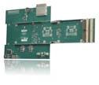

# 第7章 服务质量 (Quality of Service)

## 本章内容来源

本翻译基于《PCI Express Technology 3.0》第7章"Quality of Service"（约第245-284页）。

---

## 7.1 动机 (Motivation)

PCI Express架构的一个关键优势是其对服务质量（Quality of Service, QoS）的支持。QoS机制允许系统为不同类型的流量分配不同的优先级，确保时间敏感的数据（如音频、视频流）能够获得所需的带宽和延迟保证。

PCIe通过以下基本元素实现QoS：
- **流量类别（Traffic Class, TC）**：定义数据包的优先级
- **虚拟通道（Virtual Channel, VC）**：提供独立的传输路径
- **仲裁机制**：管理多个VC或端口之间的访问顺序

---

## 7.2 基本元素 (Basic Elements)

### 7.2.1 流量类别（Traffic Class, TC）

我们需要一种方法来区分流量——某种能够识别哪些数据包具有高优先级的机制。这通过指定**流量类别（TC）**来实现，TC定义了8个优先级，由每个TLP（事务层包）头中的3位TC字段指定（优先级从低到高：TC 0-7）。

**图7-2：TLP头中的流量类别字段**


*原文图示：VC仲裁*


```
Byte 0:  | Fmt[2:0] | Type[4:0] | R | TC[2:0] | ...
         |  7:5     |   4:0     | 1 |  6:4    |

Byte 1:  | ... | Attr[2] | TH | TD | EP | Attr[1:0] | AT[1:0] | ...

Byte 4-5: Requester ID[15:0]
Byte 6:   Tag[7:0]
Byte 8-11: Address[31:2]
```

在初始化期间，设备驱动程序与等时管理软件通信所需的服务级别，后者返回每种数据包类型应使用的适当TC值。然后驱动程序为数据包分配正确的TC优先级。TC值默认为零，因此不需要优先级服务的数据包不会意外干扰需要优先级的数据包。

不了解PCIe的配置软件将无法识别新寄存器，将对所有事务使用默认的TC0/VC0组合。此外，某些数据包始终需要使用TC0/VC0，包括配置、I/O和消息事务。如果将这些数据包视为维护级流量，那么它们需要被限制在VC0中，并远离高优先级数据包的路径，这是合理的。

### 7.2.2 虚拟通道（Virtual Channels, VCs）

**虚拟通道（VC）**是硬件缓冲区，充当传出数据包的队列。每个端口必须包含默认的VC0，但可以有最多8个（从VC0到VC7）。每个通道代表传出数据包可用的不同路径。

使用多条路径的动机类似于收费公路：驾驶员购买无线标签，可以在收费站使用几条高优先级车道之一。没有购买标签的人仍然可以使用道路，但他们必须在收费站停车并每次支付现金，这需要更长时间。如果只有一条路径，每个人的访问时间都将受到最慢驾驶员的限制，但有多条路径可用意味着有优先级的人不会被没有优先级的人延迟。

### 7.2.3 将TC分配给每个VC — TC/VC映射

分配给每个数据包的流量类别值在到达目的地之前保持不变，必须在遍历到目标的路径上的每个服务点映射到VC。VC映射特定于一条链路（Link），可以从一条链路改变到另一条链路。配置软件在初始化期间使用VC资源控制寄存器中的TC/VC映射字段建立此关联。

这个8位字段允许将TC值映射到选定的VC，其中每个位位置代表相应的TC值（位0 = TC0，位1 = TC1，等等）。设置一个位将相应的TC值分配给VC ID。

**图7-3：TC到VC映射示例**



*原文图示：端口仲裁*


```
VC3资源控制寄存器：
- VC ID: 3
- TC/VC Map: 0b00011100 (TC2、TC3、TC4映射到VC3)

VC0资源控制寄存器：
- VC ID: 0  
- TC/VC Map: 0b00000011 (TC0、TC1映射到VC0)
```

软件在分配VC ID和映射TC方面有很大的灵活性，但关于TC/VC映射有一些规则：

1. **同一链路两端端口的TC/VC映射必须相同**
2. **TC0将自动映射到VC0**
3. **其他TC可以映射到任何VC**
4. **一个TC不能映射到多个VC**

使用的虚拟通道数量取决于连接到给定链路的两个设备共享的最大能力。软件为每个VC分配一个ID，并将一个或多个TC映射到VC。

### 7.2.4 确定要使用的VC数量

软件检查连接到公共链路的设备支持的VC数量，通常将分配两个设备都能支持的最大VC数量。

**图7-4：设备支持的多个VC示例**

```
                    Root Complex
                         |
                    [8 VCs supported]
                         |
                      Switch
                    /    |    \
                   /     |     \
            Port A    Port B    Port C
           [8 VCs]   [8 VCs]   [8 VCs]
              |         |         |
          Device A   Device B   Device C
          [1 VC]     [4 VCs]    [8 VCs]
```

在这个例子中，交换机在它的每个端口上都支持全部8个VC，而设备A只支持默认的VC0，设备B支持4个VC，设备C支持8个VC。注意，即使交换机端口A支持全部8个VC，设备A只支持VC0，因此交换机端口A中有7个VC未被使用。同样，交换机端口B只使用了4个VC。

配置软件通过读取虚拟通道能力寄存器中的扩展VC计数字段来确定每个端口接口支持的最大VC数量。软件检查链路两端的扩展VC计数，并选择最高的公共计数。不过，使用所有可用的VC不是强制性的，软件也可以选择启用较少的VC。

### 7.2.5 分配VC编号（ID）

配置软件为每个VC分配一个编号（ID），除了VC0始终是硬连线的。VC能力寄存器为每个VC包含12字节的配置寄存器。第一组寄存器始终适用于VC0。扩展VC计数字段定义了此端口实现的额外VC数量，每个额外VC都有一组寄存器。

软件通过VC ID字段为每个额外VC分配一个编号。这些ID不需要连续，但每个编号只能使用一次。

---

## 7.3 VC仲裁 (VC Arbitration)

### 7.3.1 概述

如果设备有多个VC且它们都有数据包准备发送，**VC仲裁**决定数据包传输的顺序。软件可以从硬件实现的选项中选择几种方案中的任何一种。目标是实现所需的服务策略，并确保所有事务都在向前推进，以防止意外的超时。

此外，VC仲裁受与流量控制和事务排序相关的要求影响。每个支持的VC提供自己的缓冲区和流量控制。映射到同一VC的事务通常按严格顺序传递（尽管有例外，例如当数据包设置了"宽松排序"属性位时）。事务排序仅适用于VC内部，因此分配给不同VC的数据包之间没有排序关系。

VC能力寄存器提供三种基本VC仲裁方法：

1. **严格优先级仲裁（Strict Priority Arbitration）**：编号最高的有数据包准备的VC总是获胜
2. **分组仲裁（Group Arbitration）**：VC被硬件分为一个低优先级组和一个高优先级组
3. **硬件固定仲裁（Hardware Fixed Arbitration）**：内置在硬件中的方案

### 7.3.2 严格优先级VC仲裁

默认的优先级方案基于VC ID的固有优先级（VC0 = 最低优先级，VC7 = 最高优先级）。这种机制是自动的，不需要配置。

**图7-7：严格优先级仲裁**

```
VC资源          优先级顺序
--------        ------------
第8个 VC  ->    VC7    最高
第7个 VC  ->    VC6
第6个 VC  ->    VC5
第5个 VC  ->    VC4
第4个 VC  ->    VC3
第3个 VC  ->    VC2
第2个 VC  ->    VC1
第1个 VC  ->    VC0    最低
```

严格优先级要求编号较高的VC始终优先于较低优先级的VC。例如，如果所有8个VC都受严格优先级控制，那么只有当没有其他VC有待处理的数据包时，才能发送VC0中的数据包。这实现了为最高优先级数据包提供非常高的带宽和最小延迟的目标。

然而，严格优先级有可能使低优先级通道缺乏带宽，因此必须注意确保这种情况不会发生。规范要求调节高优先级流量以避免饥饿，并给出了两种可能的调节方法：

1. 源端口可以限制高优先级数据包的注入速率，为较低优先级事务留出更多带宽
2. 交换机可以在出口端口调节多个流量流。这种方法可能会限制试图超过可用带宽限制的高带宽应用和设备的吞吐量

### 7.3.3 分组仲裁

低优先级扩展VC计数字段指定一个VC ID，用于标识此设备的低优先级仲裁组的上限。例如，如果此值为4，则VC0-VC4是低优先级组的成员，VC5-VC7在高优先级组中。注意，低优先级扩展VC计数为7意味着不使用严格优先级。

**图7-10：VC仲裁优先级**


*原文图示：TC和VC*


```
VC资源    VC ID      分割优先级
--------  ------     ------------------
第8个 VC   VC7  ->   最高
第7个 VC   VC6  ->   高优先级（严格优先级方案）
第6个 VC   VC5  ->   
第5个 VC   VC4  ->   低优先级VC ID = 4
第4个 VC   VC3  ->   低优先级（替代优先级方案）
第3个 VC   VC2  ->   （由软件选择）
第2个 VC   VC1  ->   
第1个 VC   VC0  ->   最低
```

高优先级VC继续使用严格优先级仲裁，而低优先级仲裁组使用设备支持的其他仲裁方法之一。VC能力寄存器2报告该组支持的替代方法，VC控制寄存器允许选择要使用的方法。

低优先级仲裁方案包括：
- **基于硬件的固定仲裁**
- **加权轮询仲裁（WRR）**

#### 硬件固定仲裁方案

此选择定义了一种基于硬件的方法，不需要额外的软件设置。这种方法可以是硬件设计者选择内置的任何方法，可能基于设备的预期负载或带宽需求。一个简单的例子可能是普通的轮询序列，其中每个VC在轮询期间获得相等的传输机会。

#### 加权轮询仲裁方案

这是一种可以通过在序列中为某些VC提供比其他人更多条目（称为阶段）来加权（给予更高优先级）的方案。规范定义了三种WRR选项，每种具有不同数量的条目。表大小通过将相应值写入端口VC控制寄存器的VC仲裁选择字段来选择。

表中的每个条目代表一个阶段，软件用低优先级VC编号加载。VC仲裁器将以顺序方式重复扫描所有表条目，并从表条目中指定的VC发送数据包。一旦发送了一个数据包，仲裁器立即进入下一个阶段。

**图7-11：WRR VC仲裁表示例（64个条目）**

```
阶段    VC ID    说明
----    -----    ----
  0      VC 4    \
  1      VC 3     \
  2      VC 0      > 第1轮 (阶段0-3)
  3      VC 2     /
  4      VC 4    \
  5      VC 3     \
  6      VC 0      > 第2轮 (阶段4-7)
  7      VC 4     /   <- 注意: VC 2在此轮不出现
  ...    ...
 60      VC 4    \
 61      VC 0     \
 62      VC 3      > 第16轮 (阶段60-63)
 63      VC 2     /

统计:
VC 4: 出现在阶段0,4,7,...,60 = 16个阶段 (25%)
VC 3: 出现在阶段1,5,...,62 = 16个阶段 (25%)
VC 0: 出现在阶段2,6,...,61 = 16个阶段 (25%)
VC 2: 出现在阶段3,...,63 = 16个阶段 (25%)

总计: 64个阶段，每个VC获得16个阶段(25%)的传输机会
```

**注意:** 上表示例展示了64条目WRR仲裁表的一种可能配置。实际阶段分配由软件根据带宽需求编程决定。例如，如果需要给VC 4更高的优先级，可以为其分配32个阶段(50%)，其他VC各分配10-11个阶段。

### 7.3.4 设置虚拟通道仲裁表

VC仲裁表（VAT）在配置空间中的位置以VC能力结构基地址的偏移量给出。

**图7-12：VC仲裁表偏移量和加载VC仲裁表字段**

VAT中的每个条目是一个4位字段，标识在该阶段计划传送数据的缓冲区的VC编号。表长度由所选的仲裁选项确定。

配置软件加载VC仲裁表以实现虚拟通道的所需优先级顺序。每当对表进行任何更改时，硬件都会设置VC仲裁表状态位，为软件提供一种验证是否已进行更改但尚未应用到硬件的方法。加载表后，软件在端口VC控制寄存器中设置加载VC仲裁表位。这会导致硬件将新值加载或应用到VC仲裁器。当表加载完成时，硬件清除VC仲裁表状态位，向软件发出加载完成的信号。

---

## 7.4 端口仲裁 (Port Arbitration)

### 7.4.1 概述

交换机端口和根端口通常会接收需要路由到另一个端口的传入数据包。由于来自多个端口的数据包都可以针对同一出口端口的同一VC，因此需要仲裁来决定哪个传入端口的数据包获得对该VC的下一个访问权。

与VC仲裁一样，端口仲裁有几种可选方案可供配置软件选择。TC、VC和仲裁的组合支持一系列服务级别，分为两大类：

1. **异步（Asynchronous）**：数据包获得"尽力而为"服务，可能根本得不到任何优先权。许多设备和应用（如大容量存储设备）对带宽或延迟没有严格要求，不需要特殊的时序机制。另一方面，由要求更高的应用生成的数据包仍然可以通过为不同数据包建立流量类别层次结构来轻松优先处理。在服务水平需要保证之前，差异化服务仍被视为异步。异步服务始终可用，不需要任何特殊的软件或硬件选项。

2. **等时（Isochronous）**：当需要延迟和带宽保证时，我们进入等时类别。当两个设备之间通常需要同步连接时，这将非常有用。例如，从音乐CD获取数据的CD-ROM在耳机直接插入驱动器时使用同步连接。但是，当音频必须通过PCIe等通用总线路由到外部扬声器时，连接不能是同步的，因为其他流量可能也需要使用相同的数据流。为了实现等效结果，等时服务必须保证时间敏感的音频数据的正确传递，而不会阻止其他流量在同一时间使用链路。毫不奇怪，需要专门的软件和硬件来支持这一点。

**图7-14：端口仲裁概念**

```
                    CPU
                     |
                Root Complex
                /     |     \
               /      |      \
          Port 1    Port 2   Port 3
             |        |        |
           Memory   Switch   Endpoint
                      |
                  /---+---\
                 /    |    \
            Endpoint Endpoint Endpoint
               A       B       C
               
端口仲裁位置：
- 交换机的出口端口
- 根复合体端口（当支持点对点事务时）
- 根复合体出口端口（通向主内存等目标）
```

### 7.4.2 端口仲裁机制

实际的端口仲裁机制与VC仲裁使用的模型类似。配置软件通过读取寄存器确定端口的能力，并为每个支持的VC选择要使用的端口仲裁方案。

#### 硬件固定仲裁

此机制不需要软件设置。一旦选定，它完全由硬件管理。实际的仲裁方案由硬件设计者选择，可能基于设备的预期需求。这可能只是确保公平性，或者可能优化设计的某些方面，但它不支持差异化或等时服务。

#### 加权轮询仲裁

就像VC仲裁中的加权轮询机制一样，软件可以设置端口仲裁表，使某些端口比其他端口获得更多机会。这种方法为来自不同端口的流量分配不同的权重。

当扫描表时，每个阶段指定接收下一个数据包的端口号。一旦数据包被传递，仲裁逻辑立即进入下一阶段。如果选定端口没有待传输的事务，仲裁器立即前进到下一阶段。这些条目没有时间值关联。

WRR端口仲裁给出了四种表长度，由表使用的阶段数确定。推测起来，表中较多的条目允许更有趣的仲裁选择比例。另一方面，较少的条目将使用较少的存储空间且成本更低。

#### 基于时间的加权轮询仲裁（TBWRR）

此机制是等时支持所必需的。顾名思义，基于时间的加权轮询为每个仲裁阶段添加了时间元素。就像在WRR中一样，端口仲裁器从当前阶段的端口号指示的入口端口VC缓冲区传递一个事务。但现在，基于时间的仲裁器等待当前虚拟时隙过去后才前进，而不是立即前进到下一阶段。这确保事务以固定间隔从入口端口缓冲区接受。如果选定的端口没有准备好发送的数据包，则在下一个时隙之前不会发送任何内容。注意，时隙不控制传输的持续时间，而是控制传输之间的间隔。

基于时间的WRR仲裁支持最大128个阶段的表长度，但对于给定VC，实际可用的表条目数可能少于该值。该值由硬件初始化并在支持TBWRR的每个虚拟通道的最大时隙字段中报告。

**图7-18：最大时隙寄存器**

```
VCn资源能力寄存器：
- 位[13:8]：最大时隙（Maximum Time Slots）
  表示支持等时的时间时隙数量
```

### 7.4.3 加载端口仲裁表

端口仲裁表的实际大小和格式取决于阶段数和交换机、RCRB或支持点对点传输的根端口支持的入口端口数。端口仲裁表支持的最大入口端口数为256个端口。

每个表条目内的实际位数取决于设计，由可以将事务传递到出口端口的入口端口数决定。表条目的大小在端口VC能力寄存器1的2位端口仲裁表条目大小字段中报告。允许的值是：

- 00b — 1位（选择2个端口之间）
- 01b — 2位（4个端口）
- 10b — 4位（16个端口）
- 11b — 8位（256个端口）

配置软件用端口号加载每个表，以实现每个支持VC的所需端口优先级。如图7-19所示，表格式取决于此设计支持的条目大小和阶段数。

**图7-19：端口仲裁表格式**

```
32-Phase端口仲裁表（4位条目）

Phase[7]  Phase[6]  Phase[5]  Phase[4]  Phase[3]  Phase[2]  Phase[1]  Phase[0]
--------+---------+---------+---------+---------+---------+---------+--------
  00h

Phase[15] Phase[14] Phase[13] Phase[12] Phase[11] Phase[10] Phase[9]  Phase[8]
  04h

Phase[23] Phase[22] Phase[21] Phase[20] Phase[19] Phase[18] Phase[17] Phase[16]
  08h

Phase[31] Phase[30] Phase[29] Phase[28] Phase[27] Phase[26] Phase[25] Phase[24]
  0Ch
```

加载过程：
1. 配置软件加载端口仲裁表
2. 对表的更改会自动设置端口仲裁表状态位
3. 软件设置加载端口仲裁表位以将表内容应用到硬件
4. 硬件将表内容加载到端口仲裁器中，然后自动清除端口仲裁表状态位

### 7.4.4 交换机仲裁示例

让我们考虑一个三端口交换机的示例来说明端口和VC仲裁。该示例假设到达入口端口0和1的数据包向上游移动，端口2是面向上游（朝向根复合体）的出口端口。

**图7-20：交换机中的仲裁示例**

```
步骤说明：

1. 到达入口端口0的数据包根据端口0的TC/VC映射放入接收器VC。
   - 携带TC0或TC1的TLP发送到VC0缓冲区
   - 携带TC3或TC5的TLP发送到VC1缓冲区

2. 到达入口端口1的数据包也基于TC/VC映射放入VC，但此端口的映射不同：
   - 携带TC0的TLP发送到VC0
   - 携带TC2-TC4的TLP发送到VC3

3. 目标出口端口从每个数据包中的路由信息确定

4. 所有目标为出口端口2的数据包提交到该端口的TC/VC映射逻辑
   - 携带TC0-TC2的TLP放入标记有其入口端口号的VC0缓冲区
   - 携带TC3-TC7的TLP在VC1中管理

5. 端口仲裁独立应用于排队的数据包，以决定哪个端口的数据包接下来加载到实际VC中

6. 最后，VC仲裁确定VC缓冲区中的事务通过链路的顺序

注意：VC仲裁器仅在存在足够的流量控制信用量时才选择要传输的数据包
```

---

## 7.5 多功能端点中的仲裁 (Arbitration in Multi-Function Endpoints)

为在具有多个功能的设备中实现QoS的端点的特定情况定义了另一组称为**多功能虚拟通道（MFVC）能力**的寄存器。毫不奇怪，这种情况在内部呈现了交换机端口必须处理的相同仲裁问题。

规范描述了此仲裁的两种情况。在第一种情况下，有两个功能，但只有功能0包含VC能力寄存器，在那里进行的分配隐式地对所有功能相同。对于此选项，功能之间的仲裁将以某种供应商特定的方式处理。这是最简单的方法，但不包括定义来自不同功能请求之间优先级的标准结构，因此它不支持QoS。

如果需要QoS支持，则在VC0中实现MFVC，每个功能都有自己唯一的VC能力寄存器集。为了保持软件向后兼容性，规范规定不使用MFVC的设备的VC能力ID必须为0002h，而实现MFVC结构的设备的VC能力ID必须为0009h。

**图7-22：多功能仲裁中的QoS支持**

```
功能0:                    功能1:
+--------+                +--------+
| MFVC   |                | VC Cap |
| 0008h  |                | 0009h  |
|        |                |        |
| Port 1 |                | Port 1 |
|   |    |                |   |    |
|  VC0   |                |  VC0   |
|   |    |                |   |    |
| Port 2 |                | Port 2 |
|   |    |                |   |    |
|  VC7   |                |  VC7   |
+---+----+                +---+----+
    |                         |
    +-----------+-------------+
                |
         功能仲裁器
                |
         共享端口
         （完整协议栈）
                |
           出口端口
```

MFVC寄存器仅驻留在功能0中，并定义此接口要使用的VC和仲裁方法。MFVC寄存器看起来与VC能力寄存器非常相似，支持VC仲裁和功能仲裁。由于来自多个功能的数据包可能同时尝试访问同一VC，因此**功能仲裁**决定它们之间的优先级。这应该看起来很熟悉，因为它与端口仲裁的概念相同，甚至使用相同的仲裁选项，包括TBWRR。VC仲裁选项也与单功能VC寄存器中的相同。

---

## 7.6 等时支持 (Isochronous Support)

如前所述，不是每台机器或应用都需要等时支持，但有些没有它就无法运行。由于PCIe从一开始就被设计为支持它，让我们考虑需要什么才能使其工作。

### 7.6.1 时序就是一切

考虑图7-23中所示的示例，其中通常需要同步连接但不可能实现。相反，我们用等时机制模拟同步路径。在此示例中，等时性定义将在每个服务间隔内传递的数据量以实现所需的服务。

**图7-23：等时事务的应用示例**

```
相机侧：

服务间隔(SI) 1:  数据累积在缓冲区A
服务间隔(SI) 2:  缓冲区A的数据通过PCIe传输，同时新数据累积在缓冲区B
服务间隔(SI) 3:  缓冲区B的数据传输，同时新数据累积在缓冲区A
                （循环重复）

磁带存储侧：

服务间隔(SI) 1:  接收数据到缓冲区A
服务间隔(SI) 2:  缓冲区A的数据交付到存储，同时接收数据到缓冲区B
服务间隔(SI) 3:  缓冲区B的数据交付到存储，同时接收数据到缓冲区A
                （循环重复）
```

操作序列描述：
1. 同步源（摄像机和PCIe接口）在第一个相等服务间隔（SI 1）期间将数据累积在缓冲区A中
2. 摄像机在下一个服务间隔（SI 2）期间将所有累积的数据通过通用总线交付，同时它将下一个数据块累积在缓冲区B中
3. 系统必须能够保证缓冲区A的全部内容可以在服务间隔内交付，无论链路上是否有其他流量在传输。这通过为时间敏感的数据包分配高优先级并编程仲裁方案来实现，以便在有与其他流量竞争时首先处理它们
4. 在SI 2期间，磁带录像机接收并缓冲传入的数据，然后可以在SI 3期间交付到存储进行记录。摄像机在SI 3期间卸载缓冲区B到链路，同时将新数据累积到缓冲区A，循环重复

### 7.6.2 如何定义时序

PCIe通过基于时间的加权轮询端口仲裁方案中使用的时隙来定义等时时序。目前，每个时隙的时间为100ns，代表TBWRR表中128个条目之一。一旦设置，仲裁器将每12.8μs重复循环遍历此表一次，这代表整体服务间隔。

使等时路径按预期工作需要一些考虑。首先，数据包必须以可预测的时序定期交付。其次，要交付的最大等时数据量必须事先知道，数据包不能超过该限制。第三，链路带宽必须足以支持在给定时隙内需要交付的数据量。

**带宽计算示例：**

单个通道链路以2.5 Gbps运行，每4ns发送一个符号。这允许它在100ns时隙内发送25个符号，但这足够有用吗？在许多情况下不够，因为TLP可能需要28字节的开销（报头、序列号、LCRC等的组合）。这意味着甚至没有时间来完成发送开销，更不用说在100ns内发送任何数据有效载荷了。

**解决方案：**
1. **增加链路宽度**：将链路宽度增加到8个通道，允许一次发送八倍多的字节。此更改将在100ns内交付200字节，允许单个时隙交付所有等时数据。
2. **使用更多时隙**：使用单个通道但给端口更多时隙，因为较低链路宽度的8个时隙将交付相同数量的数据。

### 7.6.3 如何执行时序

当时序是设计正确操作的组成部分时（如前面的示例），它通过我们到目前为止讨论的组合来执行。首先，必须在软件中选择高优先级TC，并在硬件中设置VC，定义它们之间的映射，以便只有正确的数据包才会放入高优先级VC中。然后，所需的时序是通过编程仲裁方案以适应指定时间内所需的带宽的问题。

例如，VC仲裁的选择可能是**严格优先级**选项，因为它是唯一可以确保高优先级数据包不会被其他数据包延迟的选择。对于端口仲裁，选择必须是**TBWRR**来执行时序。

### 7.6.4 软件支持

支持等时服务需要系统软件元素之间的一些协调。在PC系统中，设备驱动程序将向操作系统报告等时需求和能力，然后操作系统将评估整体系统需求并适当分配资源。

#### 设备驱动程序

设备驱动程序必须能够向监督等时操作的软件报告其时序需求，并在尝试使用等时数据包之前获得许可。重要的是要注意，驱动程序级软件不应直接自行更改硬件分配或仲裁策略，即使它可以，因为结果将是混乱的。如果多个驱动程序各自独立尝试这样做，最后一个进行更改的将覆盖任何先前的分配。

#### 等时代理（Isochronous Broker）

此程序管理等时数据包的端到端流。它从设备驱动程序接收等时时序请求，并以协调的方式分配系统资源以通过目标路径适应请求。在规范中，这被称为在请求者/完成者对和PCIe结构之间建立**等时契约**。这样做需要验证预期路径确实可以支持等时流量，然后编程适当的仲裁方案以确保它在指定的时序要求内工作。

### 7.6.5 整合所有内容

**端点：**

在硬件中，如果要区分数据包，将需要多个VC。设备驱动程序需要向操作系统级等时代理报告设备能力和等时时序需求，后者将评估系统，然后报告是否可能建立等时契约以及软件应该使用哪些TC。

驱动程序然后将编程VC编号并将适当的TC映射到每个VC。它还可能将VC仲裁编程为高优先级通道的严格优先级。一个警告是仲裁必须仍然是"公平的"，意味着低优先级通道不会被剥夺访问权。这意味着高优先级VC不能有持续待处理的流量，而是必须随时间分散数据包注入。

**交换机：**

等时路径中的所有端口必须支持多个VC，并且每个链路两端的TC/VC映射必须匹配。记住，一旦数据包进入交换机端口的交易层，只有TC保留在数据包中，该TC的VC分配特定于每个端口。

**带宽分配问题：**

1. **超额订阅（Oversubscription）**：当设备尝试注入超过其允许权限的数据包时发生。通过编程TBWRR表可以轻松避免此问题，因为仲裁仅允许该端口在特定时间发送数据包。

2. **拥塞（Congestion）**：当在给定时间窗口内发送太多等时请求时发生。与超额订阅不同，推迟高优先级数据包到另一个时隙不是选项，因此系统必须努力处理所有请求。结果是某些请求可能会经历过度的服务延迟。

**延迟问题：**

管理数据包交付的延迟是等时性的重要部分，涉及结构延迟和完成者延迟的组合。
- **结构延迟**取决于系统各组件之间链路的特性，特别是链路宽度和操作频率
- **完成者延迟**取决于目标端点内部特性，如内存速度和内部仲裁

**根复合体：**

RC具有与交换机相同的仲裁和时序要求。它在几个下游端口上接收数据包，并以与前面描述的等时规则一致的方式将它们转发到目标。

**监听问题：**

影响根中时序和延迟的一个有趣的事情是我们尚未讨论的监听过程。通常，每当访问系统内存时，它将访问处理器认为可缓存的位置，这意味着它有权限在其本地缓存中存储临时副本。如果外部设备尝试访问该内存区域，芯片组必须首先检查处理器缓存，然后再允许访问，因为缓存副本可能已被修改。如果是这样，修改后的数据将需要写回内存，然后才能用于设备访问。

虽然这是确保内存一致性所必需的，但问题是监听需要时间。需要多长时间通常有界但不可预测，因为它取决于当时CPU正在执行的其他操作。根据时序要求，这种不确定性可能会破坏等时数据流。

**监听解决方案：**

1. 设备只访问被指定为不可缓存的内存区域
2. 软件在高优先级数据包报头中设置"No Snoop"属性位，强制芯片组跳过监听步骤

**电源管理：**

如果时序对PCIe中的路径很重要，那么该路径中设备的电源管理（PM）机制需要小心处理。配置软件可以读取与每个PM条件相关的延迟，并选择时序预算允许的那些情况。最简单的方法是在等时路径中禁用所有PM选项。

**错误处理：**

最后，还有一个问题：当链路上发生错误时该怎么办。ACK/NAK协议提供了一个自动的、基于硬件的重试机制来纠正遇到传输问题的数据包。这个本来理想的特性对等时性提出了问题，因为它需要时间。解决错误需要多长时间可能因问题检测方式等因素而有很大差异。

要决定这个问题，我们必须知道系统可以容忍多少时间不确定性，同时仍然交付等时数据。如果延迟预算太紧，就没有时间重试失败的数据包，ACK/NAK协议将必须被禁用。

---

## 术语对照表

| 英文术语 | 中文翻译 | 缩写 |
|---------|---------|------|
| Quality of Service | 服务质量 | QoS |
| Traffic Class | 流量类别 | TC |
| Virtual Channel | 虚拟通道 | VC |
| Arbitration | 仲裁 | - |
| Port Arbitration | 端口仲裁 | - |
| VC Arbitration | 虚拟通道仲裁 | - |
| Isochronous | 等时的 | - |
| Strict Priority | 严格优先级 | - |
| Weighted Round Robin | 加权轮询 | WRR |
| Time-Based Weighted Round Robin | 基于时间的加权轮询 | TBWRR |
| Service Interval | 服务间隔 | SI |
| Link | 链路 | - |
| Root Complex | 根复合体 | RC |
| Endpoint | 端点 | EP |
| Switch | 交换机 | - |
| Transaction Layer Packet | 事务层包 | TLP |

---

## 参考来源

- 《PCI Express Technology 3.0》第7章 "Quality of Service", pp.245-284
- 术语表参考：/home/ai/dev/10-reference/pcie_translation/术语表.md