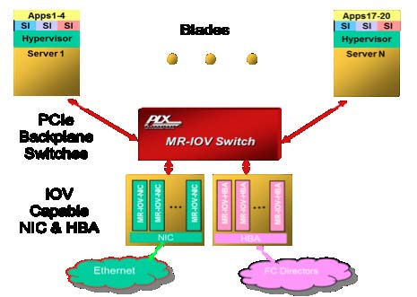
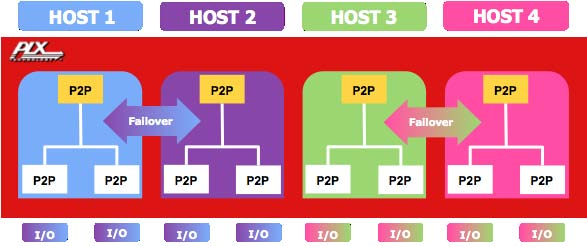
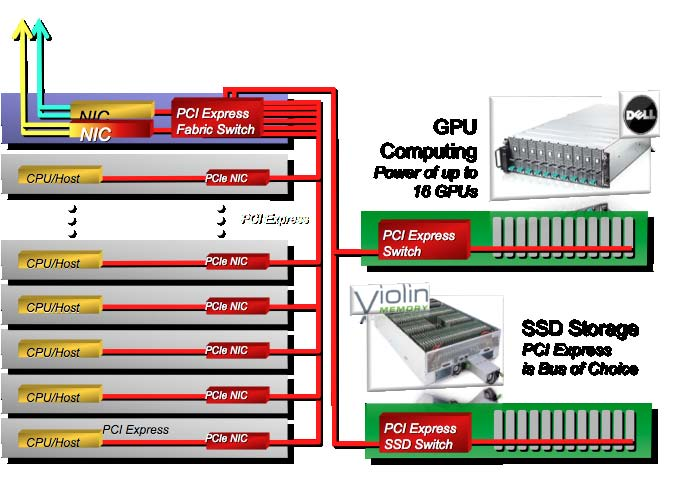
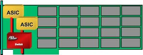
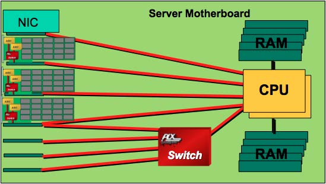

# 第12章 物理层逻辑 (Gen3)

## 目录

- [新的编码模型](#新的编码模型)
- [复杂的信号均衡](#复杂的信号均衡)
- [8.0 GT/s 的编码](#80-gts-的编码)
  - [通道级编码](#通道级编码)
  - [块对齐](#块对齐)
  - [有序集块](#有序集块)
  - [数据流和数据块](#数据流和数据块)
  - [数据块帧构造](#数据块帧构造)
  - [帧令牌](#帧令牌)
  - [数据包](#数据包)
  - [发送端帧要求](#发送端帧要求)
  - [接收端帧要求](#接收端帧要求)
  - [帧错误恢复](#帧错误恢复)
- [Gen3 物理层发送逻辑](#gen3-物理层发送逻辑)
  - [多路复用器](#多路复用器)
  - [字节条带化](#字节条带化)
  - [SOS 发送端规则](#sos-发送端规则)
  - [SOS 接收端规则](#sos-接收端规则)
  - [加扰](#加扰)
  - [串行化器](#串行化器)
  - [同步头比特多路复用器](#同步头比特多路复用器)
- [Gen3 物理层接收逻辑](#gen3-物理层接收逻辑)
  - [差分接收器](#差分接收器)
  - [CDR (时钟和数据恢复) 逻辑](#cdr-时钟和数据恢复-逻辑)
  - [反串行化器](#反串行化器)
  - [实现块对齐](#实现块对齐)
  - [块类型检测](#块类型检测)
  - [接收端时钟补偿逻辑](#接收端时钟补偿逻辑)
  - [通道间偏移](#通道间偏移)
  - [解扰器](#解扰器)
  - [字节反条带化](#字节反条带化)
  - [数据包过滤](#数据包过滤)
  - [接收缓冲区](#接收缓冲区)
  - [128b/130b 环回注意事项](#128b130b-环回注意事项)

---

## 新的编码模型

物理层的逻辑部分用新的 **128b/130b 编码方案** 取代了 8b/10b 编码。当然，这意味着要放弃在许多串行设计中使用已久的、已被充分理解的 8b/10b 模型。设计人员愿意采取这一步骤来恢复 8b/10b 编码所强加的 **20% 传输开销**。使用 128b/130b 意味着通道现在每字节传输 8 位而不是 10 位，这意味着 **8.0 GT/s 的数据速率使带宽翻倍**。这相当于每个方向 **1 GB/s 的带宽**。

为了说明这两种编码之间的差异，首先考虑图 12-1，它显示了通用的 8b/10b 数据包构造。箭头突出显示了表示 8b/10b 数据包帧符号的控制 (K) 字符。接收端通过识别这些控制字符来知道应该期待什么。

**图 12-1：8b/10b 通道编码**



*原文图示：128b/130b编码*


```
'D' 字符

STP 序列    头部    数据载荷    ECRC    LCRC 结束

'D' 字符
'K' 字符                    'K' 字符

SDP DLLP 类型   'K' 字符    杂项    CRC 结束    'K' 字符
```

相比之下，图 12-2 显示了 **128b/130b 编码**。这种编码不影响被传输的字节，而是将字符分组为 **16 字节的块**，每个块开头有一个 **2 位的同步字段 (Sync Field)**。2 位同步字段指定该块包含数据 (10b) 还是有序集 (01b)。因此，同步字段向接收端指示应该期待什么类型的流量以及何时开始。有序集与 8b/10b 版本类似，它们必须同时在所有通道上传输。这需要使通道正确同步，这是训练过程的一部分。

> **PCIe Base Spec 3.0 定义**：
> - **数据块 (Data Block)**：同步头 = **10b** (二进制，MSB优先表示)
> - **有序集块 (Ordered Set Block)**：同步头 = **01b** (二进制，MSB优先表示)
> 
> **注意**：同步头以LSB优先方式在线路上传输，因此：
> - 数据块在线路上先看到"01"（同步头10b的LSB优先传输）
> - 有序集块在线路上先看到"10"（同步头01b的LSB优先传输）

**图 12-2：128b/130b 块编码**



*原文图示：块格式*


```
位位置：
0   1   | 0 1 2 3 4 5 6 7 | 0 1 2 3 4 5 6 7 | ... | 0 1 2 3 4 5 6 7
        |                 |                 |     |
同步字段 |     符号 0       |     符号 1       | ... |     符号 15
(2位)   |    (8位)        |    (8位)        |     |    (8位)

总长度：2 + (16 × 8) = 130 位
```

---

## 复杂的信号均衡

第二个变化是在物理层的电气子块中进行的，涉及在链路的发送端和可选的接收端进行更复杂的信号均衡。Gen1 和 Gen2 实现使用固定的发送端去加重 (Tx de-emphasis) 来实现良好的信号质量。然而，将传输频率提高到 5 GT/s 以上会导致信号完整性问题变得更加明显，需要更多的发送端和接收端补偿。这可以在板级一定程度上进行管理，但设计人员希望允许外部基础设施尽可能保持不变，而是将负担放在 PHY 发送端和接收端电路上。

---

## 8.0 GT/s 的编码

如前所述，Gen3 的 **128b/130b 编码方法** 使用链路级数据包和每通道块编码。本节提供有关编码的更多详细信息。

### 通道级编码

为了说明块的使用，考虑图 12-3，其中显示了一个单通道数据块。开头是两个同步头比特，后面跟着 16 字节（128 位）的信息，总共产生 130 个传输比特。同步头简单地定义了正在发送的是数据块 (10b) 还是有序集 (01b)。

**注意**：由于同步头以LSB优先方式传输，数据块同步头10b在线路上显示为"01"，有序集块同步头01b显示为"10"。

**图 12-3：同步头数据块示例**



*原文图示：同步头*


```
时间 = 0 UI          时间 = 2 UI          时间 = 12 UI
    |                    |                    |
    v                    v                    v
+---+---+---+---+---+---+---+---+---+---+---+---+---+---+---+---+---+---+
| 0 | 1 | 0 | 1 | 2 | 3 | 4 | 5 | 6 | 7 | ... | 0 | 1 | 2 | 3 | 4 | 5 | 6 | 7 |
+---+---+---+---+---+---+---+---+---+---+---+---+---+---+---+---+---+---+
  同步 (01)              符号 0                符号 1               符号 15
  (线路值)               (8位)                 (8位)                (8位)
  
  实际值 = 10b (数据块)  128 位载荷数据块
```

### 块对齐

与以前的实现一样，Gen3 首先实现位锁定 (Bit Lock)，然后尝试建立块对齐锁定 (Block Alignment locking)。这需要接收端找到界定块边界的同步头。发送端通过发送可识别的 **EIEOS (电气空闲退出有序集)** 模式来建立这个边界，该模式由交替的 00h 和 FFh 字节组成，如图 12-4 所示。因此，EIEOS 的用途已从简单地退出电气空闲扩展到也作为建立块对齐的同步机制。

**图 12-4：Gen3 模式 EIEOS 符号模式**



*原文图示：EIEOS*


```
符号位置：
0:  00000000 (00h)
1:  11111111 (FFh)
2:  00000000 (00h)
3:  11111111 (FFh)
4:  00000000 (00h)
    ...
13: 11111111 (FFh)
14: 00000000 (00h)
15: 11111111 (FFh)
```

### 有序集块

有序集与 Gen1 和 Gen2 中的含义大致相同。它们用于管理通道协议。当发送有序集块时，它必须同时出现在所有通道上，并且几乎总是由 16 字节组成，只有一个例外。这个大小规则的唯一例外是 **SOS (SKP 有序集)**，它可以通过时钟补偿逻辑（例如与链路中继器相关）以 4 个为一组添加或删除 SKP 符号，因此合法长度可以是 **8、12、16、20 或 24 字节**。

有序集块的基本格式与数据块类似，只是同步头比特被反转，如图 12-5 所示。

**图 12-5：Gen3 x1 有序集块示例**



*原文图示：有序集块*


```
时间 = 0 UI          时间 = 2 UI          时间 = 12 UI
    |                    |                    |
    v                    v                    v
+---+---+---+---+---+---+---+---+---+---+---+---+---+---+---+---+---+---+
| 0 | 1 | 0 | 1 | 2 | 3 | 4 | 5 | 6 | 7 | ... | 0 | 1 | 2 | 3 | 4 | 5 | 6 | 7 |
+---+---+---+---+---+---+---+---+---+---+---+---+---+---+---+---+---+---+
  同步 (10)              符号 0                符号 1               符号 15
  (线路值)               (8位)                 (8位)                (8位)
  
  实际值 = 01b (有序集块) 128 位载荷有序集块
```

规范为 Gen3 定义了 **七个有序集**（比 Gen1 和 Gen2 PCIe 多一个有序集）。在大多数情况下，它们的功能与前几代相同：

1. **SOS** - 跳过有序集 (Skip Ordered Set)：用于时钟补偿
2. **EIOS** - 电气空闲有序集 (Electrical Idle Ordered Set)：用于进入电气空闲状态
3. **EIEOS** - 电气空闲退出有序集 (Electrical Idle Exit Ordered Set)：现在有两个用途：
   - 像以前一样用于电气空闲退出
   - 用于 8.0 GT/s 的块对齐指示器
4. **TS1** - 训练序列 1 有序集
5. **TS2** - 训练序列 2 有序集
6. **FTS** - 快速训练序列有序集
7. **SDS** - 数据流开始有序集 (Start of Data Stream Ordered Set)：新的有序集

**图 12-6：Gen3 FTS 有序集示例**

```
FTS 有序集结构：
符号 0: 55h (FTS 标识符)
符号 1: 47h
符号 2: 4Eh
符号 3: C7h
符号 4: CCh
符号 5: C6h
符号 6: C9h
符号 7: 25h
符号 8: 6Eh
符号 9: ECh
符号 10: 88h
符号 11: 7Fh
符号 12: 80h
符号 13: 8Dh
符号 14: 8Bh
符号 15: 8Eh

有序集标识符表：
+----------------+----------------+------------+
| 有序集         | 第一个符号     | 同步头     |
+----------------+----------------+------------+
| EIEOS          | 00h            | 01b        |
| EIOS           | 66h            | 01b        |
| FTS            | 55h            | 01b        |
| SDS            | E1h            | 01b        |
| TS1            | 1Eh            | 01b        |
| TS2            | 2Dh            | 01b        |
| SKP (SOS)      | AAh            | 01b        |
+----------------+----------------+------------+
```

### 数据流和数据块

链路通过发送 **SDS 有序集** 并转换到 **L0 链路状态** 来进入数据流。在数据流中，传输多个数据块，直到数据流以 **EDS 令牌** 结束（除非错误提前结束它）。EDS 令牌总是占据在有序集之前的数据块的最后四个符号。

对跳过有序集 (SOS) 有一个例外，因为只要满足稍后讨论的某些条件，它们就不会中断数据流。当链路状态从 L0 状态转换到任何其他链路状态（如 Recovery）时，数据流不再生效。

### 数据块帧构造

数据块由 **TLP (事务层数据包)**、**DLLP (数据链路层数据包)** 和用于传递信息的令牌组成。数据块内还使用五种类型的数据结构（称为**令牌**）。每个令牌都有便于接收端检测的模式。

**可以在块开头发送的三种令牌**（即紧接在同步数据块之后）：
- **STP** (Start TLP) - 开始 TLP：后面跟着一个 TLP
- **SDP** (Start DLLP) - 开始 DLLP：后面跟着一个 DLLP
- **IDLA** (Logical Idle) - 逻辑空闲：当没有数据包活动时发送

**在数据块末尾发送的剩余令牌**：
- **EDS** (End of Data Stream) - 数据流结束：在转换到有序集之前
- **EDB** (End Bad) - 结束错误：报告检测到已作废的数据包

**图 12-7：Gen3 x1 帧构造示例**

```
STP 令牌结构：
+--------+--------+--------+--------+
| 位[7:0]| 位[15:8]| 位[19:16]| 位[20] |
| 序列号 | 序列号  | 帧 CRC  | 奇偶校验|
| [7:0]  | [11:8] | [3:0]   |        |
+--------+--------+--------+--------+
|           长度 [10:0] (11位)        |
+-------------------------------------+

数据块内容 (16个符号)：
符号 0-2:   STP 令牌 (3字节)
符号 3-10:  头部和数据载荷 (8字节，与2.0相同)
符号 11-14: LCRC (4字节，与2.0相同)
符号 15:    (结束)
```

总之，给定数据块的内容取决于活动：
- **IDL** - 当没有传递数据包时，数据块仅由 IDL 组成
- **TLP** - 根据链路宽度，可以在给定数据块中发送一个或多个 TLP
- **DLLP** - 可以在数据块中发送一个或多个 DLLP
- 上述活动的组合可以在单个数据块中传递

### 帧令牌

规范定义了允许出现在数据块中的**五种帧令牌**（简称"令牌"）：

1. **STP** - 开始 TLP：与早期版本类似，但现在包括整个数据包的 dword 计数
2. **SDP** - 开始 DLLP
3. **EDB** - 结束错误：用于作废 TLP，与 Gen1 和 Gen2 设计中的方式相同，但现在连续发送四个 EDB 符号。END（结束正常）符号现在被取消；如果没有明确标记为错误，TLP 将被假定为正常。
4. **EDS** - 数据流结束：数据流的最后一个 dword，指示至少一个有序集将跟随。奇怪的是，数据流实际上可能不会因此而结束。如果跟随它的有序集是 SOS 并且紧接着另一个数据块，则数据流继续。如果跟随 EDS 的有序集不是 SOS，或者 SOS 后面没有数据块，则数据流结束。
5. **IDL** - 逻辑空闲：当没有 TLP 或 DLLP 准备好传输时，在链路逻辑空闲状态期间发送的简单数据零字节。

**图 12-8：Gen3 帧令牌示例**

```
STP 令牌 (小端序)：
位：  0-7     8-15    16-19   20
     +-------+-------+-------+---+
     | SeqNum| SeqNum| Frame | P |
     | [7:0] | [11:8]| CRC   |   |
     +-------+-------+-------+---+
     |      长度 [10:0] (11位)    |
     +---------------------------+

SDP 令牌：
0011 0101b (35h)

EDS 令牌：
1111 1000b (F8h)

EDB 令牌 (4个重复)：
0000 0001b (01h) × 4

IDL 令牌：
0000 0000b (00h)
```

### 数据包

STP 和 SDP 指示数据包的开始。

**TLP**：STP 令牌由 4 个 1 组成的半字节和 11 位 dword 长度字段组成。长度计算 TLP 的所有 dword，包括令牌、头部、可选数据载荷、可选摘要和 LCRC。这允许接收端计数 dword 以识别 TLP 结束的位置。因此，验证长度字段没有错误非常重要，因此它有 4 位帧 CRC 和偶校验位来保护长度和帧 CRC 字段。这些比特的组合为令牌提供了强大的三位翻转检测能力（多达 3 位可能不正确，它仍然会被识别为错误）。11 位长度字段允许整个 TLP 最大为 2K dword（8KB）。

**DLLP**：SDP 令牌指示 DLLP 的开始，不包括长度字段，因为它总是恰好 8 字节长：2 字节令牌后跟 4 字节 DLLP 载荷和 2 字节 DLLP LCRC。

EDB 令牌被添加到被作废的 TLP 末尾。对于正常的 TLP，没有"结束正常"指示；它被假定为正常，除非明确标记为错误。如果 TLP 最终被作废，LCRC 值将被反转，并将 EDB 令牌附加为 TLP 的扩展，尽管它不包括在长度值中。物理层接收端必须在每个 TLP 的末尾检查 EDB，并在看到时通知链路层。毫不奇怪，在 TLP 之后以外的任何时间接收 EDB 将被视为帧错误。

### 发送端帧要求

首先定义几件事会有帮助。首先，回想一下，数据流从 SDS 之后的第一个符号开始，它可能包含由令牌、TLP 和 DLLP 组成的数据块。数据流以有序集（SOS 除外）之前的最后一个符号结束，或者在检测到帧错误时结束。在数据流期间，除了 SOS 之外，不能发送有序集。

其次，由于帧问题通常会导致帧错误，因此解释在这种情况下会发生什么会有所帮助。当发生帧错误时，它们被视为接收端错误并会如此报告。接收端停止处理正在进行的数据流，只有在看到 SDS 有序集时才能处理新的数据流。作为对错误的响应，通过将 LTSSM 从 L0 定向到 Recovery 状态来启动恢复过程。期望是这将在物理层中解决，不需要上层采取任何行动。此外，规范指出，从两个端口都进入 Recovery 开始，完成此操作的往返时间预计不到 1μs。

**在数据流中时，发送端必须遵守以下规则**：

**发送 TLP 时**：
- STP 令牌必须紧接链路层传递的 TLP 的全部内容，即使它被作废
- 如果 TLP 被作废，EDB 令牌必须出现在 TLP 的最后一个 dword 之后，但不能包含在 TLP 长度值中
- 在链路上，每个符号时间不能发送超过一个 STP

**发送 DLLP 时**：
- SDP 令牌必须紧接数据链路层传递的 DLLP 的全部内容
- 在链路上，每个符号时间不能发送超过一个 SDP

**在数据流中发送 SOS (SKP 有序集) 时**：
- 在当前数据块的最后一个 dword 中发送 EDS 令牌
- 将 SOS 作为下一个有序集块发送
- 在 SOS 之后立即发送另一个数据块。数据流在随后数据块的第一个符号处恢复
- 如果安排了多个 SOS，它们不能像早期几代那样背靠背。相反，每个 SOS 前面必须有一个以 EDS 令牌结尾的数据块。在此期间，数据块可以填充 TLP、DLLP 或 IDL

**结束数据流**：
- 在当前数据块的最后一个 dword 中发送 EDS 令牌，然后跟随 EIOS 进入低功耗链路状态，或跟随 EIEOS 用于所有其他情况

**IDL 令牌**：
- 如果在链路上没有发送 TLP、DLLP 或其他帧令牌，则必须在所有通道上发送 IDL 令牌

**对于多通道链路**：
- 发送 IDL 令牌后，下一个 TLP 或 DLLP 的第一个符号必须在开始时位于通道 0。EDS 令牌必须始终是数据块的最后一个 dword，因此可能不总是遵循该规则
- IDL 令牌必须用于填充符号时间中否则会为空的 dword。例如，如果 x8 链路的 TLP 在通道 3 结束，但发送者没有另一个 TLP 或 DLLP 准备在通道 4 开始，则 IDL 必须填充剩余的字节直到该符号时间结束
- 由于数据包仍然是 4 字节的倍数，与早期几代一样，它们将在 4 通道边界上开始和结束。例如，x8 链路中在通道 3 结束的 DLLP 可以通过在通道 4 放置其 STP 令牌来开始下一个 TLP

### 接收端帧要求

当在接收端看到数据流时，适用以下规则：

**一般规则**：
- 当期望帧令牌时，看起来像其他任何东西的符号都将是帧错误
- 下面列表中显示的一些错误检查和报告是可选的，规范指出它们是独立可选的

**接收到 STP 时**：
- 接收端必须检查帧 CRC 和帧奇偶校验字段，任何不匹配都将是帧错误。（注意，具有帧错误的 STP 令牌在报告此错误时不被视为 TLP 的一部分）
- TLP 最后一个 DW 之后的符号是要处理的下一个令牌，接收端必须检查它是否是 EDB 令牌的开头，表明 TLP 已被作废
- 可选地检查长度值为零；如果检测到，则是帧错误
- 可选地检查在同一符号时间内到达多个 STP 令牌；如果检查并检测到，这是帧错误

**接收到 EDB 时**：
- 接收端必须在检测到第一个 EDB 符号时或在其剩余字节中的任何一个被接收后尽快通知链路层
- 如果令牌中的任何符号不是 EDB，则结果是帧错误
- EDB 令牌的唯一合法时间是在 TLP 之后；任何其他使用都将是帧错误
- EDB 令牌之后的符号将是要处理的下一个令牌的第一个符号

**接收到 EDS 令牌作为数据块的最后一个 DW 时**：
- 接收端必须停止处理数据流
- 接下来只能接受 SKP、EIOS 或 EIEOS 有序集；接收任何其他有序集将是帧错误
- 如果 EDS 之后接收到 SKP 有序集，接收端必须从跟随的数据块的第一个符号恢复数据流处理，除非检测到帧错误

**接收到 SDP 令牌时**：
- DLLP 之后的符号是要处理的下一个令牌
- 可选地检查同一符号时间内多个 SDP 令牌；如果检查并发生，这是帧错误

**接收到 IDL 令牌时**：
- 下一个令牌允许在 IDL 令牌之后的任何 DW 对齐通道上开始。对于 x4 或更窄的链路，这意味着下一个令牌只能在下一个符号时间的通道 0 开始。对于更宽的链路，有更多选项。例如，x16 链路可以在当前符号时间的通道 0、4、8 或 12 开始下一个令牌
- 与 IDL 在同一符号时间内期望的唯一令牌将是另一个 IDL 或 EDS

**处理数据流时，接收端将以下情况视为帧错误**：
- SDS 之后立即出现有序集
- 具有非法同步头（11b 或 00b）的块。这可以可选地在通道错误状态寄存器中报告
- 在上一个块中没有接收到 EDS 令牌的情况下，在任何通道上出现有序集块
- 在上一个块中 EDS 令牌之后立即出现数据块
- 可选地，验证所有通道接收相同的有序集

### 帧错误恢复

如果在处理数据流时看到帧错误，接收端必须：
- 报告接收端错误（如果可选的高级错误报告寄存器可用，设置图 12-9 中所示的状态位）
- 停止处理数据流。只有当看到下一个 SDS 有序集时，才能开始处理新的数据流
- 启动错误恢复过程。如果链路处于 L0 状态，这将涉及转换到 Recovery 状态。规范指出，通过 Recovery 状态的时间"预计"不到 1μs
- 请注意，帧错误的恢复不一定预期会直接通过 Ack/Nak 机制导致数据链路层启动的恢复活动。当然，如果 TLP 由于错误而丢失或损坏，则将需要重放事件

**图 12-9：AER 可纠正错误寄存器**

```
位：  31-16   15  14  13  12  11   9   8   7   6   5   1   0
     +-------+---+---+---+---+---+---+---+---+---+---+---+---+
     | RsvdZ |   |   |   |   |   |   |   |   |   |   |   |   |
     |       |   |   |   |   |   |   |   |   |   |   |   |   |
     +-------+---+---+---+---+---+---+---+---+---+---+---+---+
                              |   |   |   |   |   |   |   |
                              |   |   |   |   |   |   |   +-- 接收端错误状态
                              |   |   |   |   |   |   +------ 错误 TLP 状态
                              |   |   |   |   |   +---------- 错误 DLLP 状态
                              |   |   |   |   +-------------- REPLAY_NUM 翻转状态
                              |   |   |   +------------------ 重放定时器超时状态
                              |   |   +---------------------- 建议性非致命错误状态
                              |   +-------------------------- 内部可纠正错误状态
                              +------------------------------ 头部日志溢出状态

注意：所有位都指定为 RW1CS（读/写 1 清除状态）
```

---

## Gen3 物理层发送逻辑

图 12-10 说明了支持 Gen3 速度的物理层发送逻辑的概念框图。整体设计非常类似于 Gen2，因此不需要再次详细介绍所有细节，但有一些差异。刚接触 PCIe 的读者被鼓励回顾前面的章节"物理层逻辑 (Gen1 和 Gen2)"以了解物理层设计的基础知识。

### 多路复用器

TLP 和 DLLP 从数据链路层到达顶部。多路复用器混合必要的 STP 或 SDP 令牌以构建完整的 TLP 或 DLLP。上一节描述了令牌格式。

Gen3 TLP 边界由 TLP 数据包开头的 STP 令牌的长度字段中的 dword 计数定义，因此不需要 END 帧字符。

当结束数据流或刚好在发送 SOS 之前，EDS 令牌被复用到数据流中。基于跳过定时器，多路复用器定期将 SOS 插入数据流。其他有序集，如 TS1、TS2、FTS、EIEOS、EIOS、SDS 也可以根据链路要求进行复用，它们在数据流之外。

数据包以块的形式传输，由 2 位同步头标识。同步头由多路复用器添加。但是，同步头由字节条带化逻辑在多通道链路的所有通道上复制。

当没有数据包或有序集要发送但链路要保持 L0 状态活动时，使用 IDL（逻辑空闲，或数据零）令牌作为填充。这些与其他数据字节一样被加扰，并被接收端识别为填充。

**图 12-10：Gen3 物理层发送端详细信息**

```
                    来自数据链路层
                           |
                           v
+------------------+  数据包边界指示器
|     Tx 缓冲区     |<-------------------
|     (N*8)        |       |
+--------+---------+       | 节流
         |                 |
         v                 v
    +----+----+       +----+----+
    | 控制/   |       | 逻辑    |
    | 令牌字符|       | 空闲    |
    | (N*8)   |       | (8)     |
    +----+----+       +----+----+
         |                 |
         +--------+--------+
                  |
                  v
         +--------+--------+
         |   有序集 (8)    |
         +--------+--------+
                  |
                  v
            +-----+-----+
            |    Mux    |<-- D/K# (数据/控制指示)
            +-----+-----+
                  |
                  v
            +-----+-----+
            | 字节条带化 |
            +-----+-----+
                  |
      +-----------+-----------+
      |           |           |
      v           v           v
+-----+-----+ +---+---+   +---+---+
| 通道 0    | | 通道 1 |...| 通道 N|
| (8位)     | | (8位)  |   | (8位) |
+-----+-----+ +---+---+   +---+---+
      |           |           |
      v           v           v
+-----+-----+ +---+---+   +---+---+     +-------------+
| Gen3      | | Gen3  |   | Gen3  |     | 发送端本地  |
| 加扰器     | | 加扰器|   | 加扰器|     | PLL         |
+-----+-----+ +---+---+   +---+---+     +-------------+
      |           |           |               |
      v           v           v               |
+-----+-----+ +---+---+   +---+---+           |
| 8b/10b    | | 8b/10b|   | 8b/10b|           |
| 编码器     | | 编码器|   | 编码器|           |
+-----+-----+ +---+---+   +---+---+           |
      |           |           |               |
      v           v           v               |
+-----+-----+ +---+---+   +---+---+           |
|    Mux    | |  Mux  |   |  Mux  |<----------+
+-----+-----+ +---+---+   +---+---+    Tx 时钟
      |           |           |
      v           v           v
+-----+-----+ +---+---+   +---+---+
| 串行化器   | | 串行化器|   | 串行化器|
+-----+-----+ +---+---+   +---+---+
      |           |           |
      v           v           v
    通道 0      通道 1 ...   通道 N
```

### 字节条带化

此逻辑将要传递的字节分布到所有可用通道上。图 12-11 显示了一个 4 通道链路的示例。请注意，当新块开始时，同步头比特同时出现在所有通道上，并定义块类型（此示例中为数据块）。块编码对每个通道独立处理，但字节（或符号）在所有通道上条带化，就像 PCIe 的早期几代一样。

**图 12-11：Gen3 字节条带化 x4**

```
通道 0:  同步[0,1] | 符号 0[0-7] | 符号 4[0-7] | ... | 符号 60[0-7] | 符号 61-63
通道 1:  同步[0,1] | 符号 1[0-7] | 符号 5[0-7] | ... | 符号 60[0-7] | 符号 61-63
通道 2:  同步[0,1] | 符号 2[0-7] | 符号 6[0-7] | ... | 符号 60[0-7] | 符号 61-63
通道 3:  同步[0,1] | 符号 3[0-7] | 符号 7[0-7] | ... | 符号 60[0-7] | 符号 61-63

(每个块64个符号分布在4个通道上，每个通道16个符号)
```

#### 字节条带化 x8 示例

接下来，考虑图 12-12 中显示的 x8 链路示例。在这里，比特流是垂直的而不是水平的。在顶部我们可以看到同步比特（按要求以小端序显示为 01）同时出现在所有通道上，并指示数据块正在开始。

在此示例中，首先发送 TLP，因此符号 0-4 包含 STP 帧令牌，其中包括整个 TLP（包括令牌）的长度为 7 DW。接收端需要知道 TLP 的长度，因为对于 8 GT/s 速度，没有 END 控制字符。相反，接收端计数 dword，如果没有观察到 EDB（结束错误），则假定 TLP 是正常的。在这种情况下，TLP 在符号 3 的通道 3 结束。

接下来发送 DLLP，从通道 4 和 5 上的 SDP 令牌开始。由于 DLLP 总是 8 个符号长，它将在符号 4 的通道 3 结束。暂时没有其他数据包要发送，因此传输 IDL 符号直到另一个数据包准备好。当发送 IDL 时，下一个 STP 令牌只能在通道 0 开始。在示例中，TLP 在符号 6 的通道 0 开始。

下一个 TLP 的数据包长度为 23 DW，这呈现了一个有趣的情况，因为在下一个块边界之前只有 20 个 dword 可用。当数据块结束时，发送端发送同步并在下一个块的符号 0 期间继续 TLP 传输。换句话说，数据包在必要时简单地跨越块边界。最后，TLP 在符号 1 的通道 3 结束。再次没有数据包准备好发送，因此发送 IDL。

**图 12-12：Gen3 x8 示例：TLP 跨越块边界**

```
符号时间：

同步 符号 0:
通道 0: [0,1] STP 令牌：长度=7，CRC，奇偶校验，序列号
通道 1: [0,1] (STP 令牌继续)
通道 2: [0,1] (STP 令牌继续)
通道 3: [0,1] (STP 令牌继续)
通道 4: [0,1] (TLP 数据)
通道 5: [0,1] (TLP 数据)
通道 6: [0,1] (TLP 数据)
通道 7: [0,1] (TLP 数据)

符号 1-2: TLP 数据继续

符号 3: LCRC (TLP 结束于通道 3)
符号 4: IDL
符号 5: IDL, IDL, SDP 令牌 (通道 4-5), IDL...
符号 6: IDL (所有通道)

同步 符号 0 (下一个块):
通道 0: [0,1] STP 令牌：长度=23，CRC，奇偶校验，序列号 (TLP 跨越块边界)
通道 1-7: IDL

符号 1: 头部 DW 1, DW 2, DW 3, 数据 DW 14-21, LCRC
符号 5-15: IDL
```

#### 作废数据包 x8 示例

当数据包通过交换机转发以减少延迟时，可能会发生作废的 TLP。这称为**交换机直通模式**。

当交换机在入口端口接收到数据包之前以及在错误检查之前将数据包转发到出口端口时，可能会发生作废的 TLP。因为在此示例中检测到错误，所以必须作废 TLP。

图 12-13 说明了作废 TLP 所采取的步骤。出口端口发送的 TLP 在第一个块中开始（符号 6 的通道 0）。当检测到错误时，出口端口反转 CRC（符号 1 的通道 0-3）并在 TLP 之后立即添加 EDB 令牌（符号 1 的通道 4-7）。这两个更改一起向接收端表明此 TLP 已被作废，应丢弃。请注意，EDB 字节不包括在数据包长度字段中，因为它们是动态添加到飞行中的数据包的。

**图 12-13：Gen3 x8 作废数据包**

```
符号 6: STP 令牌：长度=23，CRC，奇偶校验，序列号 (IDL 填充)
符号 7: 头部 DW 1, DW 2, DW 3
符号 15 (同步): 头部 DW 3 继续...

符号 0 (下一个块): 数据 DW 16-21
符号 1: LCRC (反转), EDB, EDB, EDB, EDB (作废的 TLP)
```

### 有序集示例 - SOS

现在让我们考虑有序集传输的示例。如图 12-14 所示，有序集由 2 位同步头值 01b 指示。后面的字节将被接收端理解为组成一个总是 16 字节（128 位）长的有序集。唯一的例外是 **SOS (跳过有序集)**，因为它可以通过时钟补偿以 4 字节为增量进行更改。因此，SOS 合法地允许为 **8、12、16、20 或 24 个符号**长。

**图 12-14：Gen3 x1 有序集构造**

```
时间 = 0 UI          时间 = 2 UI          时间 = 12 UI
    |                    |                    |
    v                    v                    v
+---+---+---+---+---+---+---+---+---+---+---+---+---+---+---+---+---+---+
| 0 | 1 | 0 | 1 | 2 | 3 | 4 | 5 | 6 | 7 | ... | 0 | 1 | 2 | 3 | 4 | 5 | 6 | 7 |
+---+---+---+---+---+---+---+---+---+---+---+---+---+---+---+---+---+---+
  同步 (10)              符号 0                符号 1               符号 15
  
                        128 位载荷有序集块
```

为了说明有序集，让我们使用 SOS 来显示各种功能以及它们如何协同工作。考虑图 12-15，其中一个数据块后面跟着一个 SOS。帧规则规定，前一个数据块必须在最后一个 dword 中以 EDS 令牌结束，以让接收端知道有序集即将到来。如果当前数据流要继续，则跟随的有序集必须是 SOS，而这又必须紧接着另一个数据块。此示例没有显示，但 TLP 可能在此点不完整，并通过在必须紧跟 SOS 的数据块中恢复传输来跨越 SOS。

接收 EDS 令牌意味着数据流正在结束或暂停以插入 SOS。EDS 是唯一可以在与 IDL 相同的符号时间内在 dword 对齐通道上开始的令牌，此示例正是这样做的，在符号时间 15 的通道 4 开始。回想一下，EDS 也必须在数据块的最后一个 dword 中。根据接收端帧要求，在 EDS 之后只允许有序集块，并且必须是 SOS、EIOS 或 EIEOS，否则将被视为帧错误。

在我们的示例中，接下来看到一个 16 字节的 SOS，它由有序集同步头以及 SKP 字节模式识别。在 SOS 的末尾总是有 4 个符号包含当前的 24 位加扰器 LFSR 状态。

**图 12-15：Gen3 x8 跳过有序集 (SOS) 示例**

```
数据块 (符号 0-15):
通道 0-7: IDL, IDL, IDL, IDL, IDL, IDL, IDL, IDL
          STP 令牌 (长度=7, CRC, 奇偶校验, 序列号)
          TLP 数据...
          SDP 令牌...
          IDL...
          EDS 令牌 (通道 4-7 的符号 15) - 数据流结束标记

有序集块:
通道 0-7: [1,0] 同步 (有序集头)
          符号 0: SKP (AAh)
          符号 1-2: SKP
          符号 3: SKP
          符号 4: SKP_END (E1h)
          符号 5-6: LFSR 输出 (加扰器种子)
          符号 7: LFSR
          
下一个数据块 (符号 0-15):
通道 0-7: [0,1] 同步 (数据块头)
          数据继续...
```

**表 12-2：Gen3 16 字节跳过有序集编码**

| 符号编号 | 值 | 描述 |
|---------|-----|------|
| 0 到 11 | AAh | SKP 符号。由于符号 0 是有序集标识符，这被视为 SOS |
| 12 | E1h | SKP_END 符号，指示 SOS 在 3 个更多符号后将完成 |
| 13 | 00-FFh | 如果 LTSSM 状态是 Polling.Compliance：AAh；否则如果前一个块是数据块：位 [7] = 数据奇偶校验，位 [6:0] = LFSR [22:16]；否则：位 [7] = ~LFSR [22]，位 [6:0] = LFSR [22:16] |
| 14 | 00-FFh | 如果 LTSSM 状态是 Polling.Compliance：Error_Status [7:0]；否则 LFSR [15:8] |
| 15 | 00-FFh | 如果 LTSSM 状态是 Polling.Compliance：Error_Status [7:0]；否则 LFSR [7:0] |

表中提到的数据奇偶校验位是自最近 SDS 或 SOS 以来发送的所有数据块加扰字节的偶校验，对每个通道独立创建。接收端需要计算和检查奇偶校验。如果位不匹配，则必须设置看到错误的通道对应的通道错误状态寄存器位，但这不被视为接收端错误，也不会启动链路重新训练。

### SOS 发送端规则

使用 128b/130b 时发送端的 SOS 规则包括：
- SOS 必须在 370 到 375 个块内安排发生。但是，在环回模式下，环回主设备必须在该时间内安排两个 SOS，并且它们必须彼此相距不超过两个块
- SOS 仍然只能在数据包边界上发送，因此可能会累积。但是，不允许连续的 SOS；它们必须由数据块分隔
- 建议每当发送端处于电气空闲时重置 SOS 定时器和计数器
- 链路控制寄存器 2 中的 Compliance SOS 位在使用 128b/130b 时没有效果

### SOS 接收端规则

使用 128b/130b 时接收端的跳过有序集规则包括：
- 它们必须容忍以平均 370-375 个块的间隔接收 SOS。请注意，电气空闲后的第一个 SOS 可能会更早到达，因为发送端在电气空闲期间不需要重置 SOS 定时器
- 接收端必须检查数据流中的每个 SOS 前面都有一个以 EDS 结尾的数据块

---

## 加扰

128b/130b 的加扰逻辑根据 PCIe 的前几代进行了修改，以解决 8b/10b 编码自动处理的两个问题：**保持直流平衡**和**提供足够的转换密度**。回顾一下，直流平衡意味着比特流具有相等数量的 1 和 0。这是为了避免"直流漂移"问题，即传输介质被 1 或 0 的普遍存在充电到一侧电压太多，以至于难以在必要的时间内切换信号。另一个问题是接收端的时钟恢复需要在输入信号中看到足够的边沿，以便能够将其与恢复的时钟进行比较并根据需要调整时序和相位。

如果没有 8b/10b 来处理这些问题，采取了三个步骤：首先，新的加扰方法在更长的时间段内改善转换密度和直流平衡，但不像 8b/10b 那样在短时间段内保证它们。其次，训练期间使用的 TS1 和 TS2 有序集模式包括根据需要调整的字段以改善直流平衡。第三，接收端必须比早期几代更强大，更能容忍这些问题。

### LFSR 数量

在较低数据速率下，每个通道以相同的方式加扰，因此单个线性反馈移位寄存器 (LFSR) 可以为所有通道提供加扰输入。但是，对于 Gen3，设计人员希望相邻通道有不同的加扰值。原因可能包括希望通过相对于彼此加扰它们的输出来减少通道之间的串扰可能性，并避免在每个通道上具有相同的值，如在发送 IDL 时可能发生的那样。规范描述了实现此目标的两种方法，一种强调较低延迟，一种强调较低成本。

**选项一：多个 LFSR**。一种解决方案是为每个通道实现单独的 LFSR，并用不同的起始值或"种子"初始化每个。这具有简单和速度的优势，代价是增加逻辑。如图 12-16 所示，每个 LFSR 基于规范中给出的多项式创建伪随机输出：**G(X) = X²³ + X²¹ + X¹⁶ + X⁸ + X⁵ + X² + 1**。此多项式比以前的版本更长，并且由于不同的种子值，其行为也有所不同。为每个通道 0 到 7 指定了八个不同的种子值，需要八个不同的 LFSR。

**图 12-16：Gen3 每通道 LFSR 加扰逻辑**

```
                    数据输入
                       |
                       v
                +------+------+
                |     XOR     |<-- LFSR 输出
                +------+------+
                       |
                       v
                  数据输出

每个通道的 LFSR (24位)：
+---+---+---+---+---+---+---+---+---+---+---+---+---+---+---+---+---+---+---+---+---+---+---+---+
|D0 |D1 |D2 |D3 |D4 |D5 |D6 |D7 |D8 |D9 |D10|D11|D12|D13|D14|D15|D16|D17|D18|D19|D20|D21|D22|
+---+---+---+---+---+---+---+---+---+---+---+---+---+---+---+---+---+---+---+---+---+---+---+---+
  |   |   |   |   |   |   |   |   |   |   |   |   |   |   |   |   |   |   |   |   |   |   |
  |   |   |   |   |   |   |   |   |   |   |   |   |   |   |   |   |   |   |   +---+---+---+
  |   |   |   |   |   |   |   |   |   |   |   |   |   |   |   |   |   |   |       |
  |   |   |   |   |   |   |   |   |   |   |   |   |   |   |   |   +---+---+-------+
  |   |   |   |   |   |   |   |   |   |   |   |   |   +---+---+---+               |
  |   |   |   |   |   |   |   |   +---+---+---+---+                               |
  |   |   |   |   +---+---+---+                                                   |
  |   +---+---+                                                                   |
  +---+                                                                           |
      |                                                                           |
      +---------------------------------------------------------------------------+
      
反馈抽头：D0, D2, D5, D8, D16, D21, D23 (XOR)
```

**表 12-3：Gen3 加扰器种子值**

| 通道 | 种子值 |
|------|--------|
| 0 | 1DBFBCh |
| 1 | 0607BBh |
| 2 | 1EC760h |
| 3 | 18C0DBh |
| 4 | 010F12h |
| 5 | 19CFC9h |
| 6 | 0277CEh |
| 7 | 1BB807h |

该系列重复自身，意味着通道 8 的种子将与通道 0 相同，因此仅显示前 8 个值。每个通道使用相同的 LFSR 和相同的抽点来创建加扰输出，不同的种子值给出所需的差异。

**选项二：单个 LFSR**。替代解决方案（如图 12-17 所示，用于通道 2、10、18 和 26）是仅使用一个 LFSR，并通过将不同的抽点 XOR 在一起来为每个通道创建加扰输入。由于只有一个 LFSR，所有通道的种子值相同（全为 1），但每个通道的加扰"抽点方程"是通过组合不同的抽点得出的，如表 12-4 所示。

**图 12-17：Gen3 单 LFSR 加扰器**

```
单个 LFSR (24位，种子全为1):
+---+---+---+---+---+---+---+---+---+---+---+---+---+---+---+---+---+---+---+---+---+---+---+---+
|D0 |D1 |D2 |D3 |D4 |D5 |D6 |D7 |D8 |D9 |D10|D11|D12|D13|D14|D15|D16|D17|D18|D19|D20|D21|D22|
+---+---+---+---+---+---+---+---+---+---+---+---+---+---+---+---+---+---+---+---+---+---+---+---+

通道 2,10,18,26 的"抽点方程": D13 XOR D22

                    数据输入
                       |
                       v
                +------+------+
                |     XOR     |<-- (D13 XOR D22)
                +------+------+
                       |
                       v
                  数据输出
```

**表 12-4：Gen3 单 LFSR 加扰器的抽点方程**

| 通道编号 | 抽点方程 |
|---------|---------|
| 0, 8, 16, 24 | D9 xor D13 |
| 1, 9, 17, 25 | D1 xor D13 |
| 2, 10, 18, 26 | D13 xor D22 |
| 3, 11, 19, 27 | D1 xor D22 |
| 4, 12, 20, 28 | D3 xor D22 |
| 5, 13, 21, 29 | D1 xor D3 |
| 6, 14, 22, 30 | D3 xor D9 |
| 7, 15, 23, 31 | D1 xor D9 |

单 LFSR 解决方案使用的门比多 LFSR 版本少，但通过 XOR 过程产生额外的延迟，提供不同的成本/性能选项。

### 加扰规则

Gen3 加扰器 LFSR（无论一个或多个）不会持续前进，而是仅根据发送的内容前进。加扰器必须定期重新初始化，这发生在看到 EIEOS 或 FTSOS 时。规范列出了以下加扰规则：

- **同步头比特不加扰**，也不会使 LFSR 前进
- 发送最后一个 EIEOS 符号时重置发送端 LFSR，接收最后一个 EIEOS 符号时重置接收端 LFSR
- **TS1 和 TS2 有序集**：
  - 符号 0 绕过加扰
  - 符号 1 到 13 被加扰
  - 符号 14 和 15 可能被加扰也可能不被加扰。规范指出，如果需要改善直流平衡，它们将绕过加扰，否则将被加扰
- **FTS、SDS、EIEOS、EIOS 和 SOS 有序集的所有符号都绕过加扰**。尽管如此，输出数据流将具有足够的转换密度以允许时钟恢复，并且为有序集选择的符号产生直流平衡输出
- 即使绕过，发送端也会为除 SOS 中的符号外的所有有序集符号前进其 LFSR
- 接收端执行相同的操作，检查传入有序集的符号 0 以查看它是否是 SOS。如果是，则 LFSR 不会为该块中的任何符号前进。否则，LFSR 会为该块中的所有符号前进
- **所有数据块符号都被加扰**并使 LFSR 前进
- 符号以**小端序**加扰，意味着最低有效位先加扰，最高有效位最后加扰
- 每通道 LFSR 的种子值取决于当 LTSSM 首次进入 Configuration.Idle（完成 Polling 状态）时分配给通道的通道号。种子值（模 8）如表 12-3 所示，一旦分配，只要 LinkUp = 1，即使通过返回 Configuration 状态更改通道分配，也不会改变
- 与 8b/10b 不同，使用 128b/130b 编码时**不能禁用加扰**，因为它需要帮助信号完整性。不期望链路在没有它的情况下可靠运行，因此它必须始终开启
- 环回从设备不得对环回的比特进行加扰或解扰

### 串行化器

此移位寄存器的工作方式与 Gen1/Gen2 数据速率相同，只是它现在一次接收 8 位而不是 10 位（即，串行化器是 8 位并行到串行移位寄存器）。

### 同步头比特多路复用器

最后，必须注入两个同步头比特以将下一个字符块区分为数据块或有序集块。这些是每 130 位块的前两位，它们的逻辑可以添加在发送端中任何对设计有意义的地方。在此示例中，为简单起见，比特在过程结束时注入。无论它们包含在哪里，来自上面的字节流必须暂停以留出两个比特时间。在此示例中，需要有一种方法通知上面的逻辑暂停两个比特时间。传入数据包的流将在此期间在 Tx 缓冲区中排队。

---

## Gen3 物理层接收逻辑

与早期几代一样，接收端的逻辑（如图 12-18 所示）从 **CDR（时钟和数据恢复）电路**开始。这可能包括一个 PLL，它基于预期频率的知识和比特流中的边沿锁定到发送端时钟的频率，以生成恢复的时钟 (Rx 时钟)。此恢复的时钟将传入比特锁存到反串行化缓冲区中，然后，一旦建立了块对齐（在 LTSSM 的 Recovery 状态期间），另一个版本的恢复时钟除以 8.125 (Rx 时钟/8.125) 将 8 位符号锁存到弹性缓冲区中。之后，解扰器从加扰字符中重新创建原始数据。字节绕过 8b/10b 解码器并直接传递到字节反条带化逻辑。最后，有序集被过滤掉，剩余的 TLP 和 DLLP 字节流被转发到数据链路层。

**图 12-18：Gen3 物理层接收端详细信息**

```
到数据链路层
       |
       v
+------+------+  TLP/DLLP 指示器
|   Rx 缓冲区  |<------------------
|    (N*8)    |       |
+------+------+       |
       |              |
       v              v
+------+------+  +----+----+
|   数据包    |  | TLP/DLLP|
|   过滤      |  |  指示器 |
+------+------+  +----+----+
       |
       v
+------+------+
| 字节反条带化 |
+------+------+
       |
   +---+---+---+---+---+
   |   |   |   |   |   |
   v   v   v   v   v   v
+--+--+--+--+--+--+--+--+--+
|通道 0|通道 1|...|通道 N|
+--+--+--+--+--+--+--+--+--+
   |      |         |
   v      v         v
+--+--+  +--+--+   +--+--+
| Mux |  | Mux |   | Mux |
+--+--+  +--+--+   +--+--+
   |        |         |
   v        v         v
+--+--+  +--+--+   +--+--+     +-------------+
|Gen3 |  |Gen3 |   |Gen3 |     |  块类型     |
|解扰器|  |解扰器|   |解扰器|     |  检测       |
+--+--+  +--+--+   +--+--+     +-------------+
   |        |         |              |
   v        v         v              |
+--+--+  +--+--+   +--+--+           |
|D/K#|   |D/K#|    |D/K#|            |
+--+--+  +--+--+   +--+--+           |
   |        |         |              |
   v        v         v              v
+--+--+  +--+--+   +--+--+     +-----+-----+
|8b/10b|  |8b/10b|   |8b/10b|     |   CDR     |
|解码器|  |解码器|   |解码器|     |   逻辑    |
+--+--+  +--+--+   +--+--+     +-----+-----+
   |        |         |              |
   v        v         v              v
+--+--+  +--+--+   +--+--+     +-----+-----+
|  Rx |   |  Rx |    |  Rx |     |   Rx      |
+--+--+  +--+--+   +--+--+     +-----+-----+
   |        |         |
   +--------+---------+
            |
         通道 0,1,...,N
```

### 差分接收器

差分接收器逻辑没有改变，但有电气更改以改善信号完整性，以及建立信号均衡的训练更改。

### CDR (时钟和数据恢复) 逻辑

#### Rx 时钟恢复

尽管新的加扰方案有助于时钟恢复，但它不能在短间隔内保证良好的转换密度。因此，CDR 逻辑现在必须能够在没有那么多边沿的情况下维持更长时间的同步。规范中没有给出实现此目的的具体方法，但可能需要更强大的 PLL（锁相环）或 DLL（延迟锁定环）电路。

CDR 逻辑的另一个不同方面是弹性缓冲区使用的内部时钟并不像人们可能期望的那样简单地是 Rx 时钟除以 8。原因当然是输入不是 8 位字节的常规倍数。相反，它是 2 位同步头后跟 16 字节。这些额外的两位必须在某处考虑。规范不要求任何特定的实现，但一个解决方案是时钟除以 8.125，如图 12-19 所示，以在 130 位时间内产生 16 个时钟边沿。

**图 12-19：Gen3 CDR 逻辑**

```
D+ D- (差分输入)
   |
   v
+--+--+
| 差分 |----> 串行比特流
| 接收器|        |
+--+--+        v
   |      +-----+-----+
   |      | 串行      |
   |      | 比特流    |
   |      +-----+-----+
   |            |
   v            v
+--+--+  +-----+-----+
| 本地 |  |   Rx      |
| 时钟 |  | 时钟恢复  |
| PLL  |  |   PLL     |
+--+--+  +-----+-----+
   |            |
   |            v
   |      +-----+-----+
   |      | Rx 时钟/8.125|
   |      +-----+-----+
   |            |
   v            v
+--+--+  +-----+-----+
| 控制 |  | 反串行化   |
|      |  | 寄存器     |
+--+--+  +-----+-----+
              |
              v
         +----+----+
         | 弹性    |
         | 缓冲区   |
         +----+----+
              |
              v
         +----+----+     +-------------+
         | 通道    |     | 块对齐 &    |
         | 去偏移  |---->| 块类型检测  |
         | 延迟电路|     |   逻辑      |
         +---------+     +-------------+
```

块类型检测逻辑然后可以用于从反串行化器中取出它在到达块边界时间时无论如何都需要检查的多余两位，确保只有 8 位字节被传递到弹性缓冲区。

只是为了结束关于此讨论的所有松散端，8.0 GT/s 数据速率的内部时钟实际上将是 8.0 GHz / 8.125 = 0.985 GHz。这导致略低于通常用于描述 Gen3 带宽的 1.0 GB/s 数据速率，但差异足够小（比 1 GB/s 少 1.5%），通常不会被提及。

### 反串行化器

传入数据由恢复的 Rx 时钟时钟输入到每个通道的串行到并行转换器中，如图 12-19 所示。8 位符号被发送到弹性缓冲区，并由 Rx 时钟的版本时钟输入到弹性缓冲区，该版本已被除以 8.125 以在 130 位中正确容纳 16 字节。

### 实现块对齐

训练期间发送的 EIEOS 用于识别 130 位块的边界。如图 12-20 所示，可以在比特流中识别此有序集，因为它显示为 00h 和 FFh 的交替字节模式。当看到这个模式时，EIEOS 的最后一个符号被解释为块边界，测试接下来的 130 位将揭示边界是否正确。如果不是，逻辑继续搜索此模式。规范将此过程描述为发生在三个阶段：**未对齐、对齐和锁定**。

**图 12-20：EIEOS 符号模式**

```
符号位置：
0:  00000000 (00h)
1:  11111111 (FFh)
2:  00000000 (00h)
3:  11111111 (FFh)
4:  00000000 (00h)
    ...
13: 11111111 (FFh)
14: 00000000 (00h)
15: 11111111 (FFh)
```

**未对齐阶段**：接收端在电气空闲期后进入此阶段，例如在更改为 8.0 GT/s 或从低功耗链路状态退出后。在此阶段，块对齐逻辑监视 EIEOS 的到达，因为交替字节的结束必须对应于块的结束。当看到 EIEOS 时，调整对齐并且逻辑进入下一阶段。在此之前，它还必须根据任何 SOS 的到达调整其块对齐。

**对齐阶段**：在此阶段，接收端继续监视 EIEOS，并在看到它时进行必要的位和块对齐调整。但是，由于它们已暂时识别块边界，因此它们现在还可以搜索 **SDS（数据流开始）有序集**以指示数据流的开始。当看到 SDS 时，接收端进入锁定阶段。在此之前，它还必须根据 SOS 的到达调整其块对齐。如果检测到未定义的同步头（值为 00b 或 11b），允许接收端返回未对齐阶段。规范指出，这将在链路训练期间发生，当 EIEOS 后跟 TS 有序集时。

**锁定阶段**：一旦接收端到达此阶段，它不再调整其块对齐。相反，它现在期望在 SDS 之后看到数据块，如果此时必须重新调整对齐，一些未对齐的数据可能会丢失。如果检测到未定义的同步头，允许接收端返回未对齐或对齐阶段。只要停止数据流处理，接收端可以被定向从锁定阶段转换到其他阶段之一。

**特殊情况：环回**。在讨论块对齐时，规范描述了当链路处于环回模式时会发生什么。环回主设备必须能够在环回期间调整对齐，并且允许在环回期间发送 EIEOS 并在环回活动期间回传时基于检测到的 EIEOS 调整其接收端。环回从设备必须能够在环回进入期间调整对齐，但在环回活动期间不得调整对齐。当从设备开始环回比特流时，从设备的接收端被认为处于锁定阶段。

### 块类型检测

一旦实现了块对齐，接收端就可以识别传入块的开始时间并检查前两位以识别正在传入的两种可能类型中的哪一种。有序集块仅对物理层感兴趣，因此它们不会转发到更高层，但数据块会被转发。当检测到同步头时，此信息被发送到物理层的其他部分，以确定是否应从流向更高层的字节流中删除当前块。时钟恢复机制和同步头检测有效地完成了必须在物理层中进行的从 130 位到 128 位的转换。

请注意，由于每个通道的块信息相同，因此可以仅为一个通道（例如图 12-18 中所示的通道 0）实现此逻辑。但是，如果支持不同的链路宽度和通道反转，则更多通道需要包括此逻辑以确保始终有一个活动通道具有此逻辑可用。一个示例可能是每个能够作为通道 0 操作的通道都会实现它，但只有当前充当通道 0 的通道才会使用它。

### 接收端时钟补偿逻辑

#### 背景

8.0 GT/s 的时钟要求与早期规范版本相同：两个链路合作伙伴的时钟必须在中心频率的 +/- 300 ppm（百万分之一）以内，这在最坏情况下导致每 1666 个时钟增益或损失一个时钟。

#### 弹性缓冲区的作用

接收到的符号使用时恢复的时钟时钟输入弹性缓冲区，并使用接收端的本地时钟时钟输出。弹性缓冲区像以前一样通过添加或删除 SKP 符号来补偿频率差异，但现在它一次执行 **4 个符号**而不是仅 1 个。当 SKP 有序集到达时，监视缓冲区状态的控制逻辑进行评估。如果本地时钟运行得更快，缓冲区将接近下溢条件，逻辑可以通过在 SOS 到达时附加 4 个额外的 SKP 来快速重新填充缓冲区来进行补偿。另一方面，如果恢复的时钟运行得更快，缓冲区将接近溢出条件，逻辑将通过在看到 SOS 时删除 4 个 SKP 来快速排空缓冲区进行补偿。

Gen3 发送端每 370 到 375 个块安排一次 SOS，但像以前一样，它们只能在块边界上发送。如果安排 SOS 时数据包正在进行中，它们会累积并在下一个数据包边界插入。但是，与较低数据速率不同，8.0 GT/s 不允许两个连续的 SOS；它们必须由数据块分隔。接收端必须能够容忍由设备支持的最大数据包载荷大小分隔的 SOS。

这样的事实，即调整仅以 4 个符号的增量进行，可能会影响弹性缓冲区的深度，因为在应用任何补偿之前需要看到 4 的差异，并且大型数据包可能在本应是适当时间的时候正在进行中。因此，在确定此缓冲区的最佳大小时需要小心，因此让我们考虑一个示例。允许的 SOS 之间的时间为 375 个块，每块 16 个符号，等于 6000 个符号时间。除以增益或损失一个时钟的最坏情况时间 1666，意味着在此期间可能增益或损失 3.6 个时钟。如果最大可能的 TLP（4KB）刚好在下一个 SOS 发送之前开始，则其总延迟变为约 6000 + 4096 = 10096 个符号时间（对于 x1 链路），这转换为增益或损失 10096 / 1666 = 6.06 个时钟。因此，如果支持 4KB 大小的 TLP，缓冲区可能被设计为在 SOS 保证到达之前处理多 7 个或少 7 个符号。

可能发生两个 SOS 在第一个发送之前被安排。在较低数据速率下，排队的 SOS 背靠背发送，但对于 8.0 GT/s，它们不是，必须由数据块分隔。每当 SOS 确实到达接收端时，它可以添加或删除 4 个 SKP 符号以快速填充或排空缓冲区并避免问题。

### 通道间偏移

#### 通道间飞行时间差异

对于多通道链路，到达时间之间的差异由接收端通过延迟早到达直到它们全部匹配来自动纠正。规范允许设计人员使用任何首选方法来完成此操作，但在弹性缓冲区之后使用数字延迟有一个优势，即到达时间差异现在被数字化为接收端的本地符号时钟。如果一个通道的输入在时钟边沿上而另一个不在，它们之间的差异将以时钟周期为单位测量，因此早到达可以简单地延迟适当数量的时钟以使其与晚到达对齐。

规范定义，接收端必须能够去偏移高达 **20ns（Gen1）**、**8ns（Gen2）**和 **6ns（Gen3）**，分别对应 5、4 和 6 个符号时间时钟。

#### 去偏移机会

必须在所有通道上同时看到相同的符号才能执行去偏移，任何有序集都可以。但是，去偏移仅在 L0s、Recovery 和 Configuration LTSSM 状态中执行。特别是，它必须作为以下条件完成：
- 离开 Configuration.Complete
- 离开 Configuration.Idle 或 Recovery.Idle 后开始处理数据流
- 离开 Recovery.RcvrCfg
- 离开 Rx_L0s.FTS

如果偏移值在 L0 中发生变化（基于温度或电压变化），可能会发生接收端错误并导致重放的 TLP。如果问题变得持续存在，链路最终将转换到 Recovery 状态，并在那里进行去偏移。规范指出，虽然设备不允许在 L0 中对通道进行去偏移，但必须在此状态中定期发送的 SOS 包含旨在帮助外部工具执行此操作的 LFSR 值。这些工具不受数据流规则的约束，可以搜索 SOS 并使用模式在数据流中实现位锁定、块对齐和通道间去偏移。

#### 接收端通道间去偏移能力

可以理解，发送端只允许引入最小量的偏移，以便将偏移预算的其余部分留给路由差异和其他变化。接收端可以纠正的允许偏移量如表 12-5 所示。

**表 12-5：信号偏移参数**

| 参数 | Gen1 | Gen2 | Gen3 |
|------|------|------|------|
| 发送端最大偏移 | 1.3 ns | 1.3 ns | 1.1 ns |
| 接收端最大偏移 | 20 ns | 8 ns | 6 ns |
| 符号时间周期 | 4 ns | 2 ns | 1 ns |
| 接收端偏移（以符号时间表示） | 5 | 4 | 6 |

**图 12-22：接收端链路去偏移逻辑**

```
通道 0 Rx:  SYNC --> 延迟(0) --> SOS/SDS/EIEOS --> 解扰器
通道 1 Rx:  SYNC --> 延迟(N) --> SOS/SDS/EIEOS --> 解扰器
通道 2 Rx:  SYNC --> 延迟(M) --> SOS/SDS/EIEOS --> 解扰器
通道 3 Rx:  SYNC --> 延迟(P) --> SOS/SDS/EIEOS --> 解扰器

(延迟值根据每个通道的到达时间进行调整)
```

使用 8b/10b 编码时，明确的去偏移机制是监视 COM 控制字符，它必须同时出现在所有通道上。此选项对于 128b/130b 不可用，但有序集仍然在同时到达所有通道，例如 SOS、SDS 和 EIEOS。因此，即使去偏移通道时搜索的模式不同，过程也可以非常相似。

### 解扰器

#### 概述

接收端遵循与发送端完全相同的生成加扰多项式的规则，只需将相同的值再次 XOR 到输入数据以恢复原始信息。与发送端一样，允许它们为每个通道实现单独的 LFSR 或仅实现一个。

#### 禁用解扰

与 Gen1/Gen2 数据速率不同，在 Gen3 模式下，**不能禁用解扰**，因为它在促进时钟恢复和信号完整性方面发挥作用。在较低速率下，TS1 和 TS2 的控制字节中的"禁用加扰"位用于通知链路邻居正在关闭加扰。该位保留用于 8.0 GT/s 及更高的速率。

### 字节反条带化

此逻辑与 Gen1 或 Gen2 实现基本相同。在某个时刻，Gen3 的字节流和较低数据速率的字节流必须复用在一起。

**图 12-23：物理层接收逻辑详细信息**

```
到数据链路层
       |
       v
+------+------+  TLP/DLLP 指示器
|   Rx 缓冲区  |<------------------
|    (N*8)    |       |
+------+------+       |
       |              |
       v              v
+------+------+  +----+----+
|   数据包    |  | TLP/DLLP|
|   过滤      |  |  指示器 |
+------+------+  +----+----+
       |
       v
+------+------+
| 字节反条带化 |
+------+------+
       |
   +---+---+---+---+---+
   |   |   |   |   |   |
   v   v   v   v   v   v
+--+--+--+--+--+--+--+--+--+
|通道 0|通道 1|...|通道 N|
+--+--+--+--+--+--+--+--+--+
   |      |         |
   v      v         v
+--+--+  +--+--+   +--+--+
| Mux |  | Mux |   | Mux |
+--+--+  +--+--+   +--+--+
   |        |         |
   v        v         v
+--+--+  +--+--+   +--+--+     +-------------+
|Gen3 |  |Gen3 |   |Gen3 |     |  块类型     |
|解扰器|  |解扰器|   |解扰器|     |  检测       |
+--+--+  +--+--+   +--+--+     +-------------+
   |        |         |              |
   v        v         v              |
+--+--+  +--+--+   +--+--+           |
|D/K#|   |D/K#|    |D/K#|            |
+--+--+  +--+--+   +--+--+           |
   |        |         |              |
   v        v         v              v
+--+--+  +--+--+   +--+--+     +-----+-----+
|8b/10b|  |8b/10b|   |8b/10b|     |   CDR     |
|解码器|  |解码器|   |解码器|     |   逻辑    |
+--+--+  +--+--+   +--+--+     +-----+-----+
   |        |         |              |
   v        v         v              v
+--+--+  +--+--+   +--+--+     +-----+-----+
|  Rx |   |  Rx |    |  Rx |     |   Rx      |
+--+--+  +--+--+   +--+--+     +-----+-----+
   |        |         |
   +--------+---------+
            |
         通道 0,1,...,N
```

### 数据包过滤

字节反条带化逻辑提供的串行字节流包含 TLP、DLLP、逻辑空闲 (IDL) 和有序集。逻辑空闲字节和有序集在此处被消除，不会转发到数据链路层。剩下的是 TLP 和 DLLP，它们与其数据包类型指示器一起被转发。

### 接收缓冲区 (Rx 缓冲区)

Rx 缓冲区保存接收到的 TLP 和 DLLP，直到数据链路层能够接受它们。规范中没有描述与数据链路层的接口，因此设计人员可以自由选择细节，如此总线的宽度。路径越宽，时钟频率越低，但需要更多信号和逻辑来支持它。

### 128b/130b 环回注意事项

规范特别描述了在较高速率下环回模式的操作。基本规则可以总结如下：

- 环回主设备必须发送实际的有序集或数据块，但在从数据块更改为有序集或反之亦然时，它们不需要遵循正常的协议规则。换句话说，不需要 SDS 有序集和 EDS 令牌。从设备不得期望或检查它们的存在
- 主设备必须像往常一样发送 SOS，并且必须允许环回流中的 SKP 符号数量不同，因为接收端将执行时钟补偿
- 允许环回从设备像通常那样通过一次添加或删除 4 个 SKP 符号来修改 SOS，但生成的 SOS 仍必须遵循正确的格式规则
- 除了 SOS（可以如前所述更改）以及 EIEOS 和 EIOS（在环回中具有定义的目的，应避免）之外，所有内容都应完全按照发送的方式环回
- 如果从设备无法获取块对齐，它将无法按照接收的所有位进行环回，允许根据需要添加或删除符号以继续操作

---

## 总结

本章介绍了 PCIe Gen3（第三代）物理层逻辑的关键特性：

### 主要变化

1. **128b/130b 编码**：取代了 8b/10b 编码，消除了 20% 的传输开销，使带宽翻倍至 8.0 GT/s（每方向 1 GB/s）

2. **块结构**：数据以 130 位块（2 位同步头 + 16 字节数据）的形式传输

3. **帧令牌**：新的 STP、SDP、EDS、EDB 和 IDL 令牌用于帧定界

4. **增强的加扰**：使用 24 位 LFSR 和每通道不同种子值来改善信号完整性

5. **更复杂的时钟补偿**：一次添加/删除 4 个 SKP 符号

### 关键概念

| 概念 | 描述 |
|------|------|
| 同步头 (Sync Header) | 2 位字段：01b = 数据块，10b = 有序集块 |
| 数据流 (Data Stream) | 由 SDS 开始，由 EDS 或链路状态更改结束 |
| EIEOS | 用于块对齐和电气空闲退出 |
| SOS (SKP Ordered Set) | 用于时钟补偿，可动态调整大小 |
| 块对齐 (Block Alignment) | 使用 EIEOS 模式实现，分三个阶段 |

### 与 Gen1/Gen2 的比较

| 特性 | Gen1/Gen2 | Gen3 |
|------|-----------|------|
| 编码 | 8b/10b | 128b/130b |
| 数据速率 | 2.5/5.0 GT/s | 8.0 GT/s |
| 带宽效率 | 80% | 98.5% |
| 每方向带宽 | 250/500 MB/s | 1 GB/s |
| 符号大小 | 10 位 | 8 位 + 2 位同步头 |
| 加扰 | 可禁用 | 始终启用 |
| 时钟补偿 | 1 个 SKP | 4 个 SKP |

---

## 术语表参考

本章使用的主要术语（参考 `/home/ai/dev/10-reference/pcie_translation/术语表.md`）：

- **TLP (Transaction Layer Packet)**：事务层数据包
- **DLLP (Data Link Layer Packet)**：数据链路层数据包
- **LFSR (Linear Feedback Shift Register)**：线性反馈移位寄存器
- **LTSSM (Link Training and Status State Machine)**：链路训练和状态状态机
- **SKP (Skip Ordered Set)**：跳过有序集
- **EIEOS (Electrical Idle Exit Ordered Set)**：电气空闲退出有序集
- **SDS (Start of Data Stream)**：数据流开始
- **EDS (End of Data Stream)**：数据流结束
- **STP (Start TLP)**：TLP 开始令牌
- **SDP (Start DLLP)**：DLLP 开始令牌
- **CDR (Clock and Data Recovery)**：时钟和数据恢复

---

**来源**：MindShare《PCI Express Technology 3.0》第 12 章
**翻译日期**：2026-03-17
**翻译说明**：本文档为 PCI Express 3.0 规范第 12 章的中文翻译，涵盖了 Gen3 物理层逻辑的详细技术内容。 值将被反转，并将 EDB