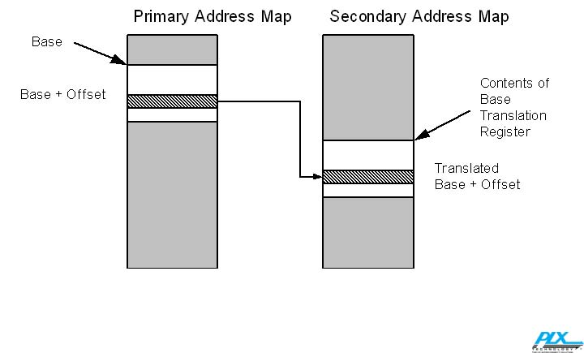

# 第14章：链路初始化与训练

## 概述

完整的训练过程在复位后由硬件自动启动，并由LTSSM（链路训练与状态状态机，Link Training and Status State Machine）管理。

在链路初始化和训练过程中会配置多个参数。让我们预先了解这些参数并定义一些术语：

- **位锁定（Bit Lock）**：当链路训练开始时，接收器的时钟尚未与输入信号的发送时钟同步，无法可靠地采样输入位。在链路训练期间，接收器CDR（时钟与数据恢复，Clock and Data Recovery）逻辑使用输入位流作为时钟参考来重建发送器的时钟。一旦从流中恢复时钟，接收器就被认为获得了位锁定，然后能够采样输入位。

- **符号锁定（Symbol Lock）**：对于8b/10b编码（用于Gen1和Gen2），下一步是获取符号锁定。这是一个类似的问题，即接收器现在可以看到单个位，但不知道10位符号的边界在哪里。在交换TS1和TS2时，接收器在位流中搜索可识别的模式。一个简单的方法是使用COM符号。其独特的编码使其易于识别，其到达显示了符号和有序集的边界，因为TS1或TS2必须正在进行中。

- **块锁定（Block Lock）**：对于8.0 GT/s（Gen3），过程与符号锁定略有不同，因为不使用8b/10b编码，所以没有COM字符。然而，接收器仍然需要在输入位流中找到可识别的包边界。解决方案是在训练序列中包含更多EIEOS（电气空闲退出有序集，Electrical Idle Exit Ordered Set）实例，并使用它来定位边界。EIEOS可识别为交替的00h和FFh字节模式，它定义了块边界，因为根据定义，当该模式结束时，下一个块必须开始。

- **链路宽度（Link Width）**：具有多个通道的设备可能能够使用不同的链路宽度。例如，具有x2端口的设备可能连接到具有x4端口的设备。在链路训练期间，两个设备的物理层测试链路并将宽度设置为最高公共值。

- **通道反转（Lane Reversal）**：多通道设备端口上的通道按顺序编号，从通道0开始。通常，一个设备端口的通道0连接到邻居端口的通道0，通道1连接到通道1，依此类推。然而，有时希望能够逻辑反转通道编号以简化布线，并允许通道直接布线而无需交叉。只要一个设备支持可选的通道反转功能，这就可以工作。该情况在链路训练期间被检测到，一个设备必须内部反转其通道编号。

- **极性反转（Polarity Inversion）**：两个设备的D+和D-差分对端子也可以根据需要反转，以使板布局和布线更容易。每个接收器通道必须独立检查这一点，并在训练期间根据需要自动纠正。为此，接收器查看输入TS1或TS2的符号6到15。如果在TS1中收到D21.5而不是D10.2，或在TS2中收到D26.5而不是预期的D5.2，则该通道的极性被反转，必须纠正。与通道反转不同，此功能的支持是强制性的。

- **链路数据速率（Link Data Rate）**：复位后，链路初始化和训练将始终使用默认的2.5Gbit/s数据速率以确保向后兼容性。如果支持更高的数据速率，它们在此过程中被通告，当训练完成时，设备将自动通过快速重新训练来更改为最高共同支持的速率。

- **通道间去偏斜（Lane-to-Lane De-skew）**：走线长度变化和其他因素导致多通道链路的并行位流在不同时间到达接收器，这个问题被称为信号偏斜。接收器需要通过延迟早到达的信号来补偿这种偏斜，以对齐位流。它们必须自动纠正相对较大的偏斜（在2.5GT/s时允许20ns的到达时间差异），这使板设计人员免于创建等长走线的有时困难的约束。与极性反转和通道反转一起，这大大简化了板设计人员创建可靠高速链路的任务。

---

## Linux内核中的链路训练实现

### LTSSM状态监控

在Linux内核中，PCIe驱动通过读取调试寄存器来监控链路训练状态。以DesignWare PCIe控制器为例：

```c
// DesignWare PCIe LTSSM状态寄存器
#define PCIE_PORT_DEBUG0              0x728
#define PORT_LOGIC_LTSSM_STATE_MASK   0x1f
#define PORT_LOGIC_LTSSM_STATE_L0     0x11

// 读取当前LTSSM状态
u32 val = dw_pcie_readl_dbi(pci, PCIE_PORT_DEBUG0);
u32 ltssm_state = val & PORT_LOGIC_LTSSM_STATE_MASK;

// 检查链路是否在L0状态
if (ltssm_state == PORT_LOGIC_LTSSM_STATE_L0)
    printk("Link is in L0 state\n");
```

### 链路状态检测

```c
#define PCIE_PORT_DEBUG1              0x72C
#define PCIE_PORT_DEBUG1_LINK_UP      BIT(4)
#define PCIE_PORT_DEBUG1_LINK_IN_TRAINING  BIT(29)

// 检查链路是否建立
u32 val = dw_pcie_readl_dbi(pci, PCIE_PORT_DEBUG1);
if (val & PCIE_PORT_DEBUG1_LINK_UP)
    printk("Link is up\n");
if (val & PCIE_PORT_DEBUG1_LINK_IN_TRAINING)
    printk("Link is in training\n");
```

### N_FTS配置

N_FTS（从L0s退出所需的FTS数量）在TS1符号3中通告，内核中可通过寄存器配置：

```c
#define PCIE_PORT_AFR                 0x70C
#define PORT_AFR_N_FTS_MASK           GENMASK(15, 8)
#define PORT_AFR_N_FTS(n)             FIELD_PREP(PORT_AFR_N_FTS_MASK, n)

// 设置N_FTS为128
dw_pcie_writel_dbi(pci, PCIE_PORT_AFR, PORT_AFR_N_FTS(128));
```

### 链路宽度配置

```c
#define PCIE_LINK_WIDTH_SPEED_CONTROL  0x80C
#define PORT_LOGIC_LINK_WIDTH_MASK     GENMASK(12, 8)
#define PORT_LOGIC_LINK_WIDTH(n)       FIELD_PREP(PORT_LOGIC_LINK_WIDTH_MASK, n)

// 配置链路宽度为x4
dw_pcie_writel_dbi(pci, PCIE_LINK_WIDTH_SPEED_CONTROL, 
                   PORT_LOGIC_LINK_WIDTH(0x4));
```

---

## 链路训练中的有序集

### 概述

在训练过程中，TS1和TS2训练序列是有意义的。这些在Gen1或Gen2模式下的格式如图14-4所示，而在Gen3操作模式下，它们如图14-5所示。



*原文图示：L0状态*


*原文图示：Configuration状态*


### TS1和TS2有序集

如图所示，TS1和TS2由16个符号组成。它们在LTSSM的轮询、配置和恢复状态下交换。

**符号描述如下：**

**符号0：**
- 对于Gen1或Gen2，任何有序集的第一个符号是K28.5（COM）字符。接收器使用此字符获取符号锁定。由于它必须同时出现在所有通道上，它对于通道去偏斜也很有用。
- 对于Gen3，有序集由必须在块之前的前导的2位同步头（Sync Header）标识（图中未显示），其后的第一个符号指示将跟随哪个有序集。对于TS1，第一个符号是1Eh，对于TS2，它是2Dh。

**符号1（链路号）：** 在轮询状态下，此字段包含PAD符号，但在其他状态下分配链路号。

**符号2（通道号）：** 在轮询状态下，此字段包含PAD符号，但在其他状态下分配通道号。

**符号3（N_FTS）：** 指示接收器从L0s电源状态退出时达到L0状态所需的快速训练序列（FTS）数量。发送器将发送至少那么多的FTS以退出L0s。这需要的时间取决于需要多少以及使用的数据速率。例如，在2.5 GT/s时，每个符号需要4ns，因此如果需要200个FTS，所需时间将是200 FTS * 每个FTS 4个符号 * 4ns/符号 = 3200 ns。如果发送器设备中设置了扩展同步位，则必须发送总共4096个FTS。这个大数字旨在为外部链路监控工具提供足够的时间来获取位和符号锁定，因为它们在这方面可能较慢。

**符号4（速率ID）：** 设备报告它们支持哪些数据速率，以及用于硬件启动的带宽更改的更多信息。2.5 GT/s速率必须始终被支持，链路在复位后将始终自动训练到该速度，以便新组件与旧组件保持向后兼容。如果支持8.0 GT/s，则还要求5.0 GT/s必须可用。此符号中的其他信息包括：
- **自主更改（Autonomous Change）**：如果设置，任何请求的带宽更改是出于电源管理原因启动的。如果请求更改且此位未设置，则在较高速度或较宽链路上检测到不可靠的操作，请求更改以修复该问题。
- **可选去加重（Selectable De-emphasis）**：上行端口设置此位以指示它们在5.0 GT/s时所需的去加重级别。它们如何做出此选择是实现特定的。
- **链路上配置能力（Link Upconfigure Capability）**：报告宽链路在宽度减少后是否能够返回到宽情况。

**符号5（训练控制）：** 传达特殊条件，如热复位、启用环回模式、禁用链路、禁用加扰。

**符号6-9（均衡控制）：**
- 对于Gen1或Gen2，符号7-9只是TS1或TS2指示器，符号6通常也是。但是，如果符号6的位7设置为1而不是TS1或TS2标识符的0，则表示这是从下行端口（DSP）发送的EQ TS1或EQ TS2。"EQ"标签代表均衡，意味着链路将更改为8.0 GT/s，因此上行端口（USP）需要知道使用什么均衡器值。
- 对于Gen3，符号6-9为均衡过程提供预设值和系数。

**符号10-13：** TS1或TS2标识符。

**符号14-15（DC平衡）：**
- 对于Gen1和Gen2，这些只是TS1或TS2指示器，因为DC平衡由8b/10b编码维护。
- 对于Gen3，这两个符号的内容取决于通道的DC平衡。

---

## 链路训练与状态状态机（LTSSM）

### 概述

LTSSM由11个顶级状态组成：检测（Detect）、轮询（Polling）、配置（Configuration）、恢复（Recovery）、L0、L0s、L1、L2、热复位（Hot Reset）、环回（Loopback）和禁用（Disable）。这些可以分为五类：

1. **链路训练状态**
2. **重新训练（恢复）状态**
3. **软件驱动的电源管理状态**
4. **主动状态电源管理（ASPM）状态**
5. **其他状态**

当从任何类型的复位退出时，LTSSM的流程遵循链路训练状态：检测 => 轮询 => 配置 => L0。在L0状态下，正常的包传输/接收正在进行中。

### LTSSM状态概述

**检测（Detect）**：复位后的初始状态。在此状态下，设备在链路远端电气检测接收器是否存在。

**轮询（Polling）**：在此状态下，发送器开始发送TS1和TS2（为向后兼容以2.5 GT/s），以便接收器可以使用它们完成以下任务：
- 实现位锁定
- 获取符号锁定或块锁定
- 纠正通道极性反转（如需要）
- 了解可用的通道数据速率
- 如指示，启动合规性测试序列

**配置（Configuration）**：上行和下行组件现在扮演特定角色，继续以2.5 GT/s交换TS1和TS2以完成以下任务：
- 确定链路宽度
- 分配通道号
- 可选检查通道反转并纠正
- 对通道间时序差异进行去偏斜

**L0**：这是链路的正常、完全活动状态，在此期间可以交换TLP、DLLP和有序集。在此状态下，链路可以以高于2.5 GT/s的速度运行，但只有在重新训练（恢复）链路并经过速度更改过程之后。

**恢复（Recovery）**：当链路需要重新训练时进入此状态。这可能是由L0中的错误、从L1恢复到L0、或从L0s恢复引起的（如果链路使用FTS序列训练不当）。

**L0s**：此ASPM状态旨在提供一些电源节省，同时提供快速恢复到L0的时间。当一个发送器在L0状态下发送EIOS时进入。从L0s退出涉及发送FTS以快速重新获取位和符号/块锁定。

**L1**：此状态通过权衡比L0s更长的恢复时间来提供更大的电源节省。进入L1涉及两个链路伙伴之间的协商，以一起进入。

**L2**：在此状态下，设备的主电源被关闭以实现更大的电源节省。几乎所有逻辑都关闭，但仍有少量电源来自Vaux源，以允许设备指示唤醒事件。

**环回（Loopback）**：此状态用于测试。基本操作很简单：将作为环回主设备的设备发送TS1有序集，其中训练控制字段中设置了环回位。

**禁用（Disable）**：此状态允许配置链路被禁用。在此状态下，发送器处于电气空闲状态，而接收器处于低阻抗状态。

**热复位（Hot Reset）**：软件可以通过设置桥控制寄存器中的辅助总线复位位来复位链路。

---

## 检测状态

### 简介

检测状态的动作由每个发送器执行，以检测链路另一端是否存在接收器。

### 详细检测子状态

**Detect.Quiet**

此子状态是任何复位（功能级复位除外）或上电事件后的初始状态，必须在复位后20ms内进入。此子状态的属性如下：
- 发送器从电气空闲开始（但DC共模电压不必在正常指定范围内）
- 预期数据速率设置为2.5 GT/s（Gen1）
- 物理层的状态位（LinkUp = 0）通知数据链路层链路未运行
- 通过将四个链路状态2寄存器位设置为零来清除任何先前的均衡状态

退出到"Detect.Active"：
在12ms超时或当任何通道退出电气空闲后，下一个子状态是Detect.Active。

**Detect.Active**

此子状态从Detect.Quiet进入。此时发送器通过设置DC共模电压为合法范围内的任何值然后改变它来测试每个通道上是否连接了接收器。

退出到"Detect.Quiet"：
如果没有通道检测到接收器，则返回Detect.Quiet。只要未检测到接收器，它们之间的循环每12ms重复一次。

退出到"轮询状态"：
如果所有通道都检测到接收器，则下一个状态将是轮询。

---

## 轮询状态

### 简介

到目前为止，链路一直处于电气空闲状态，但在轮询期间，LTSSM TS1和TS2在两个连接的设备之间交换。此状态的主要目的是让两个设备相互理解。换句话说，它们需要在彼此发送的位流上建立位和符号锁定，并解决任何极性反转问题。

### 详细轮询子状态

**Polling.Active**

在此子状态中，发送器在通道上发送TS1有序集，接收器使用这些有序集来实现位锁定、符号/块锁定和极性反转（如果需要）。

退出到"Polling.Configuration"：
当实现位锁定和符号/块锁定时，退出到Polling.Configuration。

退出到"Polling.Compliance"：
如果指示进入合规性模式，则退出到Polling.Compliance。

退出到"检测"：
如果在24ms内未实现位锁定和符号/块锁定，则退出到检测。

**Polling.Configuration**

在此子状态中，设备交换TS2有序集以确认它们已准备好进入配置状态。

退出到"配置"：
当收到8个连续的TS2有序集且链路号和通道号设置为PAD时，退出到配置状态。

退出到"检测"：
如果在48ms内未收到8个连续的TS2有序集，则退出到检测。

**Polling.Compliance**

此子状态用于测试目的。如果设备被指示进入合规性模式，它将发送合规性模式而不是TS1。

---

## 配置状态

### 配置状态 - 概述

配置状态是链路训练过程中的关键阶段，其中上行和下行端口协商链路宽度和通道编号。

### 配置状态 - 训练示例

**链路配置示例1**

此示例显示两个设备之间的正常链路配置，其中链路宽度和通道编号成功协商。

链路号协商：
- 下行端口发送TS1，链路号设置为0
- 上行端口响应TS1，链路号设置为0

通道号协商：
- 下行端口发送TS1，通道号设置为0、1、2、3（对于x4链路）
- 上行端口响应TS1，通道号设置为0、1、2、3

确认链路和通道号：
- 两个端口交换TS2有序集以确认配置

**链路配置示例2**

此示例显示更复杂的配置场景。

**链路配置示例3：失败的通道**

此示例显示当一个或多个通道失败时如何处理链路配置。

### 详细配置子状态

**Configuration.Linkwidth.Start**

在此子状态中，下行端口开始链路宽度协商过程。

下行通道：
- 下行端口发送TS1，链路号设置为0，通道号设置为PAD
- 上行端口响应，指示它支持的链路宽度

交叉链路（Crosslinks）：
- 对于交叉链路，两个端口都可以充当下行端口

链路上配置（Upconfiguring the Link Width）：
- 如果链路宽度减少，设备可以支持稍后增加链路宽度

上行通道：
- 上行端口等待来自下行端口的TS1

**Configuration.Linkwidth.Accept**

在此子状态中，上行端口接受链路宽度配置。

**Configuration.Lanenum.Wait**

在此子状态中，设备等待通道号协商。

**Configuration.Lanenum.Accept**

在此子状态中，设备接受通道号配置。

**Configuration.Complete**

在此子状态中，设备完成链路配置并准备进入L0状态。

**Configuration.Idle**

在此子状态中，设备等待数据链路层指示它已准备好进入L0状态。

退出到"L0"：
当数据链路层指示它已准备好时，退出到L0状态。

---

## L0状态

L0是链路的正常操作状态，在此期间可以交换TLP、DLLP和有序集。

### 速度更改

设备可以通过恢复状态从L0启动速度更改。

### 链路宽度更改

设备可以通过恢复状态从L0启动链路宽度更改。

### 链路伙伴启动

链路伙伴可以启动速度或链路宽度更改。

---

## 恢复状态

### 进入恢复状态的原因

恢复状态在以下情况下进入：
- 从L1或L0s低功耗状态恢复
- 速度或链路宽度更改
- 检测到链路错误
- 软件请求链路重新训练

### 启动恢复过程

当满足进入恢复状态的条件时，LTSSM从L0转换到恢复状态。

### 详细恢复子状态

**Recovery.RcvrLock**

在此子状态中，接收器重新获取位锁定和符号/块锁定。

**Recovery.RcvrCfg**

在此子状态中，设备交换TS2有序集以协商速度或链路宽度更改。

**Recovery.Idle**

在此子状态中，设备等待数据链路层指示它已准备好返回L0状态。

### 速度更改示例

速度更改过程涉及以下步骤：
1. 设备协商新速度
2. 设备进入恢复状态
3. 设备以新速度重新训练
4. 设备返回L0状态

### 链路均衡概述

对于Gen3（8.0 GT/s）操作，链路均衡是确保信号完整性的关键过程。

**阶段0**：
下行端口发送EQ TS1以指示发送器预设值。

**阶段1**：
上行端口使用预设值进行均衡，并报告结果。

**阶段2**：
下行端口根据上行端口的反馈调整均衡系数。

**阶段3**：
上行端口完成均衡过程。

### 均衡注意事项

- 均衡过程必须在进入L0状态之前完成
- 如果均衡失败，链路可以回退到较低速度
- 软件可以通过配置寄存器控制均衡过程

### 详细均衡子状态

**Recovery.Equalization**

此子状态处理链路均衡过程。

阶段1下行：
下行端口发送EQ TS1，指示发送器预设值。

阶段2下行：
下行端口根据上行端口的反馈调整均衡系数。

阶段3下行：
下行端口完成均衡过程。

阶段0上行：
上行端口接收EQ TS1并应用预设值。

阶段1上行：
上行端口报告均衡结果。

阶段2上行：
上行端口根据下行端口的请求调整均衡系数。

阶段3上行：
上行端口完成均衡过程。

**Recovery.Speed**

在此子状态中，设备更改链路速度。

---

## 轮询状态（续）

### 详细轮询子状态

**Polling.Active**

在Polling.Active期间，发送器在共模电压稳定在发送边距字段指定的水平后，在所有检测到的通道上发送至少1024个连续的TS1。两个链路伙伴可能在不同时间退出检测状态，因此TS1交换不同步。在Gen1速度（2.5 GT/s）下发送1024个TS1所需的时间为64μs。

此子状态的一些注意事项：
- TS1的通道和链路号字段必须使用PAD符号
- 必须通告设备支持的所有数据速率，即使它不打算使用全部
- 接收器使用输入的TS1获取位锁定，然后获取较低速率的符号锁定或8.0 GT/s的块对齐

退出到"Polling.Configuration"：
在发送至少1024个TS1后，如果所有检测到的通道接收到8个连续的训练序列（或其补码，由于极性反转），满足以下条件之一，则下一个状态是Polling.Configuration：
- 接收到链路号和通道号设置为PAD的TS1，且合规接收位清零为0b（符号5的位4）
- 接收到链路号和通道号设置为PAD的TS1，且符号5的环回位设置为1b
- 接收到链路号和通道号设置为PAD的TS2

退出到"Polling.Compliance"：
如果链路控制2寄存器中的进入合规位设置为1b，或者在进入Polling.Active之前设置了此位，则必须立即更改为Polling.Compliance，且不在Polling.Active中发送TS1。

退出到"检测状态"：
如果在24ms后，未达到进入Polling.Configuration或Polling.Compliance的条件，则返回检测状态。

**Polling.Configuration**

在此子状态中，发送器将停止发送TS1并开始发送TS2，链路号和通道号仍设置为PAD。更改为发送TS2而不是TS1的目的是向链路伙伴通告此设备已准备好进入状态机的下一个状态。这是一种握手机制，确保链路上的两个设备一起通过LTSSM。两个设备都准备好之前，没有一个设备可以进入下一个状态。它们通告准备好的方式是发送TS2有序集。因此，一旦设备正在发送和接收TS2，它就知道可以进入下一个状态，因为它已准备好且其链路伙伴也准备好了。

退出到"配置状态"：
在接收到8个连续的链路号和通道号设置为PAD的TS2后，退出到配置状态。

退出到"检测状态"：
否则，在48ms超时后退出到检测。

**Polling.Compliance**

此子状态仅用于测试，并使发送器发送特定的模式，旨在创建接近最坏情况的符号间干扰（ISI）和串扰条件，以促进链路分析。在此子状态期间可以发送两种不同的模式：合规模式和修改的合规模式。

**8b/10b的合规模式**：此模式由4个符号组成，按顺序重复：K28.5-、D21.5+、K28.5+和D10.2-，其中(-)表示负电流运行差异（CRD），(+)表示正CRD。

**128b/130b的合规模式**：此模式由以下36个块的重复序列组成：
1. 第一个块由同步头01b组成，包含64个1后跟64个0的未加扰有效载荷
2. 第二个块具有同步头01b，包含表14-4所示的未加扰有效载荷
3. 第三个块具有同步头01b，包含表14-5所示的未加扰有效载荷
4. 第四个块是EIEOS块
5. 32个更多的数据块，每个包含16个加扰的IDL符号（00h）

---

## L0s状态

L0s是一种ASPM低功耗状态，提供快速恢复到L0的能力。

### L0s发送器状态机

**Tx_L0s.Entry**

发送器进入L0s状态并发送EIOS有序集。

**Tx_L0s.Idle**

发送器处于电气空闲状态。

**Tx_L0s.FTS**

发送器发送FTS有序集以退出L0s状态。

### L0s接收器状态机

**Rx_L0s.Entry**

接收器进入L0s状态。

**Rx_L0s.Idle**

接收器处于电气空闲状态。

**Rx_L0s.FTS**

接收器接收FTS有序集以重新获取位锁定和符号/块锁定，然后退出到L0状态。

---

## L1状态

L1状态提供比L0s更大的电源节省，但恢复时间更长。

### L1.Entry

在此子状态中，设备协商进入L1状态。

### L1.Idle

在此子状态中，链路处于电气空闲状态，两个设备都关闭大部分电路以节省电源。

---

## L2状态

L2状态提供最大的电源节省，主电源被关闭。

### L2.Idle

在此子状态中，设备处于低功耗状态，仅保留Vaux电源以支持唤醒功能。

### L2.TransmitWake

在此子状态中，上行端口发送信标信号以请求系统唤醒。

---

## 热复位状态

软件可以通过设置桥控制寄存器中的辅助总线复位位来复位链路。这会导致桥的下行端口在TS1训练控制字段中设置热复位位发送TS1。当接收器看到两个连续的热复位位设置的TS1时，它必须复位其设备。

---

## 禁用状态

此状态允许配置链路被禁用。在此状态下，发送器处于电气空闲状态，而接收器处于低阻抗状态。这可能是因为链路变得不可靠或由于设备的意外移除而需要。软件通过设置链路控制寄存器中的禁用位来命令设备执行此操作。

---

## 环回状态

此状态用于测试。基本操作很简单：将作为环回主设备的设备发送TS1有序集，其中训练控制字段中设置了环回位。当设备看到两个连续的环回位设置的TS1时，它作为环回从设备进入环回状态，并回显输入的所有内容。

### Loopback.Entry

设备进入环回状态。

### Loopback.Active

主设备发送测试模式，从设备回显这些模式。

### Loopback.Exit

设备退出环回状态。

---

## 动态带宽更改

### 动态链路速度更改

设备可以在运行时动态更改链路速度。

### 上行端口启动速度更改

上行端口可以启动速度更改过程。

### 速度更改示例

速度更改过程涉及以下步骤：
1. 设备协商新速度
2. 设备进入恢复状态
3. 设备以新速度重新训练
4. 设备返回L0状态

### 软件控制的速度更改

软件可以通过配置寄存器控制速度更改过程。

### 动态链路宽度更改

设备可以在运行时动态更改链路宽度。

### 链路宽度更改示例

链路宽度更改过程涉及重新协商链路宽度并重新训练链路。

---

## 相关配置寄存器

### 链路能力寄存器

**最大链路速度[3:0]**：指示设备支持的最大链路速度。

**最大链路宽度[9:4]**：指示设备支持的最大链路宽度。

### 链路能力2寄存器

包含有关设备支持的附加链路功能的信息。

### 链路状态寄存器

**当前链路速度[3:0]**：指示当前链路速度。

**协商的链路宽度[9:4]**：指示协商的链路宽度。

**链路训练[11]**：指示链路是否正在训练。

### 链路控制寄存器

**链路禁用**：软件可以设置此位以禁用链路。

**重新训练链路**：软件可以设置此位以启动链路重新训练。

**扩展同步**：设置此位以在退出L0s时发送更多FTS有序集。

---

## 术语表

| 英文术语 | 中文翻译 | 缩写 |
|----------|----------|------|
| Link Training | 链路训练 | |
| Link Initialization | 链路初始化 | |
| LTSSM | 链路训练与状态状态机 | LTSSM |
| Training Sequence | 训练序列 | TS |
| Electrical Idle | 电气空闲 | |
| Recovery | 恢复 | |
| Polling | 轮询 | |
| Configuration | 配置 | |
| L0 | L0状态 | |
| L0s | L0s状态 | |
| L1 | L1状态 | |
| L2 | L2状态 | |
| Bit Lock | 位锁定 | |
| Symbol Lock | 符号锁定 | |
| Block Lock | 块锁定 | |
| Lane Reversal | 通道反转 | |
| Polarity Inversion | 极性反转 | |
| Ordered Set | 有序集 | |
| TS1/TS2 | 训练序列1/2 | |
| FTS | 快速训练序列 | |
| EIOS | 电气空闲进入有序集 | |
| EIEOS | 电气空闲退出有序集 | |
| Compliance | 合规性 | |
| Loopback | 环回 | |
| Hot Reset | 热复位 | |
| ASPM | 主动状态电源管理 | ASPM |

---

## 参考文档

本文档翻译自《PCI Express Technology 3.0》第14章"Link Initialization & Training"。

原始文档信息：
- 书名：PCI Express Technology 3.0
- 作者：Mike Jackson, Ravi Budruk
- 出版社：MindShare Press
- 章节：第14章 Link Initialization & Training
- 页码范围：约第506-647页