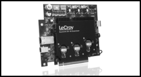

# 第18章 系统复位 (System Reset)

## 前一章回顾

前一章描述了PCIe功能（Function）生成中断的不同方式。旧的PCI模型使用引脚来实现中断，但在串行模型中，边带信号是不受欢迎的，因此强制要求支持带内MSI（消息信号中断）机制。出于软件向后兼容的原因，PCI INTx#引脚操作仍然可以使用PCIe INTx消息来模拟。本章描述了PCI传统INTx#方法和较新版本的MSI/MSI-X。

## 本章内容

本章描述了PCIe定义的四种复位类型：冷复位（Cold Reset）、热复位（Warm Reset）、热复位（Hot Reset）和功能级复位（Function-Level Reset）。本章讨论了使用边带复位信号PERST#生成系统复位的方法，以及使用带内TS1生成热复位的方法。

## 下一章预告

下一章描述PCI Express热插拔模型。还为所有支持热插拔功能的设备和外形尺寸定义了标准使用模型。热插拔卡的电源也是一个问题，当在运行时将新卡添加到系统中时，确保其电源需求不超过系统所能提供的电源是很重要的。需要一个机制来查询和控制设备的电源需求，电源预算（Power Budgeting）提供了这个功能。

---

## 18.1 系统复位的两个类别

PCI Express规范描述了四种复位机制。其中三种是早期PCIe规范版本的一部分，现在统称为**传统复位（Conventional Reset）**，其中两种称为**基本复位（Fundamental Reset）**。第四种类别和方法是在2.0规范修订版中添加的，称为**功能级复位（Function Level Reset, FLR）**。

---

## 18.2 传统复位（Conventional Reset）

### 18.2.1 基本复位（Fundamental Reset）

基本复位（Fundamental Reset）由硬件处理，复位整个设备，重新初始化每个状态机和所有硬件逻辑、端口状态以及配置寄存器。此规则的例外是一组被标识为"粘性（sticky）"的配置寄存器字段，这意味着除非所有电源都被移除，否则它们会保留其内容。这使得它们在诊断需要复位才能使链路重新工作的问题时非常有用，因为错误状态在复位后仍然保留，可供软件 afterwards 使用。如果主电源被移除但Vaux可用，这也会保持粘性位，但如果主电源和Vaux都丢失，粘性位将与其他所有内容一起被复位。

基本复位发生在系统范围复位时，但也可以对单个设备执行。

定义了两种类型的基本复位：

- **冷复位（Cold Reset）**：当设备的主电源打开时产生的结果。循环电源将导致冷复位。
- **热复位（Warm Reset）**（可选）：通过系统特定的方式触发，而不关闭主电源。例如，系统电源状态的变化可能用于启动此复位。规范未定义生成热复位的机制，因此系统设计者将选择如何执行此操作。

当发生基本复位时：

- 对于正电压，接收端端接需要满足ZRX-HIGH-IMP-DC-POS参数。在2.5 GT/s时，这不小于10 KΩ。在更高速度下，对于低于200mv的电压，它必须不小于10 KΩ，对于高于200mv的电压，必须不小于20 KΩ。这些是端接未通电时的值。
- 类似地，对于负电压，ZRX-HIGH-IMP-DC-NEG参数的值在任何情况下都是最小1 KΩ。
- 发送端端接需要满足输出阻抗ZTX-DIFF-DC，Gen1为80到120Ω，Gen2和Gen3最大为120Ω，但可以将驱动器置于高阻抗状态。
- 发送端保持0到3.6 V之间的直流共模电压。

当退出基本复位时：

- 当接收端端接被启用时，单端接收端端接必须存在，以便接收端检测正常工作（Gen1和Gen2为40-60Ω，Gen3为50Ω ± 20%）。在进入检测状态时，共模阻抗必须在50Ω ± 20%的适当范围内。
- 必须在基本复位退出后5毫秒内重新启用其接收端端接ZRX-DIFF-DC为100Ω，使其在训练期间可被邻居的发送端检测到。
- 发送端保持0到3.6 V之间的直流共模电压。

定义了两种传递基本复位的方法。首先，它可以用一个称为PERST#（PCI Express复位）的辅助边带信号来表示。其次，当PERST#未提供给附加卡或组件时，当电源循环时，组件或附加卡自主生成基本复位。

#### 18.2.1.1 PERST#基本复位生成

PCI Express系统中的中央资源设备（如芯片组）提供此复位。例如，图18-1中的IO控制器中心（ICH）芯片可能基于系统电源"POWERGOOD"信号的状态生成PERST#，因为这表示主电源已打开且稳定。如果电源循环关闭，POWERGOOD切换并导致PERST#断言和取消断言，从而导致冷复位。系统还可以提供通过其他方式切换PERST#的方法来实现热复位。

PERST#信号馈送到主板上的所有PCI Express设备，包括连接器和图形控制器。设备可以选择使用PERST#，但不是必需的。PERST#还馈送到图中所示的PCIe-to-PCI-X桥。桥总是将其主（上行）总线上的复位转发到其次（下行）总线，因此PCI-X总线看到RST#被断言。

```
图18-1：PERST#生成示意图


*原文图示：复位类型*


                    处理器
                      |
                     FSB
                      |
    +-----------------+------------------+
    |                                    |
   GFX                               Root Complex
   (PCI Express                      |
    GFX)                             |
    |                                |
    |           DDR SDRAM            |
    |                                |
    |                                |
    +-----------PCI Express----------+
                      |
                      |
                 +----+----+
                 |   ICH   |
                 | (IO控制 |
                 |  器中心) |
                 +----+----+
                      |
        +------+------+------+------+
        |      |      |      |      |
     POWERGOOD PERST# IEEE   SCSI   PCI
                      1394          |
                                    |
                              +-----+-----+
                              |  Switch   |
                              +-----+-----+
                                    |
                    +---------------+---------------+
                    |               |               |
              PCIe-to-PCI-X    Add-In Card    Add-In Card
                    |
                 PRST#
                    |
                 PCI-X
```

#### 18.2.1.2 自主复位生成

设备必须设计为在主电源施加时自主生成其自身的硬件复位。规范未描述如何执行此操作，因此自复位机制可以内置到设备中或作为外部逻辑添加。例如，检测通电的附加卡可以使用该事件为其设备生成本地复位。如果设备检测到其电源超出规定的限制，它还必须生成自主复位。

#### 18.2.1.3 从L2低功耗状态链路唤醒

作为自主复位需求的一个例子，作为主电源管理策略的一部分而关闭主电源的设备，如果设计为发出唤醒信号，则可能能够请求恢复全功率。当电源恢复时，必须复位设备。系统的电源控制器可以向设备断言PERST#引脚，如图18-1所示，但如果不这样做，或者设备不支持PERST#，则设备必须在感应到主电源重新施加时自主生成其自身的基夲复位。

---

### 18.2.2 热复位（Hot Reset）(带内复位)

热复位通过使用TS1有序集（其内容如图18-2所示）在带内从一个链路邻居传播到另一个链路邻居，其中符号5的位0被断言。这些TS1在所有通道上发送，使用先前协商的链路和通道号，持续2毫秒。一旦发送，热复位的收发器都将最终进入检测LTSSM状态（参见第612页的"热复位状态"）。

```
图18-2：显示热复位位的TS1有序集


*原文图示：Fundamental Reset*


TS1有序集结构:
+--------+--------+--------+--------+
| 符号0   | 符号1   | 符号2   | 符号3   |
| COM    | Link # | Lane # | # FTS  |
| K28.5  |        |        |        |
+--------+--------+--------+--------+
| 符号4   | 符号5 (训练控制) | 符号6-13 |
| Rate ID| Bit 0: 热复位   | TS ID  |
|        | 0 = 取消热复位  | D10.2  |
|        | 1 = 断言热复位  |        |
|        | Bit 1: 禁用链路 |        |
|        | Bit 2: 环回     |        |
|        | Bit 3: 禁用加扰 |        |
|        | Bit 4: 合规接收 |        |
|        | Bit 5-7: 保留   |        |
+--------+--------+--------+--------+
| 符号14  | 符号15  |
| TS ID  | TS ID  |
| D10.2  | D10.2  |
+--------+--------+
```

通过在桥的桥控制配置寄存器中设置辅助总线复位位来在软件中启动热复位，如图18-5第840页所示。因此，只有包含桥的设备（如根复合体或交换机）才能执行此操作。在其上行端口接收热复位的交换机必须将其广播到所有下行端口并复位自身。接收热复位的交换机下游的所有设备都将复位自身。

#### 18.2.2.1 接收热复位的响应

- 设备的LTSSM经过恢复和热复位状态，然后返回到检测状态，在那里开始链路训练过程。
- 设备的所有状态机、硬件逻辑、端口状态和配置寄存器（粘性寄存器除外）初始化为其默认条件。

#### 18.2.2.2 交换机在下行端口生成热复位

交换机在以下情况下在其所有下行端口上生成热复位：

- 它在其上行端口接收热复位
- 对于交换机或桥上行端口，如果数据链路层报告DL_Down状态，效果与热复位非常相似。当上行端口由于物理层或数据链路层无法恢复的错误而失去与上游设备的连接时，可能会发生这种情况。
- 软件设置与上行端口关联的桥控制配置寄存器的"辅助总线复位"位，如图18-3第838页所示。

```
图18-3：交换机在一个下行端口生成热复位



*原文图示：Hot Reset*


                    处理器
                      |
                     FSB
                      |
    +-----------------+------------------+
    |                                    |
   GFX                               Root Complex
   (PCI Express                      |
    GFX)                             |
    |                                |
    |           DDR SDRAM            |
    |                                |
    |                                |
    +-----------PCI Express----------+
                      |
                      |
                 +----+----+
                 | Switch A|
                 +----+----+
                      |
        +-------------+-------------+
        |                           |
   'Secondary Bus      +------------+------------+
    Reset'位设置       |            |            |
        |          Switch B     10Gb以太网   Switch C
        |              |
        |              |
    (热复位通过        +----+----+
     TS1有序集            |
     发送)         +------+------+
                  |      |      |
                PCIe   SCSI   Slots
                 to-PCI
                  |
               PRST#
                  |
                 PCI
```

#### 18.2.2.3 桥将热复位转发到辅助总线

如果桥（如PCI Express-to-PCI(-X)桥）在其上行端口检测到热复位，它必须在其次级PCI(-X)总线上断言PRST#信号，如图18-4第839页所示。

```
图18-4：交换机在所有下行端口生成热复位

                    处理器
                      |
                     FSB
                      |
    +-----------------+------------------+
    |                                    |
   GFX                               Root Complex
   (PCI Express                      |
    GFX)                             |
    |                                |
    |           DDR SDRAM            |
    |                                |
    |                                |
    +-----------PCI Express----------+
                      |
                      |
                 +----+----+
                 | Switch C|
                 +----+----+
                      |
        +-------------+-------------+
        |             |             |
   'Secondary Bus   Switch A    Switch B
    Reset'位设置       |
    (在上行端口)       |
                      |
                 +----+----+
                 |PCIe-to- |
                 |PCI桥    |
                 +----+----+
                      |
                   PRST#
                      |
                     PCI
```

#### 18.2.2.4 软件生成热复位

软件通过向关联端口的配置头中的桥控制寄存器的"辅助总线复位"位写入1后跟0来在特定端口上生成热复位（参见图18-5第840页）。考虑图18-3第838页所示的示例。软件设置交换机A左侧下行端口的"辅助总线复位"寄存器，导致它发送设置了热复位位的TS1有序集。交换机B在其上行端口接收此热复位，并将其转发到其所有下行端口。

如果软件设置交换机上行的"辅助总线复位"位，则交换机在其所有下行端口上生成热复位，如图18-4第839页所示。这里，软件设置交换机C的上行端口的辅助总线复位位，导致它在所有下行端口上发送设置了热复位位的TS1。PCIe-to-PCI桥接收此热复位，并通过断言PRST#将其转发到PCI总线。

设置辅助总线复位位会导致端口的LTSSM转换到恢复状态（有关LTSSM的更多信息，请参见第519页的"LTSSM状态概述"），在那里它生成设置了热复位位的TS1。TS1连续生成2毫秒，然后端口退出到检测状态，准备开始链路训练过程。

热复位TS1的接收器（始终是下行）也将进入恢复状态。当它看到两个连续的设置了热复位位的TS1时，它进入热复位状态进行2毫秒超时，然后退出到检测。上行和下行端口都被初始化，最终进入检测状态，准备开始链路训练。如果下游设备也是交换机或桥，它也会将热复位转发到其下行端口，如图18-3第838页所示。

```
图18-5：用于生成热复位的辅助总线复位寄存器

桥控制寄存器（Bridge Control Register）:
+---+---+---+---+---+---+---+---+---+---+---+---+---+---+---+---+
|15 |14 |13 |12 |11 |10 | 9 | 8 | 7 | 6 | 5 | 4 | 3 | 2 | 1 | 0 |
+---+---+---+---+---+---+---+---+---+---+---+---+---+---+---+---+
| 保留  |丢弃定时器|SERR#使能|丢弃定时器状态|辅助丢弃超时|主丢弃超时|
|       |   2.2   |  2.2   |    2.2      |    2.2    |   2.2    |
+---+---+---+---+---+---+---+---+---+---+---+---+---+---+---+---+
|快速背靠背使能|辅助总线复位|主中止模式|VGA使能|ISA使能|SERR#使能|奇偶校验错误响应|
|    2.2     |    [6]    |   2.2   |  2.2  |  2.2  |  2.2  |     2.2      |
+---+---+---+---+---+---+---+---+---+---+---+---+---+---+---+---+

位6: 辅助总线复位 (Secondary Bus Reset)
    0 = 正常操作
    1 = 复位辅助总线
```

#### 18.2.2.5 软件可以禁用链路

软件还可以禁用链路，强制其进入电气空闲并保持在那里，直到进一步通知。此时提到这一点的原因是，禁用链路也会导致下游组件上的热复位。通过设置下行端口的链路控制寄存器中的链路禁用位来完成禁用，如图18-6第841页所示。这会导致端口进入恢复LTSSM状态，并开始发送设置了禁用位的TS1。由于这只能针对下行端口进行控制，如果链路已被禁用，则此位保留给上行端口（如端点或交换机上行的上行端口）。

```
图18-6：链路控制寄存器

链路控制寄存器 (Link Control Register):
+---+---+---+---+---+---+---+---+---+---+---+---+---+---+---+---+
|15 |14 |13 |12 |11 |10 | 9 | 8 | 7 | 6 | 5 | 4 | 3 | 2 | 1 | 0 |
+---+---+---+---+---+---+---+---+---+---+---+---+---+---+---+---+
|保留|链路自主带宽中断使能|链路带宽管理中断使能|硬件自主宽度禁用|
+---+---+---+---+---+---+---+---+---+---+---+---+---+---+---+---+
|使能时钟电源管理|扩展同步|公共时钟配置|重新训练链路|链路禁用|
+---+---+---+---+---+---+---+---+---+---+---+---+---+---+---+---+
|读完成边界控制|保留|主动状态PM控制|
+---+---+---+---+---+---+---+---+---+---+---+---+---+---+---+---+

位4: 链路禁用 (Link Disable)
    0 = 正常操作
    1 = 禁用链路
```

当上行的上行端口识别到传入的设置了禁用位的TS1时，其物理层向链路层发出LinkUp=0（false）信号，所有通道进入电气空闲。经过2毫秒超时后，上行端口将进入检测，但下行端口将保持在禁用LTSSM状态，直到指示退出（例如通过清除链路禁用位），因此链路将保持禁用状态，在那时之前不会尝试训练。

```
图18-7：显示禁用链路位的TS1有序集

TS1有序集结构:
+--------+--------+--------+--------+
| 符号0   | 符号1   | 符号2   | 符号3   |
| COM    | Link # | Lane # | # FTS  |
| K28.5  |        |        |        |
+--------+--------+--------+--------+
| 符号4   | 符号5 (训练控制) | 符号6-13 |
| Rate ID| Bit 0: 热复位   | TS ID  |
|        | 0 = 取消热复位  | D10.2  |
|        | 1 = 断言热复位  |        |
|        | Bit 1: 禁用链路 |        |
|        | 0 = 取消禁用链路|        |
|        | 1 = 断言禁用链路|        |
|        | Bit 2: 环回     |        |
|        | Bit 3: 禁用加扰 |        |
|        | Bit 4: 合规接收 |        |
|        | Bit 5-7: 保留   |        |
+--------+--------+--------+--------+
| 符号14  | 符号15  |
| TS ID  | TS ID  |
| D10.2  | D10.2  |
+--------+--------+
```

---

## 18.3 功能级复位（Function Level Reset, FLR）

FLR功能允许软件仅复位多功能设备中的一个功能，而不影响它们共享的链路。强烈建议实现此功能，但不是必需的，因此软件在尝试使用之前需要通过检查设备功能寄存器来确认其可用性，如图18-8第843页所示。如果设置了功能级复位能力位，则可以通过简单地设置设备控制寄存器中的启动功能级复位位来启动FLR，如图18-9第843页所示。

```
图18-8：功能级复位能力位

设备能力寄存器 (Device Capabilities Register):
+---+---+---+---+---+---+---+---+---+---+---+---+---+---+---+---+
|31 |30 |29 |28 |27 |26 |25 |24 |23 |22 |21 |20 |19 |18 |17 |16 |
+---+---+---+---+---+---+---+---+---+---+---+---+---+---+---+---+
|                    保留                    |FLR能力| 保留      |
|                                            | [28] |           |
+---+---+---+---+---+---+---+---+---+---+---+---+---+---+---+---+

位28: Function-Level Reset Capability (FLR能力)
    0 = 不支持FLR
    1 = 支持FLR
```

```
图18-9：功能级复位启动位

设备控制寄存器 (Device Control Register):
+---+---+---+---+---+---+---+---+---+---+---+---+---+---+---+---+
|15 |14 |13 |12 |11 |10 | 9 | 8 | 7 | 6 | 5 | 4 | 3 | 2 | 1 | 0 |
+---+---+---+---+---+---+---+---+---+---+---+---+---+---+---+---+
|桥配置重试使能/|最大读取请求大小|使能无窥探|辅助电源PM使能|
|启动功能级复位 |               |         |             |
+---+---+---+---+---+---+---+---+---+---+---+---+---+---+---+---+
|幻影功能使能|扩展标签字段使能|最大有效载荷大小|使能宽松排序|
+---+---+---+---+---+---+---+---+---+---+---+---+---+---+---+---+
|不支持的请求报告使能|致命错误报告使能|非致命错误报告使能|可纠正错误报告使能|
+---+---+---+---+---+---+---+---+---+---+---+---+---+---+---+---+

位15: Initiate Function-Level Reset (启动功能级复位)
    0 = 正常操作
    1 = 启动FLR
```

规范提到了几个激励添加FLR的示例：

1. 控制功能的软件可能遇到问题并且不再正确运行。防止数据损坏需要复位该功能，但如果设备中的其他功能仍在正常工作，则希望能够仅复位有问题的功能。

2. 在虚拟化环境中，应用程序可以从一个硬件迁移到另一个硬件，重要的是当应用程序从功能移出时，该功能不保留有关其正在执行的任何信息。这可以防止一个应用程序使用的可能被视为机密的信息对运行在该功能上的新应用程序可见。清理迁移先前应用程序后的最简单方法就是简单地复位该功能。

3. 当软件正在为功能重建软件堆栈时，有时需要首先将功能置于未初始化状态。与之前一样，避免复位共享链路的所有功能是理想的。

另一个功能没有出现在规范中的案例列表中，但仍然是一个激励因素。虽然传统复位将重新初始化设备中的所有内容，但它不要求所有外部活动（如网络接口上的流量）必须立即停止。FLR添加了这个要求，是唯一这样做的复位。

FLR复位功能的内部状态和寄存器，使其静止，但不会影响任何粘性位、硬件初始化位或链路特定寄存器，如捕获功率、ASPM控制、Max_Payload_Size或虚拟通道寄存器。如果已发送未完成的断言INTx中断消息，则必须发送相应的取消断言INTx消息，除非该中断在内部被另一个仍断言它的功能共享。当接收到FLR时，要求该功能的所有外部活动停止。

### 18.3.1 允许的时间

功能必须在100毫秒内完成FLR。但是，如果存在任何尚未返回的未完成分割完成（由设备状态寄存器中的事务待定位保持设置指示），软件可能需要延迟启动FLR。在这种情况下，软件必须要么等待它们完成后再启动FLR，要么在FLR后等待100毫秒再尝试重新初始化功能。如果未管理此问题，则可能出现潜在的数据损坏问题：功能可能有未完成的分割事务，但复位会导致它丢失对它们的跟踪。如果它们稍后返回，它们可能被误认为是自FLR以来发出的新请求的响应。为避免此问题，规范建议软件应：

1. 与可能访问该功能的其他软件协调，以确保它在FLR期间不会尝试访问。
2. 清除整个命令寄存器，从而使功能静止。
3. 通过轮询设备状态寄存器中的事务待定位直到清除，或等待足够长的时间以确保完成不会返回，确保先前请求的完成已返回。多长时间足够长？如果使用完成超时，则在发送FLR之前等待超时期间。如果禁用完成超时，则至少等待100毫秒。
4. 启动FLR并等待100毫秒。
5. 设置功能的配置寄存器并启用它以进行正常操作。

当FLR完成时，无论时间如何，事务待定位必须清除。

### 18.3.2 FLR期间的行为

规范编写者选择以相当广泛的术语描述功能复位的行为，以免排除设计人员可能希望采取的任何内部步骤。规范中列出了以下行为：

- 功能不得在外部接口上显示为具有活动主机的初始化适配器。确保外部接口上的所有活动终止的步骤将是设计特定的。例如，网络适配器不得响应需要活动主机的请求。

- 功能不得保留可能包括功能先前使用留下的机密信息的任何软件可读状态。例如，任何内部存储器必须清除或随机化。

- 功能必须由下一个驱动程序正常配置。

- 功能必须为导致FLR的配置写操作返回完成，然后启动FLR。

当FLR正在进行时：

- 允许静默丢弃到达的任何请求，而不记录它们或发出错误信号。但是，必须更新流量控制信用量以保持链路操作。

- 传入的完成可以被视为意外完成，或静默丢弃而不记录它们或发出错误信号。

- FLR本身必须在上述描述的时间内完成，但之后的进一步初始化可能需要更长时间。如果在初始化完成之前传入配置请求，功能必须返回带有CRS（配置重试状态）状态的完成。一旦返回带有任何其他状态的完成，在功能再次复位之前，CRS状态将不再合法。

---

## 18.4 复位退出

退出复位状态后，链路训练和初始化必须在20毫秒内开始。设备可以在不同时间退出复位状态，因为复位信号是异步的，但必须在此时间内开始训练。

为了允许复位组件执行内部初始化，系统软件在尝试向它们发送配置请求之前，必须等待复位结束后至少100毫秒。如果软件在100毫秒等待时间后向设备启动配置请求，但设备仍未完成其自初始化，它将返回带有CRS状态的完成。由于配置请求只能由CPU启动，完成将返回到根复合体。作为响应，根可以自动重新发出配置请求，或使失败对软件可见。规范还指出，软件应仅在已启用CRS软件可见性时使用100毫秒等待期，否则可能会导致长时间超时或处理器停顿。

设备在复位后被允许整整1.0秒（-0%/+50%）才能对配置请求给出适当的响应。因此，系统必须小心，在决定无响应的设备是否损坏之前等待那么长时间。此值继承自PCI，此 lengthy 延迟的原因可能是某些设备将配置空间实现为本地存储器，必须在配置软件正确看到之前进行初始化。其初始化可能涉及从慢速串行EEPROM复制必要信息，因此可能需要一些时间。

---

## 18.5 Linux内核复位实现

### 源码位置
- `drivers/pci/pcie/aer.c` - AER复位处理
- `drivers/pci/pci.c` - 通用PCI复位接口

### 复位类型支持

```c
// PCI复位方法枚举
enum pci_reset_method {
    PCI_RESET_METHOD_D3COLD = 0,    // D3cold复位
    PCI_RESET_METHOD_BUS,            // 总线复位（热复位）
    PCI_RESET_METHOD_SLOT,           // 插槽复位
    PCI_RESET_METHOD_FUNCTION,       // 功能级复位（FLR）
    PCI_RESET_METHOD_HOT_RESET,      // 热复位
    PCI_RESET_METHOD_COLD_RESET,     // 冷复位
};
```

### 功能级复位（FLR）实现

```c
int pci_reset_function(struct pci_dev *dev)
{
    // 1. 检查FLR能力（Device Capabilities Register位28）
    // 2. 检查事务待定位（PCI_EXP_DEVSTA_TRANSACTION_PENDING）
    // 3. 设置Initiate Function-Level Reset位（Device Control Register位15）
    // 4. 等待100ms完成复位
}
```

**FLR注意事项**（与文档一致）：
1. 复位前需确保无未完成事务
2. 必须等待100ms让FLR完成
3. 粘性位（Sticky Bits）在FLR后保留

### 热复位实现

```c
int pci_reset_bus(struct pci_dev *dev)
{
    // 1. 设置Bridge Control Register的Secondary Bus Reset位（位6）
    // 2. 等待2ms
    // 3. 清除Secondary Bus Reset位
    // 4. 等待设备恢复（100ms）
}
```

### 复位时序

| 阶段 | 时间要求 | 说明 |
|------|----------|------|
| 复位断言 | 2ms（热复位） | TS1有序集发送时间 |
| 复位退出到训练开始 | 20ms | 最大延迟 |
| 软件等待配置访问 | 100ms | 设备初始化时间 |
| 设备响应配置请求 | 1.0s | 最大允许时间 |

### 用户接口

```bash
# 通过sysfs触发FLR（如果设备支持）
echo 1 > /sys/bus/pci/devices/0000:01:00.0/reset

# 查看设备复位能力
lspci -vvv -s 0000:01:00.0 | grep -i reset
```

---

## 本章总结

PCIe定义了四种类型的复位机制：

| 复位类型 | 描述 | 触发方式 |
|---------|------|---------|
| **冷复位（Cold Reset）** | 基本复位的一种，主电源开启时发生 | 电源循环 |
| **热复位（Warm Reset）** | 基本复位的一种，不关闭主电源 | 系统特定方式（可选） |
| **热复位（Hot Reset）** | 带内复位，通过TS1有序集传播 | 软件设置桥控制寄存器或链路丢失 |
| **功能级复位（FLR）** | 仅复位单个功能，不影响共享链路 | 软件设置设备控制寄存器 |

**关键要点：**

1. **基本复位**复位整个设备，但保留"粘性"寄存器内容，除非所有电源都丢失。
2. **PERST#**是用于生成基本复位的边带信号。
3. **热复位**使用带内TS1有序集传播，位0在符号5中设置。
4. **FLR**允许单独复位多功能设备中的一个功能，在虚拟化环境中特别有用。
5. 复位退出后，设备有100毫秒进行内部初始化，系统软件应在此之后才能访问配置空间。

---

## 术语对照表

| 英文术语 | 中文翻译 | 缩写 |
|---------|---------|------|
| Fundamental Reset | 基本复位 | - |
| Cold Reset | 冷复位 | - |
| Warm Reset | 热复位（电源不关断） | - |
| Hot Reset | 热复位（带内复位） | - |
| Function Level Reset | 功能级复位 | FLR |
| PERST# | PCI Express复位信号 | - |
| Sticky Bits | 粘性位 | - |
| Link Training and Status State Machine | 链路训练与状态状态机 | LTSSM |
| Training Sequence 1 | 训练序列1 | TS1 |
| Root Complex | 根复合体 | RC |
| Configuration Retry Status | 配置重试状态 | CRS |

---

*翻译来源: MindShare PCI Express Technology 3.0, Chapter 18: System Reset (第832-847页)*
*术语表参考: /home/ai/dev/10-reference/pcie_translation/术语表.md*
---

## 18.5 Linux内核实现参考（平台特定补充）

### 18.5.1 Linux复位实现

Linux内核实现了书中第18章介绍的PCIe复位机制，包括传统复位和功能级复位（FLR）。

#### 传统复位实现

```c
// 来自 drivers/pci/pci.c

// 热复位（对应书中18.2.2节）
int pcie_hot_reset(struct pci_dev *dev)
{
    u16 ctrl;
    int i;
    
    // 读取链路控制寄存器
    pcie_capability_read_word(dev, PCI_EXP_LNKCTL, &ctrl);
    
    // 设置热复位位（对应书中18.2.2节）
    ctrl |= PCI_EXP_LNKCTL_RL;
    pcie_capability_write_word(dev, PCI_EXP_LNKCTL, ctrl);
    
    // 保持复位至少100us（书中要求）
    msleep(100);
    
    // 清除热复位位
    ctrl &= ~PCI_EXP_LNKCTL_RL;
    pcie_capability_write_word(dev, PCI_EXP_LNKCTL, ctrl);
    
    // 等待链路训练完成
    for (i = 0; i < 1000; i++) {
        pcie_capability_read_word(dev, PCI_EXP_LNKSTA, &ctrl);
        if (ctrl & PCI_EXP_LNKSTA_DLLLA)
            break;
        msleep(10);
    }
    
    return 0;
}
```

**与书中18.2.2节的对应**：

书中热复位流程：
1. 发送TS1有序集（带热复位位）
2. 保持复位至少100us
3. 退出复位，开始链路训练

Linux实现：
1. 设置`PCI_EXP_LNKCTL_RL`位
2. 延时100ms
3. 清除`PCI_EXP_LNKCTL_RL`位
4. 等待`PCI_EXP_LNKSTA_DLLLA`（数据链路层激活）

#### 功能级复位（FLR）实现

```c
// 功能级复位（对应书中18.3节）
int pcie_flr(struct pci_dev *dev)
{
    u32 cap;
    u16 ctrl, cap2;
    int i;
    
    // 检查FLR能力（对应书中18.3.1节）
    pcie_capability_read_dword(dev, PCI_EXP_DEVCAP, &cap);
    if (!(cap & PCI_EXP_DEVCAP_FLR))
        return -ENOTTY;  // 不支持FLR
    
    // 保存设备状态
    pci_save_state(dev);
    
    // 触发FLR（对应书中18.3.3节）
    pcie_capability_read_word(dev, PCI_EXP_DEVCTL, &ctrl);
    ctrl |= PCI_EXP_DEVCTL_BCR_FLR;
    pcie_capability_write_word(dev, PCI_EXP_DEVCTL, ctrl);
    
    // 等待FLR完成（书中要求100ms）
    msleep(100);
    
    // 恢复设备状态
    pci_restore_state(dev);
    
    return 0;
}
```

**与书中18.3节的对应**：

书中FLR流程：
1. 检查FLR能力
2. 停止设备活动
3. 设置FLR位
4. 等待100ms
5. 重新初始化设备

Linux实现：
1. 检查`PCI_EXP_DEVCAP_FLR`
2. `pci_save_state()`保存状态
3. 设置`PCI_EXP_DEVCTL_BCR_FLR`
4. 延时100ms
5. `pci_restore_state()`恢复状态

#### 基本复位实现

```c
// 基本复位（冷复位/热复位）
int pci_reset_bus(struct pci_dev *dev)
{
    struct pci_bus *bus = dev->bus;
    
    // 尝试功能级复位
    if (pcie_flr(dev) == 0)
        return 0;
    
    // 尝试热复位
    if (pcie_hot_reset(dev) == 0)
        return 0;
    
    // 尝试桥接器复位
    if (pci_parent_bus_reset(dev) == 0)
        return 0;
    
    return -ENOTTY;
}
```

### 18.5.2 复位状态处理

```c
// 配置重试状态（CRS）处理（对应书中18.4节）
static int pci_crs_retry(struct pci_dev *dev)
{
    int i;
    
    // CRS超时重试（书中要求最多64ms）
    for (i = 0; i < 65; i++) {
        u32 status;
        
        // 读取配置状态
        pci_read_config_dword(dev, PCI_STATUS, &status);
        
        // 检查CRS位
        if (!(status & PCI_STATUS_CRS))
            return 0;  // 设备就绪
        
        msleep(1);
    }
    
    return -ETIME;  // 超时
}
```

**与书中18.4节的对应**：

书中CRS要求：
- 设备返回CRS表示未就绪
- 软件应重试配置访问
- 最多等待64ms

Linux实现：
- 检查`PCI_STATUS_CRS`
- 最多重试65次（65ms）
- 超时返回错误

### 18.5.3 飞腾平台复位支持

飞腾PCIe控制器支持完整的复位机制：

```c
// 飞腾复位相关寄存器（假设）
#define PHYTIUM_PCIE_RST_CTRL       0x1000  // 复位控制
#define PHYTIUM_PCIE_RST_LINK       (1 << 0) // 链路复位
#define PHYTIUM_PCIE_RST_FLR        (1 << 1) // FLR复位
#define PHYTIUM_PCIE_RST_STATUS     0x1004  // 复位状态
```

**调试技巧**：
1. 查看复位状态：`lspci -vv | grep -i reset`
2. 手动触发复位：`echo 1 > /sys/bus/pci/devices/.../reset`
3. 检查FLR支持：`lspci -vv | grep -i flr`

### 18.5.4 实际应用建议

**复位策略**：
- 首选FLR（影响最小，只复位单个功能）
- 次选热复位（影响链路，需要重新训练）
- 最后选择基本复位（影响整个总线）

**故障排查**：
1. 设备无响应：尝试FLR
2. 链路错误：尝试热复位
3. 总线错误：尝试基本复位

**注意事项**：
- 复位前保存设备状态
- 复位后恢复设备配置
- 检查复位是否成功（链路状态）
- 处理CRS重试

---

*翻译来源: MindShare PCI Express Technology 3.0, Chapter 18: System Reset*
*平台补充: Linux复位实现参考*
*术语表参考: /home/ai/dev/10-reference/pcie_translation/术语表.md*
