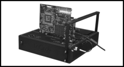

# 第19章 热插拔与电源预算

**来源**: MindShare《PCI Express Technology 3.0》第19章 (第848-903页)

---

## 本章内容

**前一章**

前一章描述了PCIe定义的三类复位：基本复位（包括冷复位和热复位）、热复位（Hot Reset）以及功能级复位（FLR）。讨论了使用边带复位信号PERST#来产生系统复位，以及基于带内TS1有序集的热复位。

**本章**

本章描述PCI Express热插拔和电源预算。热插拔允许用户在不关闭系统电源的情况下添加或移除PCIe设备。电源预算确保系统能够为所有已安装的设备提供足够的功率。

**下一章**

下一章介绍PCIe规范2.1版本的更新，包括多播、原子操作、TPH（TLP处理提示）、TLP前缀、IDO（基于ID的排序）、ARI（替代路由ID解释）等特性，以及电源管理改进。

---

## 19.1 背景

热插拔（Hot Plug）功能允许在系统运行时添加或移除PCI Express卡，而无需关闭系统电源。这对于需要高可用性的服务器系统尤为重要。

PCI Express热插拔设计遵循"无意外"（no surprises）原则。换句话说，用户通常不允许在未通知系统的情况下安装或移除PCI Express卡。软件会先准备卡和插槽，最后向操作员指示热插拔过程的状态，并通知可以执行安装或移除操作。

### 19.1.1 PCI Express环境中的热插拔

PCI Express热插拔与PCI热插拔有以下主要区别：

1. **点对点连接**：PCIe使用点对点连接，消除了共享总线上的隔离逻辑需求
2. **分布式热插拔控制器**：每个支持热插拔的端口都有独立的热插拔控制器
3. **标准化软件接口**：为每个根端口和交换机端口定义了标准化的软件接口

### 19.1.2 意外移除通知

按照PCIe卡机电规范（CEM）设计的卡在连接器上实现了卡存在检测引脚（PRSNT1#和PRSNT2#）。这些引脚比其他引脚短，因此在从插槽中移除卡时会先断开连接。这可以用于向软件提前通知"意外"移除，允许在信号断开之前有时间移除电源。

### 19.1.3 PCI与PCIe热插拔的区别

支持热插拔所需的元素在PCI和PCIe热插拔解决方案中基本相同。但是，PCI解决方案在系统板上实现一个单一的标准化热插拔控制器来处理总线上的所有热插拔插槽。在PCI环境中需要隔离逻辑来在更改之前将卡与共享总线电气断开，以避免在活动总线上产生信号毛刺。

PCIe使用点对点连接，消除了对隔离逻辑的需求，但需要为每个连接器的端口配备单独的热插拔控制器。为每个根端口和交换机端口定义的标准化软件接口控制热插拔操作。

**图19-1：PCI热插拔元素**


*原文图示：热插拔*


```
+------------------+         +------------------+
|   热插拔软件      |         |   热插拔软件      |
|   (操作系统)      |<------->|   (系统BIOS)     |
+------------------+         +------------------+
          |                           |
          v                           v
+------------------+         +------------------+
|  热插拔系统驱动   |         |  热插拔系统驱动   |
+------------------+         +------------------+
          |                           |
          v                           v
+------------------+         +------------------+
|  热插拔控制器    |<------->|  热插拔控制器    |
|  (标准化接口)    |         |  (标准化接口)    |
+------------------+         +------------------+
          |                           |
    +-----+-----+               +-----+-----+
    |     |     |               |     |     |
    v     v     v               v     v     v
+------+------+------+    +------+------+------+
| 插槽1 | 插槽2 | 插槽3 |    | 插槽1 | 插槽2 | 插槽3 |
+------+------+------+    +------+------+------+
| 隔离  | 隔离  | 隔离  |    |      |      |      |
| 逻辑  | 逻辑  | 逻辑  |    |      |      |      |
+------+------+------+    +------+------+------+
     PCI共享总线               PCIe点对点连接
```

---

## 19.2 支持热插拔所需的元素

如图19-2所示，要使热插拔环境工作，涉及几个部分。为了讨论，我们将这些分解为软件元素和硬件元素。



*原文图示：电源预算*


### 19.2.1 软件元素

下表描述了支持热插拔功能的主要软件元素。

**表19-1：主要热插拔软件元素介绍**

| 软件元素 | 提供者 | 描述 |
|---------|--------|------|
| 用户界面 | 操作系统供应商 | 操作系统提供的实用程序，允许用户请求关闭连接器电源以移除卡，或打开电源以使用刚安装的卡 |
| 热插拔服务 | 操作系统供应商 | 处理操作系统发出的请求（称为热插拔原语）的服务。这包括：提供插槽标识符、打开或关闭卡电源、打开或关闭注意指示灯、读取插槽当前电源状态（开或关）。热插拔服务与热插拔系统驱动程序交互以满足请求 |
| 标准化热插拔系统驱动程序 | 系统板供应商或操作系统 | 从操作系统内的热插拔服务接收请求（热插拔原语）。与硬件热插拔控制器交互以完成请求 |
| 设备驱动程序 | 适配卡供应商 | 热插拔功能设备驱动程序必须包含一些热插拔特定功能，包括：支持Quiesce命令、可选支持Pause命令、支持Start命令或可选Resume命令 |

支持热插拔的系统可能使用不支持热插拔功能的操作系统。在这种情况下，虽然系统BIOS会包含热插拔相关软件，但热插拔服务不会存在。假设用户不尝试热插入或移除卡，系统将作为标准非热插拔系统运行：
- 系统启动固件必须确保所有注意指示灯关闭
- 规范还规定："热插拔插槽必须处于适合加载非热插拔系统软件的状态"

### 19.2.2 硬件元素

**表19-2：主要热插拔硬件元素**

| 硬件元素 | 描述 |
|---------|------|
| 热插拔控制器 | 接收并处理热插拔系统驱动程序发出的命令。每个支持热插拔操作的根端口或交换机端口都关联一个控制器。PCIe规范为热插拔控制器定义了标准软件接口 |
| 卡插槽电源开关逻辑 | 允许在程序控制下打开或关闭插槽电源。由热插拔控制器在热插拔系统驱动程序的指导下控制 |
| 卡复位逻辑 | 热插拔控制器根据热插拔系统驱动程序的指示驱动PERST#信号到特定插槽 |
| 电源指示灯 | 指示连接器上当前是否有电源活动。由与每个端口关联的热插拔逻辑控制，并由热插拔系统驱动程序指导 |
| 注意指示灯 | 吸引操作员注意需要服务的连接器。由热插拔逻辑控制，并由热插拔系统驱动程序指导 |
| 注意按钮 | 由操作员按下以通知热插拔软件请求更换卡 |
| 卡存在检测引脚 | 有两个：PRSNT1#位于卡插槽的一端，PRSNT2#位于另一端。这些引脚比其他引脚短，因此在移除卡时会先断开连接。系统板将PRSNT1#接地，并将PRSNT2#作为热插拔控制器的输入连接，接上拉电阻。卡本身将PRSNT1#短接到PRSNT2#，因此如果没有物理插入卡，PRSNT2#输入为高，如果插入了卡则为低 |

---

## 19.3 卡移除和插入过程

以下对典型卡移除和插入的描述旨在作为介绍性质。应注意，以下部分中描述的过程假设操作系统（而非热插拔系统驱动程序）负责配置新安装的设备。如果热插拔系统驱动程序有此职责，热插拔服务将调用热插拔系统驱动程序并指示它配置新安装的设备。

### 19.3.1 开和关状态

处于"开"状态的插槽具有以下特征：
- 电源施加到插槽
- REFCLK开启
- 链路处于活动状态或主动状态电源管理状态
- PERST#信号被取消断言

处于"关"状态的插槽具有以下特征：
- 插槽电源关闭
- REFCLK关闭
- 链路不活动（交换机端口根部的驱动器处于高阻态）
- PERST#信号被断言

### 19.3.2 关闭插槽

关闭当前处于"开"状态的插槽所需的步骤：
1. 停用链路。这可能涉及发出EIOS以进入高阻态
2. 向插槽断言PERST#信号
3. 关闭插槽的REFCLK
4. 移除插槽的电源

### 19.3.3 打开插槽

打开当前处于"关"状态的插槽的步骤：
1. 向插槽施加电源
2. 打开插槽的REFCLK
3. 取消断言插槽的PERST#信号。系统必须满足相对于PERST#上升沿的建立和保持时序要求（在PCI Express规范中指定）

一旦电源和时钟恢复并且PERST#被移除，两个端口的物理层将执行链路训练和初始化。当链路处于活动状态时，设备将初始化VC0（包括流量控制），使链路准备好传输TLP。

### 19.3.4 卡移除过程

当要移除卡时，需要多个步骤来准备软件和硬件以安全移除卡，并为正在处理的卡设置指示灯。在正常操作期间指示灯的状态为：
- 注意指示灯（琥珀色或黄色）- 正常操作期间"关闭"
- 电源指示灯（绿色）- 正常操作期间"开启"

软件使用针对热插拔功能端口实现的插槽控制寄存器的配置写入向热插拔控制器发送请求。这些控制插槽的电源和指示灯的状态。

事件序列如下：

1. 操作员通过按下插槽的注意按钮或使用系统用户界面选择要移除的卡的物理插槽号来请求卡移除。如果使用了按钮，热插拔控制器检测到此事件并向根复合体传递中断。中断指示热插拔服务调用热插拔系统驱动程序读取插槽状态信息并检测注意按钮请求。

2. 接下来，热插拔服务命令热插拔系统驱动程序使插槽的电源指示灯闪烁5秒钟，作为对操作员的视觉反馈。如果这是通过按注意按钮启动的，操作员可以在此5秒间隔内第二次按下按钮取消请求。

3. 电源指示灯在热插拔软件验证请求时继续闪烁。如果卡当前用于某些关键系统操作，软件可能拒绝请求。在这种情况下，它将向热插拔控制器发出命令将电源指示灯重新打开。规范还建议软件通知操作员，可能通过消息或记录条目指示请求被拒绝的原因。

4. 如果请求被验证，热插拔服务实用程序命令卡的设备驱动程序使设备静默。即，禁用其产生新请求的能力，并完成或终止所有未完成的根或交换机端口请求。

5. 然后软件发出命令通过附加插槽的根或交换机端口中的链路控制寄存器禁用卡的链路。

6. 接下来，软件命令热插拔控制器关闭插槽。

7. 成功断电后，软件发出电源指示灯关闭请求，关闭电源指示灯，以便操作员知道可以移除卡。

8. 操作员释放机械保持闩锁（如果有），导致热插拔控制器从插槽移除所有开关信号（例如SMBus和JTAG信号）。现在可以移除卡。

9. 操作系统释放分配给设备的内存空间、I/O空间、中断线等，并使这些资源可用于将来分配给其他设备。

### 19.3.5 卡插入过程

安装新卡的过程基本上反转了卡移除中列出的步骤。以下步骤假设插槽保持在卡从连接器移除后立即处于的状态（换句话说，电源指示灯处于关闭状态，表示插槽已准备好进行卡插入）。

插入和启用卡的步骤如下：

1. 操作员安装卡并固定MRL（机械保持闩锁）。如果实现了MRL传感器，它将向热插拔控制器发出闩锁已关闭的信号，导致开关辅助信号和Vaux连接到插槽。

2. 接下来，操作员通过按下注意按钮或使用热插拔实用程序选择插槽来通知热插拔服务卡已安装。

3. 如果按下了按钮，它向热插拔控制器发出事件信号，导致状态寄存器位被设置并产生发送到根复合体的系统中断。随后，热插拔软件从端口读取插槽状态并识别请求。

4. 热插拔服务向热插拔系统驱动程序发出请求，命令热插拔控制器使插槽的电源指示灯闪烁，以通知操作员不得移除卡。从指示灯开始闪烁时起，操作员被授予5秒的中止间隔，可以通过第二次按下按钮中止请求。

5. 电源指示灯在热插拔软件验证请求时继续闪烁。注意，软件可能无法验证请求（例如，安全策略设置可能禁止启用插槽）。如果请求未通过验证，软件将向热插拔控制器发出命令将电源指示灯重新关闭。规范建议软件通过消息或记录条目通知操作员指示请求被拒绝的原因。

6. 热插拔服务向热插拔系统驱动程序发出请求，命令热插拔控制器打开插槽。

7. 一旦施加电源，软件发出命令打开电源指示灯。

8. 一旦链路训练完成，操作系统命令平台配置例程通过分配必要的资源来配置卡功能。

9. 操作系统定位适当的驱动程序（使用供应商ID和设备ID，或类代码，或子系统供应商ID和子系统ID配置寄存器值作为搜索条件）用于PCI Express设备内的功能，并将其加载到内存中。

10. 然后操作系统调用驱动程序的初始化代码入口点，导致处理器执行驱动程序的初始化代码。此代码完成设备的设置，然后在设备的PCI配置命令寄存器中设置适当的位以启用设备。

---

## 19.4 标准化使用模型

### 19.4.1 背景

基于PCI热插拔规范原始1.0版本的系统实现了硬件和软件设计，差异很大，因为规范没有定义标准化寄存器或用户界面。因此，购买不同供应商的热插拔功能系统的客户面临着用户界面的广泛变化，需要在购买新系统时重新培训操作员。此外，每个板卡设计人员都需要编写软件来管理其实现特定的热插拔控制器。

PCI热插拔控制器（HPC）规范的1.1修订版定义了：
- 消除操作员重新培训的标准用户界面
- 热插拔控制器的标准编程接口，允许将标准化热插拔驱动程序合并到操作系统中

PCI Express实现了HPC规范未定义的寄存器，因此PCI和PCI Express的标准热插拔控制器驱动程序实现略有不同。

### 19.4.2 标准用户界面

用户界面包括以下功能：

**注意指示灯（Attention Indicator）**

使用LED显示插槽的注意状态，可以是开启、关闭或闪烁。规范将闪烁频率定义为1到2 Hz，占空比为50%（±5%）。此指示灯的状态严格受软件控制。

**电源指示灯（Power Indicator）**

显示插槽的电源状态，也可以是开启、关闭或闪烁（1到2 Hz，占空比50%（±5%））。此指示灯由软件控制；但是，规范允许在硬件电源故障条件下例外。

**手动操作保持闩锁和可选传感器（MRL）**

将卡固定在插槽内，并在闩锁释放时通知系统。

**机电互锁（Electromechanical Interlock，可选）**

锁定卡或保持闩锁，以防止在施加电源时移除卡。

**软件用户界面**

允许操作员请求热插拔操作。

**注意按钮（Attention Button）**

允许操作员手动请求热插拔操作。

**插槽编号标识（Slot Numbering Identification）**

提供板上插槽的视觉识别。

---

## 19.5 标准化使用模型的详细元素

### 19.5.1 注意指示灯（Attention Indicator）

如前一节所述，规范要求系统供应商为每个热插拔插槽包含一个注意指示灯。此指示灯必须位于相应插槽附近，颜色为黄色或琥珀色。此指示灯吸引最终用户对插槽进行维护的注意。规范对操作错误和验证错误进行了明确区分，不允许注意指示灯报告验证错误。验证错误是软件在开始热插拔操作之前检测和报告的问题。

**表19-3：插槽注意指示灯的行为和含义**

| 指示灯行为 | 注意状态 |
|-----------|---------|
| 关闭 | 正常 - 正常操作 |
| 开启 | 注意 - 热插拔操作因操作问题而失败（例如，外部电缆问题、附加卡、软件驱动程序和电源故障） |
| 闪烁 | 定位 - 插槽正在按操作员请求被识别 |

### 19.5.2 电源指示灯（Power Indicator）

电源指示灯仅反映插槽主电源的状态，由热插拔软件控制。此指示灯的颜色为绿色，当插槽电源为"开启"时点亮。

规范明确禁止根或交换机端口硬件因电源故障或其他事件而自主更改电源指示灯状态。此规则的唯一例外是允许平台检测卡住的电源故障。卡住的故障是指发出移除插槽电源命令无效的情况。如果系统设计为检测此情况，系统可以覆盖根或交换机端口的命令以关闭电源指示灯，并强制其保持开启。这通知操作员不应从插槽中移除卡。

**表19-4：电源指示灯的行为和含义**

| 指示灯行为 | 电源状态 |
|-----------|---------|
| 关闭 | 电源关闭 - 可以安全地移除或插入卡。热插拔操作所需的所有电源已被移除。仅在手动保持闩锁释放时才移除Vaux |
| 开启 | 电源开启 - 不允许移除或插入卡。电源当前施加到插槽 |
| 闪烁 | 电源转换 - 不允许移除或插入卡。此状态通知操作员软件当前正在响应热插拔请求移除或施加插槽电源 |

### 19.5.3 手动操作保持闩锁和传感器（MRL）

手动保持闩锁（MRL）是必需的，可将PCI Express卡牢固地固定在插槽中。每个MRL可以实现一个可选传感器，通知热插拔控制器闩锁已关闭或打开。规范还允许单个闩锁固定多个卡。此类实现不支持MRL传感器。

MRL传感器是一个开关、光学设备或其他类型的传感器，报告闩锁是关闭还是打开。如果检测到意外的闩锁释放，端口会自动禁用插槽并通知系统软件，但不允许自主更改电源或注意指示灯的状态。

当MRL传感器指示MRL打开时，必须从插槽自动移除开关信号和辅助电源（Vaux）；当MRL传感器指示闩锁关闭时，必须将其恢复到插槽。开关信号包括Vaux、SMBCLK和SMBDAT。

规范还描述了当MRL传感器不存在时移除Vaux和SMBus电源的替代方法。PRSNT#2引脚指示卡是否物理安装到插槽中，可用于触发端口移除开关信号。

### 19.5.4 机电互锁（Electromechanical Interlock，可选）

可选的机电卡互锁机制提供了一种更复杂的方法，确保在电源施加到插槽时不会移除卡。规范未定义互锁的具体性质，但声明它可以物理锁定附加卡或MRL。

锁定机制通过软件控制；但是，没有为其定义特定的编程接口。相反，互锁由与向插槽启用主电源相同的端口信号控制。

### 19.5.5 软件用户界面

操作员可以使用软件界面请求卡移除或插入。此界面由系统软件提供，系统软件还监控插槽并向操作员报告状态信息。规范指出用户界面由操作系统实现，因此超出规范的范围。

操作员必须能够在每个插槽独立启动操作，与其他插槽无关。因此，操作员可以在一个插槽上启动热插拔操作，使用软件用户界面或注意按钮，而另一个插槽上的热插拔操作正在进行中。无论操作员使用哪个界面启动第一个热插拔操作，都可以这样做。

### 19.5.6 注意按钮（Attention Button）

注意按钮是一个瞬时接触按钮开关，位于相应热插拔插槽附近或模块上。操作员按下此按钮以启动此插槽的热插拔操作（例如，卡移除或插入）。

一旦按下注意按钮，电源指示灯开始闪烁。从闪烁开始，操作员有5秒钟的时间通过第二次按下按钮中止热插拔操作。

规范建议如果注意按钮启动的操作失败，系统软件应通知操作员失败。例如，可以报告或记录解释失败性质的消息。

### 19.5.7 插槽编号标识（Slot Numbering Identification）

软件和操作员必须能够根据其插槽号识别物理插槽。每个支持热插拔的端口必须实现软件用于识别物理插槽号的寄存器。寄存器包括物理插槽号和机箱号。主机箱始终标记为机箱0。其他机箱的机箱号必须为非零，并通过PCI-to-PCI桥的机箱号寄存器分配。

---

## 19.6 标准化热插拔控制器信号接口

### 19.6.1 热插拔控制器编程接口

PCI Express规范定义了支持热插拔控制器所需的寄存器，这些寄存器集成到各个根端口和交换机端口中。在热插拔软件控制下，这些控制器和关联的端口接口必须控制卡接口信号，以确保在更换卡时有条不紊地断电和通电。为此，它们需要：

- 向PCI Express卡连接器断言和取消断言PERST#信号
- 移除或向卡连接器施加电源
- 选择性地打开或关闭与特定卡连接器关联的电源和注意指示灯，以吸引用户对连接器的注意并指示是否向插槽施加了电源
- 监控插槽事件（例如卡移除）并通过中断向软件报告

**图19-3：交换机内的热插拔控制功能**


*原文图示：插槽结构*


```
+------------------+
|   交换机端口      |
|                  |
|  +-------------+ |
|  | 热插拔控制器 | |
|  +-------------+ |
|       |          |
|  信号 |          |
|       v          |
|  +-------------+ |
|  | 插槽接口    |<----+ 卡连接器
|  +-------------+ |
+------------------+
```

**标准化热插拔控制器信号接口包括以下必需和可选的端口接口信号**：

| 信号 | 必需/可选 | 描述 |
|-----|----------|------|
| PWRLED# | 必需 | 端口输出，控制电源指示灯状态 |
| ATNLED# | 必需 | 端口输出，控制注意指示灯状态 |
| PWREN | 必需（如果实现参考时钟） | 端口输出，控制插槽主电源 |
| REFCLKEN# | 必需 | 端口输出，控制向插槽传递参考时钟 |
| PERST# | 必需 | 端口输出，控制插槽的PERST# |
| PRSNT1# | 必需 | 在连接器处接地 |
| PRSNT2# | 必需 | 端口输入，在系统板上拉，指示插槽中卡的存在 |
| PWRFLT# | 必需 | 端口输入，通知热插拔控制器外部逻辑检测到的电源故障条件 |
| AUXEN# | 必需（如果实现AUX电源） | 端口输出，控制MRL打开和关闭时向插槽的开关AUX信号和AUX电源 |
| MRL# | 必需（如果实现MRL传感器） | 来自MRL传感器的端口输入 |
| BUTTON# | 必需（如果实现注意按钮） | 端口输入，指示操作员已按下注意按钮 |

### 19.6.2 PCIe能力寄存器用于热插拔

**图19-4：用于热插拔的PCIe能力寄存器**

```
DW0: PCIe能力寄存器
+------------------+------------------+
| PCIe能力ID      | 下一个能力指针    |
+------------------+------------------+

DW1: 设备能力寄存器
DW2: 设备控制/状态寄存器
DW3: 链路能力寄存器
DW4: 链路控制/状态寄存器
DW5: 插槽能力寄存器
DW6: 插槽控制/状态寄存器
DW7: 根能力/控制寄存器
DW8: 根状态寄存器
DW9: 设备能力2寄存器
DW10: 设备控制2/状态2寄存器
DW11: 链路能力2寄存器
DW12: 链路控制2/状态2寄存器
DW13: 插槽能力2寄存器
DW14: 插槽控制2/状态2寄存器
```

### 19.6.3 插槽能力（Slot Capabilities）

**图19-5：插槽能力寄存器**

```
31        19 18 17 16 15 14    7 6 5 4 3 2 1 0
+-----------+--+--+--+--+------+-+-+-+-+-+-+-+
| 物理插槽号 |NC|EI|SPS|SPL|保留|H|H|P|P|M|P|A|
|           |CS|LP|cale|Value| |C|S|I|I|R|C|B|
+-----------+--+--+--+--+------+-+-+-+-+-+-+-+

位0: 注意按钮存在 - 指示插槽旁边机箱上注意按钮的存在
位1: 电源控制器存在 - 指示此插槽电源控制器的存在
位2: MRL传感器存在 - 指示插槽上MRL传感器的存在
位3: 注意指示灯存在 - 指示插槽旁边机箱上注意指示灯的存在
位4: 电源指示灯存在 - 指示插槽旁边机箱上电源指示灯的存在
位5: 热插拔意外 - 指示用户可能在没有事先通知的情况下从系统移除卡
位6: 热插拔能力 - 指示此插槽支持热插拔操作
位14:7: 插槽电源限制值 - 指定此插槽可提供的最大功率
位16:15: 插槽电源限制比例 - 指定插槽电源限制值的比例因子
位17: 机电互锁存在 - 指示为此插槽实现
位18: 无命令完成支持 - 指示此插槽在命令完成时不生成软件通知
位31:19: 物理插槽号 - 指示与此端口关联的物理插槽号
```

**表19-5：插槽能力寄存器字段和描述**

| 位 | 寄存器名称和描述 |
|---|----------------|
| 0 | 注意按钮存在 - 指示插槽旁边机箱上注意按钮的存在 |
| 1 | 电源控制器存在 - 指示此插槽电源控制器的存在 |
| 2 | MRL传感器存在 - 指示插槽上MRL传感器的存在 |
| 3 | 注意指示灯存在 - 指示插槽旁边机箱上注意指示灯的存在 |
| 4 | 电源指示灯存在 - 指示插槽旁边机箱上电源指示灯的存在 |
| 5 | 热插拔意外 - 指示用户可能在没有事先通知的情况下从系统移除卡。这告诉操作系统允许此类移除而不影响持续的软件操作 |
| 6 | 热插拔能力 - 指示此插槽支持热插拔操作 |
| 14:7 | 插槽电源限制值 - 指定此插槽可提供的最大功率。此限制值乘以下一个字段中指定的比例 |
| 16:15 | 插槽电源限制比例 - 指定插槽电源限制值的比例因子 |
| 17 | 机电互锁存在 - 指示为此插槽实现 |
| 18 | 无命令完成支持 - 指示此插槽在命令完成时不生成软件通知 |
| 31:19 | 物理插槽号 - 指示与此端口关联的物理插槽号。它必须硬件初始化为机箱内唯一的编号 |

### 19.6.4 插槽电源限制控制（Slot Power Limit Control）

规范提供了一种方法，让软件限制安装到扩展插槽或背板实现中的卡消耗的功率。支持此功能的寄存器包含在插槽能力寄存器中。

### 19.6.5 插槽控制（Slot Control）

**图19-6：插槽控制寄存器**

```
15 14 13 12 11 10 9 8 7 6 5 4 3 2 1 0
+-+-+-+-+--+--+--+--+--+--+--+--++-+-+
|保留|DLL|EI|PC|PI|AI|HPI|CCI|PDC|MSC|PFD|ABP|
|   |SCE|LC|C |C |C |E  |E  |E  |E  |E  |E  |
+-+-+-+-+--+--+--+--+--+--+--+--++-+-+

位0: 注意按钮按下启用
位1: 电源故障检测启用
位2: MRL传感器更改启用
位3: 存在检测更改启用
位4: 命令完成中断启用
位5: 热插拔中断启用
位7:6: 注意指示灯控制 (00b=保留, 01b=开启, 10b=闪烁, 11b=关闭)
位9:8: 电源指示灯控制 (00b=保留, 01b=开启, 10b=闪烁, 11b=关闭)
位10: 电源控制器控制 (0b=电源开启, 1b=电源关闭)
位11: 机电互锁控制
位12: 数据链路层状态更改启用
```

**表19-6：插槽控制寄存器字段和描述**

| 位 | 寄存器名称和描述 |
|---|----------------|
| 0 | 注意按钮按下启用 - 设置时，此位启用热插拔中断（如果启用）或Wake#消息的生成，当按下注意按钮时 |
| 1 | 电源故障检测启用 - 设置时，启用热插拔中断（如果启用）或Wake#消息的生成，当检测到电源故障时 |
| 2 | MRL传感器更改启用 - 设置时，启用热插拔中断或Wake#（如果启用）消息的生成，当检测到MRL传感器更改事件时 |
| 3 | 存在检测更改启用 - 设置时，此位启用热插拔中断或Wake消息的生成，当插槽状态寄存器中的存在检测更改位被设置时 |
| 4 | 命令完成中断启用 - 设置时，启用热插拔中断的生成，通知软件热插拔控制器已准备好接收下一个命令 |
| 5 | 热插拔中断启用 - 设置时，启用热插拔中断的生成 |
| 7:6 | 注意指示灯控制 - 写入此字段控制注意指示灯的状态，读取返回当前状态：00b=保留，01b=开启，10b=闪烁，11b=关闭 |
| 9:8 | 电源指示灯控制 - 写入此字段控制电源指示灯的状态，读取返回当前状态：00b=保留，01b=开启，10b=闪烁，11b=关闭 |
| 10 | 电源控制器控制 - 写入此字段切换插槽的主电源，读取返回当前状态：0b=电源开启，1b=电源关闭 |
| 11 | 机电互锁控制 - 如果实现了互锁，向此位写入1b会切换其状态，而写入0b没有效果。读取此位始终返回0b |
| 12 | 数据链路层状态更改启用 - 如果数据链路层链路活动报告能力为1b，设置此位启用软件通知，当数据链路层链路活动位更改时 |

### 19.6.6 插槽状态和事件管理（Slot Status and Events Management）

热插拔控制器监控各种事件并向热插拔系统驱动程序报告这些事件。软件可以使用"检测"位来确定发生了哪个事件，而状态位标识更改的性质。更改位必须由软件清除以检测后续更改。

**图19-7：插槽状态寄存器**

```
15       9 8 7 6 5 4 3 2 1 0
+-+-+-+-+--+--+--+--++-+-+-+
|保留|DLL|EI|PD|MR|CC|PDC|MSC|PFD|ABP|
|   |SC|S |S |LS| |S  |S  |D  |P  |
+-+-+-+-+--+--+--+--++-+-+-+

位0: 注意按钮按下
位1: 电源故障检测
位2: MRL传感器更改
位3: 存在检测更改
位4: 命令完成
位5: MRL传感器状态
位6: 存在检测状态
位7: 机电互锁状态
位8: 数据链路状态更改
```

**表19-7：插槽状态寄存器字段和描述**

| 位位置 | 寄存器名称和描述 |
|-------|----------------|
| 0 | 注意按钮按下 - 如果实现了按钮，当按下注意按钮时设置此位 |
| 1 | 电源故障检测 - 如果实现了支持电源故障检测的电源控制器，当在此插槽检测到电源故障时设置此位。规范指出，电源故障可能在任何时间检测到，无论电源控制设置或插槽是否被占用 |
| 2 | MRL传感器更改 - 如果实现了MRL传感器，当检测到MRL传感器状态更改时设置此位。如果没有传感器，此位将始终为零 |
| 3 | 存在检测更改 - 当存在检测状态位检测到更改时设置 |
| 4 | 命令完成 - 如果插槽能力寄存器中的无命令完成支持位为0b，则当热插拔命令已完成且热插拔控制器已准备好接受另一个命令时设置此位 |
| 5 | MRL传感器状态 - 设置时，指示MRL传感器的当前状态（如果实现）：0b=MRL关闭，1b=MRL打开 |
| 6 | 存在检测状态 - 此位指示插槽中卡的存在，对于实现插槽的所有下游端口都是必需的。其值是物理层检测逻辑和为插槽实现的任何其他边带检测机制（如PRSNT1#和PRSNT2#）的逻辑"或"。它们之间的最大区别是引脚不需要电源来物理检测卡，因此可以在不需要恢复电源的情况下报告它，而使用物理层检测逻辑确实需要电源 |
| 7 | 机电互锁状态 - 如果实现了机电互锁，此位指示它是接合（1b）还是分离（0b） |
| 8 | 数据链路状态更改 - 当链路状态寄存器中的数据链路层链路活动位更改时设置此位。作为对此事件的响应，软件必须读取数据链路层链路活动位，以确定在向热插拔设备发送配置周期之前链路是否处于活动状态 |

### 19.6.7 附加卡能力（Add-in Card Capabilities）

**图19-8：设备能力寄存器中的热插拔相关字段**

```
31        18 17 15 14 13 12 11      0
+-----------+--+--+--+-----------+
| 捕获的插槽 |  |  |  |           |
| 电源限制值 |  |  |  |           |
+-----------+--+--+--+-----------+
| 捕获的插槽 |
| 电源限制比例|
+-----------+

位14:0: 保留
位17:15: 捕获的插槽电源限制比例
位25:18: 捕获的插槽电源限制值
```

设备能力寄存器还具有与附加卡相关的字段，记录热插拔控制器报告的其插槽可用的电源。每当发生以下任一情况时，必须通过Set_Slot_Power_Limit消息自动传达此信息：
- 对插槽能力寄存器的配置写入更改插槽电源限制值和插槽电源限制比例值
- 链路从非DL_UP状态转换为DL_Up状态（除非插槽能力寄存器尚未初始化）

消息使用消息中的值更新捕获的插槽电源限制值和比例寄存器，使此信息可供其设备驱动程序使用。

---

## 19.7 使卡和驱动程序静默（Quiescing）

### 19.7.1 概述

在从系统移除卡之前，必须发生两件事：设备驱动程序必须停止访问卡，卡必须停止发起或响应新请求。这是如何完成的取决于操作系统，但必须发生以下情况：
- 操作系统必须停止向设备的驱动程序发出新请求，或指示驱动程序停止接受新请求
- 驱动程序必须终止或完成所有未完成的请求
- 必须禁用卡产生中断或请求的能力

当操作系统命令驱动程序使其自身及其设备静默时，操作系统不得期望设备保留在系统中（换句话说，它可以被移除，并且不会被相同的卡替换）。

### 19.7.2 暂停驱动程序（可选）

可选地，操作系统可以实现"暂停"功能，以临时停止驱动程序活动，期望相同的卡将被重新插入。但是，如果卡在合理的时间内未重新安装，驱动程序必须被静默，然后从内存中移除。

例如，当前安装的卡出现故障或正在作为升级被替换为更高版本。如果操作要从软件和操作角度看起来无缝，驱动程序必须使设备静默，保存当前上下文（寄存器内容、本地微控制器的堆栈和指令指针等）并关闭插槽电源。然后可以安装新卡并通电，当其上下文恢复时，它可以从停止的地方恢复正常操作。当然，如果旧卡已故障，可能无法简单地恢复操作。

### 19.7.3 使控制多个设备的驱动程序静默

如果驱动程序控制多个卡，并且它收到来自操作系统的命令以静默其与特定卡的活动，它必须仅静默其与该卡的活动和卡本身。

### 19.7.4 使故障卡静默

如果卡已故障，驱动程序可能无法完成先前发给卡的请求。在这种情况下，驱动程序必须检测错误，在没有完成的情况下终止请求，并尝试复位卡。

---

## 19.8 原语（Primitives）

本节讨论热插拔软件元素和它们之间传递的信息。有关软件元素及其相互关系的回顾，请参阅表19-1。操作系统内热插拔服务与热插拔系统驱动程序之间的通信以请求的形式进行。规范没有定义这些请求的确切格式，但定义了基本请求类型及其内容。热插拔服务向热插拔系统驱动程序发出的每种请求类型称为原语。

**表19-8：原语**

| 原语 | 参数 | 描述 |
|-----|------|------|
| 查询热插拔系统驱动程序 | 输入：无<br>返回：此驱动程序控制的插槽的逻辑插槽ID集合 | 请求热插拔系统驱动程序返回其控制的插槽的逻辑插槽ID集合 |
| 设置插槽状态 | 输入：逻辑插槽ID、新插槽状态、新注意指示灯状态、新电源指示灯状态<br>返回：请求完成状态 | 用于控制插槽和与每个插槽关联的注意指示灯 |
| 查询插槽状态 | 输入：逻辑插槽ID<br>返回：插槽状态、卡电源要求 | 返回指示插槽的状态 |
| 插槽状态更改异步通知 | 输入：逻辑插槽ID<br>返回：无 | 当驱动程序检测到插槽状态的未经请求的变化时发送 |

### 19.8.1 查询热插拔系统驱动程序

此原语由热插拔服务在初始化期间调用，以发现系统中的热插拔插槽。驱动程序返回其控制的所有插槽的逻辑插槽ID集合。

### 19.8.2 设置插槽状态

此原语用于控制插槽的电源状态、指示灯状态和互锁状态。参数包括：
- **逻辑插槽ID**：标识目标插槽
- **新插槽状态**：电源开启/关闭
- **新注意指示灯状态**：开启/关闭/闪烁
- **新电源指示灯状态**：开启/关闭/闪烁

### 19.8.3 查询插槽状态

此原语用于获取插槽的当前状态，包括：
- 电源状态（开/关）
- 卡存在状态
- MRL状态
- 指示灯状态
- 电源故障状态

### 19.8.4 插槽状态更改异步通知

当热插拔控制器检测到未经请求的插槽状态变化时（如意外移除、电源故障等），使用此原语异步通知热插拔服务。

---

## 19.9 热插拔意外移除处理

### 19.9.1 意外移除检测

当MRL传感器指示MRL打开时，必须从插槽自动移除开关信号和辅助电源（Vaux）；当MRL传感器指示闩锁关闭时，必须将其恢复到插槽。开关信号包括Vaux、SMBCLK和SMBDAT。

规范还描述了当MRL传感器不存在时移除Vaux和SMBus电源的替代方法。PRSNT#2引脚指示卡是否物理安装到插槽中，可用于触发端口移除开关信号。

### 19.9.2 机电互锁（Electromechanical Interlock，可选）

可选的机电卡互锁机制提供了一种更复杂的方法，确保在电源施加到插槽时不会移除卡。规范未定义互锁的具体性质，但声明它可以物理锁定附加卡或MRL。

锁定机制通过软件控制；但是，没有为其定义特定的编程接口。相反，互锁由与向插槽启用主电源相同的端口信号控制。

### 19.5.5 软件用户界面

操作员可以使用软件界面请求卡移除或插入。此界面由系统软件提供，系统软件还监控插槽并向操作员报告状态信息。规范指出用户界面由操作系统实现，因此超出规范的范围。

操作员必须能够在每个插槽独立启动操作，与其他插槽无关。因此，操作员可以在一个插槽上启动热插拔操作，使用软件用户界面或注意按钮，而另一个插槽上的热插拔操作正在进行中。无论操作员使用哪个界面启动第一个热插拔操作，都可以这样做。

### 19.5.6 注意按钮（Attention Button）

注意按钮是一个瞬时接触按钮开关，位于相应热插拔插槽附近或模块上。操作员按下此按钮以启动此插槽的热插拔操作（例如，卡移除或插入）。

一旦按下注意按钮，电源指示灯开始闪烁。从闪烁开始，操作员有5秒钟的时间通过第二次按下按钮中止热插拔操作。

规范建议如果注意按钮启动的操作失败，系统软件应通知操作员失败。例如，可以报告或记录解释失败性质的消息。

### 19.5.7 插槽编号标识（Slot Numbering Identification）

软件和操作员必须能够根据其插槽号识别物理插槽。每个支持热插拔的端口必须实现软件用于识别物理插槽号的寄存器。寄存器包括物理插槽号和机箱号。主机箱始终标记为机箱0。其他机箱的机箱号必须为非零，并通过PCI-to-PCI桥的机箱号寄存器分配。

---

## 19.6 标准化热插拔控制器信号接口

### 19.6.1 热插拔控制器编程接口

PCI Express规范定义了支持热插拔控制器所需的寄存器，这些寄存器集成到各个根端口和交换机端口中。在热插拔软件控制下，这些控制器和关联的端口接口必须控制卡接口信号，以确保在更换卡时有条不紊地断电和通电。为此，它们需要：

- 向PCI Express卡连接器断言和取消断言PERST#信号
- 移除或向卡连接器施加电源
- 选择性地打开或关闭与特定卡连接器关联的电源和注意指示灯，以吸引用户对连接器的注意并指示是否向插槽施加了电源
- 监控插槽事件（例如卡移除）并通过中断向软件报告

**标准化热插拔控制器信号接口包括以下必需和可选的端口接口信号**：

| 信号 | 必需/可选 | 描述 |
|-----|----------|------|
| PWRLED# | 必需 | 端口输出，控制电源指示灯状态 |
| ATNLED# | 必需 | 端口输出，控制注意指示灯状态 |
| PWREN | 必需（如果实现参考时钟） | 端口输出，控制插槽主电源 |
| REFCLKEN# | 必需 | 端口输出，控制向插槽传递参考时钟 |
| PERST# | 必需 | 端口输出，控制插槽的PERST# |
| PRSNT1# | 必需 | 在连接器处接地 |
| PRSNT2# | 必需 | 端口输入，在系统板上拉，指示插槽中卡的存在 |
| PWRFLT# | 必需 | 端口输入，通知热插拔控制器外部逻辑检测到的电源故障条件 |
| AUXEN# | 必需（如果实现AUX电源） | 端口输出，控制MRL打开和关闭时向插槽的开关AUX信号和AUX电源 |
| MRL# | 必需（如果实现MRL传感器） | 来自MRL传感器的端口输入 |
| BUTTON# | 必需（如果实现注意按钮） | 端口输入，指示操作员已按下注意按钮 |

### 19.6.2 插槽能力（Slot Capabilities）

**图19-5：插槽能力寄存器**

```
31        19 18 17 16 15 14    7 6 5 4 3 2 1 0
+-----------+--+--+--+--+------+-+-+-+-+-+-+-+
| 物理插槽号 |NC|EI|SPS|SPL|保留|H|H|P|P|M|P|A|
|           |CS|LP|cale|Value| |C|S|I|I|R|C|B|
+-----------+--+--+--+--+------+-+-+-+-+-+-+-+

位0: 注意按钮存在
位1: 电源控制器存在
位2: MRL传感器存在
位3: 注意指示灯存在
位4: 电源指示灯存在
位5: 热插拔意外
位6: 热插拔能力
位14:7: 插槽电源限制值
位16:15: 插槽电源限制比例
位17: 机电互锁存在
位18: 无命令完成支持
位31:19: 物理插槽号
```

**表19-5：插槽能力寄存器字段和描述**

| 位 | 寄存器名称和描述 |
|---|----------------|
| 0 | 注意按钮存在 - 指示插槽旁边机箱上注意按钮的存在 |
| 1 | 电源控制器存在 - 指示此插槽电源控制器的存在 |
| 2 | MRL传感器存在 - 指示插槽上MRL传感器的存在 |
| 3 | 注意指示灯存在 - 指示插槽旁边机箱上注意指示灯的存在 |
| 4 | 电源指示灯存在 - 指示插槽旁边机箱上电源指示灯的存在 |
| 5 | 热插拔意外 - 指示用户可能在没有事先通知的情况下从系统移除卡 |
| 6 | 热插拔能力 - 指示此插槽支持热插拔操作 |
| 14:7 | 插槽电源限制值 - 指定此插槽可提供的最大功率 |
| 16:15 | 插槽电源限制比例 - 指定插槽电源限制值的比例因子 |
| 17 | 机电互锁存在 - 指示为此插槽实现 |
| 18 | 无命令完成支持 - 指示此插槽在命令完成时不生成软件通知 |
| 31:19 | 物理插槽号 - 指示与此端口关联的物理插槽号 |

### 19.6.3 插槽电源限制控制（Slot Power Limit Control）

规范提供了一种方法，让软件限制安装到扩展插槽或背板实现中的卡消耗的功率。

### 19.6.4 插槽控制（Slot Control）

**图19-6：插槽控制寄存器**

```
15 14 13 12 11 10 9 8 7 6 5 4 3 2 1 0
+-+-+-+-+--+--+--+--+--+--+--+--++-+-+
|保留|DLL|EI|PC|PI|AI|HPI|CCI|PDC|MSC|PFD|ABP|
|   |SCE|LC|C |C |C |E  |E  |E  |E  |E  |E  |
+-+-+-+-+--+--+--+--+--+--+--+--++-+-+

位0: 注意按钮按下启用
位1: 电源故障检测启用
位2: MRL传感器更改启用
位3: 存在检测更改启用
位4: 命令完成中断启用
位5: 热插拔中断启用
位7:6: 注意指示灯控制 (00b=保留, 01b=开启, 10b=闪烁, 11b=关闭)
位9:8: 电源指示灯控制 (00b=保留, 01b=开启, 10b=闪烁, 11b=关闭)
位10: 电源控制器控制 (0b=电源开启, 1b=电源关闭)
位11: 机电互锁控制
位12: 数据链路层状态更改启用
```

### 19.6.5 插槽状态和事件管理（Slot Status and Events Management）

**图19-7：插槽状态寄存器**

```
15       9 8 7 6 5 4 3 2 1 0
+-+-+-+-+--+--+--+--++-+-+-+
|保留|DLL|EI|PD|MR|CC|PDC|MSC|PFD|ABP|
|   |SC|S |S |LS| |S  |S  |D  |P  |
+-+-+-+-+--+--+--+--++-+-+-+

位0: 注意按钮按下
位1: 电源故障检测
位2: MRL传感器更改
位3: 存在检测更改
位4: 命令完成
位5: MRL传感器状态
位6: 存在检测状态
位7: 机电互锁状态
位8: 数据链路状态更改
```

### 19.6.6 附加卡能力（Add-in Card Capabilities）

设备能力寄存器还具有与附加卡相关的字段，记录热插拔控制器报告的其插槽可用的电源。

---

## 19.7 使卡和驱动程序静默（Quiescing）

### 19.7.1 概述

在从系统移除卡之前，必须发生两件事：设备驱动程序必须停止访问卡，卡必须停止发起或响应新请求。

### 19.7.2 暂停驱动程序（可选）

可选地，操作系统可以实现"暂停"功能，以临时停止驱动程序活动。

### 19.7.3 使控制多个设备的驱动程序静默

如果驱动程序控制多个卡，它必须仅静默其与目标卡的活动。

### 19.7.4 使故障卡静默

如果卡已故障，驱动程序必须检测错误，在没有完成的情况下终止请求，并尝试复位卡。

---

## 19.8 原语（Primitives）

**表19-8：原语**

| 原语 | 参数 | 描述 |
|-----|------|------|
| 查询热插拔系统驱动程序 | 输入：无<br>返回：此驱动程序控制的插槽的逻辑插槽ID集合 | 请求热插拔系统驱动程序返回其控制的插槽的逻辑插槽ID集合 |
| 设置插槽状态 | 输入：逻辑插槽ID、新插槽状态、新注意指示灯状态、新电源指示灯状态<br>返回：请求完成状态 | 用于控制插槽和与每个插槽关联的注意指示灯 |
| 查询插槽状态 | 输入：逻辑插槽ID<br>返回：插槽状态、卡电源要求 | 返回指示插槽的状态 |
| 插槽状态更改异步通知 | 输入：逻辑插槽ID<br>返回：无 | 当驱动程序检测到插槽状态的未经请求的变化时发送 |

---

## 19.9 Linux内核热插拔实现

### 源码位置
`drivers/pci/hotplug/pciehp_hpc.c`

### 核心数据结构

```c
struct controller {
    struct pcie_device *pcie;           // PCIe设备
    struct slot *slot;                  // 插槽信息
    struct work_struct irq_thread;      // 中断处理工作队列
    wait_queue_head_t queue;            // 等待队列
    unsigned int cmd_busy;              // 命令忙标志
    unsigned long cmd_started;          // 命令开始时间
    u16 slot_ctrl;                      // 插槽控制寄存器缓存
    // ...
};

struct slot {
    struct controller *ctrl;            // 指向控制器
    struct hotplug_slot *hotplug_slot;  // 热插拔插槽
    char name[SLOT_NAME_SIZE];          // 插槽名称
    // ...
};
```

### 中断处理流程

```c
// 中断服务程序（上半部）
static irqreturn_t pciehp_isr(int irq, void *dev_id)
{
    // 读取插槽状态寄存器
    // 确定事件类型（按钮按下、存在检测变化等）
    // 调度线程处理
}

// 中断线程（下半部）
static irqreturn_t pciehp_ist(int irq, void *dev_id)
{
    // 处理热插拔事件
    // 调用用户空间通知机制
}
```

### 命令完成检测

```c
static int pcie_poll_cmd(struct controller *ctrl, int timeout)
{
    do {
        pcie_capability_read_word(pdev, PCI_EXP_SLTSTA, &slot_status);
        if (slot_status & PCI_EXP_SLTSTA_CC) {  // 命令完成位
            pcie_capability_write_word(pdev, PCI_EXP_SLTSTA,
                                       PCI_EXP_SLTSTA_CC);  // 清除位
            ctrl->cmd_busy = 0;
            return 1;  // 成功
        }
        msleep(10);
        timeout -= 10;
    } while (timeout >= 0);
    return 0;  // 超时
}
```

### 工作模式

1. **中断模式**（默认）
   - 使用PCIe原生热插拔中断
   - 通过`request_threaded_irq()`注册中断处理程序

2. **轮询模式**（`pciehp_poll_mode=1`）
   - 创建内核线程`pciehp_poll`轮询状态
   - 适用于中断不可用的情况

### 插槽控制操作

```c
static void pcie_do_write_cmd(struct controller *ctrl, u16 cmd,
                              u16 mask, bool wait)
{
    // 1. 等待前一个命令完成
    pcie_wait_cmd(ctrl);
    
    // 2. 读取当前插槽控制寄存器
    pcie_capability_read_word(pdev, PCI_EXP_SLTCTL, &slot_ctrl);
    
    // 3. 修改相应位域
    slot_ctrl &= ~mask;
    slot_ctrl |= (cmd & mask);
    
    // 4. 写入新值
    pcie_capability_write_word(pdev, PCI_EXP_SLTCTL, slot_ctrl);
    
    // 5. 可选等待命令完成
    if (wait)
        pcie_wait_cmd(ctrl);
}
```

### 用户接口

```bash
# 查看热插拔插槽
ls /sys/bus/pci/slots/

# 查看插槽状态
cat /sys/bus/pci/slots/1/power

# 手动控制电源（需root权限）
echo 0 > /sys/bus/pci/slots/1/power  # 关闭电源
echo 1 > /sys/bus/pci/slots/1/power  # 打开电源

# 查看插槽信息
cat /sys/bus/pci/slots/1/attention
```

### 电源预算支持

内核通过PCIe电源预算能力支持电源管理：

```c
// 设置插槽电源限制
static void pcie_set_slot_power_limit(struct pci_dev *dev)
{
    // 写入Slot Capabilities寄存器的Power Limit Value和Scale
    // 硬件自动发送Set_Slot_Power_Limit消息到设备
}
```

---

## 19.10 电源预算简介

PCI Express电源预算能力的主要目标是为在运行时添加到系统的PCI Express热插拔设备分配电源。这确保系统能够为这些设备分配适当的功率和冷却。

规范指出"对于不需要热插拔的PCI Express设备，或集成在系统板上的设备，电源预算能力是可选的。"

---

## 19.10 电源预算元素

**图19-9：电源预算寄存器**

```
偏移
00h  +------------------------+
     | PCIe扩展能力头         |
04h  +------------------------+
     | 数据选择寄存器          |
08h  +------------------------+
     | 数据寄存器              |
0Ch  +------------------------+
     | 电源预算能力寄存器       |
     | (位0: 系统分配位)       |
     +------------------------+
```

### 19.10.1 系统固件

由平台设计人员为特定系统编写，负责报告系统电源信息。

### 19.10.2 电源预算管理器

负责为所有PCI Express设备分配功率，包括尚未由系统分配的设备、启动时安装的热插拔设备、运行期间添加的新设备。

### 19.10.3 扩展端口

热插拔端口必须在插槽能力寄存器内实现插槽电源限制和插槽电源比例字段。

### 19.10.4 附加设备

支持电源预算能力的扩展卡必须在设备能力寄存器内包含插槽电源限制值和插槽限制比例字段。

**图19-10：电源预算涉及的元素**

```
+-------------------+         +-------------------+
|     操作系统       |         |      固件          |
|                   |         |  (报告电源预算信息  |
|  +-------------+  |         |   给电源管理器)    |
|  | 设备驱动程序1 |  |         +-------------------+
|  +-------------+  |                  |
|                   |                  v
|  +-------------+  |         +-------------------+
|  | 设备驱动程序2 |  |         |   电源预算管理器   |
|  +-------------+  |         +-------------------+
|                   |                  |
+-------------------+                  v
                              +-------------------+
                              |   PCIe总线驱动程序 |
                              +-------------------+
                                       |
                    +------------------+------------------+
                    |                                     |
                    v                                     v
           +----------------+                    +----------------+
           | 根端口或交换机  |                    | 根端口或交换机  |
           | 端口热插拔     |                    | 端口热插拔     |
           | 控制器1       |                    | 控制器2       |
           +----------------+                    +----------------+
                    |                                     |
                    v                                     v
           +----------------+                    +----------------+
           |  扩展卡1       |                    |  扩展卡2       |
           +----------------+                    +----------------+
```

---

## 19.11 插槽电源限制控制

### 19.11.1 扩展端口传递插槽电源限制

软件写入插槽能力寄存器的插槽电源限制值和插槽电源限制比例字段，以指定设备可以消耗的最大功率。

**表19-9：系统板扩展插槽的最大功耗**

| 连接类型 | X1链路 | X4/X8链路 | X16链路 |
|---------|--------|-----------|---------|
| 标准高度卡 | 10W(桌面)<br>25W(服务器) | 25W | 25W(服务器)<br>75W(显卡) |
| 低矮型卡 | 10W | 25W | 25W |

**图19-11：插槽电源限制序列**

```
根端口或交换机端口
热插拔控制器1
+------------------+
| 插槽能力寄存器    |
| 31            0  |
| 热插拔控制       |
| 指示灯控制       |
| 热插拔状态       |
| 物理插槽号       |
| 插槽电源比例     |
| 插槽电源值       |
+------------------+
         |
         | 端口接口
         v
根端口或交换机端口
发送电源限制消息到附加卡
         |
         v
+------------------+
| 设备能力寄存器    |
| 31            0  |
| 保留             |
| 捕获的插槽电源限制比例 |
| 捕获的插槽电源限制值  |
+------------------+
```

**插槽电源限制序列步骤**：

1. 当热插拔软件收到卡插入请求通知时，电源和时钟恢复到插槽
2. 热插拔软件调用配置和电源预算软件来配置和分配电源给设备
3. 电源预算软件可以查询卡以确定其电源要求和特性
4. 然后根据设备的要求和系统的能力分配电源
5. 电源管理软件写入扩展端口内的插槽电源比例和插槽电源值字段
6. 写入这些字段命令端口发送Set_Slot_Power_Limit消息以传递插槽电源字段的内容
7. 插槽接收消息并更新其捕获的插槽电源限制值和比例字段
8. 这些值限制扩展设备在被其设备驱动程序启用后可以消耗的功率

### 19.11.2 扩展设备限制功耗

设备驱动程序从捕获的插槽电源限制和比例字段读取值，以验证可用电源是否足以操作设备。可能存在以下几种情况：

- **有足够的电源以全能力操作设备**：驱动程序通过写入配置命令寄存器来启用设备
- **可用电源足以操作设备但不能全能力**：驱动程序需要配置设备，使其消耗的功率不超过电源限制字段中指定的功率
- **可用电源不足以操作设备**：驱动程序不得启用卡，必须向更高软件层报告电源不足的情况
- **可用电源超过外形尺寸规范指定的最大功率**：设备不允许消耗超过外形尺寸允许的最大功率
- **可用电源小于外形尺寸规范指定的最低值**：这违反了规范

---

## 19.12 电源预算能力寄存器集

**图19-12：电源预算能力寄存器**

```
偏移
00h  +------------------------+
     | PCIe扩展能力头         |
04h  +------------------------+
     | 数据选择寄存器          |
08h  +------------------------+
     | 数据寄存器              |
0Ch  +------------------------+
     | 电源预算能力寄存器       |
     +------------------------+
```

**图19-13：电源预算数据字段格式和定义**

```
31        21 20   18 17   15 14 13 12 10 9    8 7    0
+----------------+--------+--------+-----+-----+--------+
|     保留       | 基础功率| PM状态 |PM子状态|数据比例| 电源轨 |
+----------------+--------+--------+-----+-----+--------+

位[7:0] - 电源轨：
  000b = 12V电源
  001b = 3.3V电源
  010b = 1.8V电源
  111b = 热

位[9:8] - 数据比例：  00b = 1.0x
  01b = 0.1x
  10b = 0.01x
  11b = 0.001x

位[12:10] - PM子状态：
  000b = 默认子状态
  001b-111b = 设备特定子状态

位[17:15] - PM状态：
  000b = PME辅助
  001b = 辅助
  010b = 空闲
  011b = 持续
  111b = 最大

位[20:18] - 此条目描述的PM状态：
  00b = D0
  01b = D1
  10b = D2
  11b = D3
```

---

## 术语表参考

| 英文术语 | 中文翻译 |
|---------|---------|
| Hot Plug | 热插拔 |
| Power Budgeting | 电源预算 |
| Attention Indicator | 注意指示灯 |
| Power Indicator | 电源指示灯 |
| Attention Button | 注意按钮 |
| MRL (Manually Operated Retention Latch) | 手动操作保持闩锁 |
| Slot | 插槽 |
| PERST# | 复位信号 |
| PRSNT1#/PRSNT2# | 存在检测引脚 |
| Electromechanical Interlock | 机电互锁 |
| Hot-Plug Controller | 热插拔控制器 |
| Quiesce | 静默 |
| Surprise Removal | 意外移除 |
| Form Factor | 外形尺寸 |
| Set_Slot_Power_Limit | 设置插槽电源限制（消息） |
| Captured Slot Power Limit | 捕获的插槽电源限制 |
| Power Budget Manager | 电源预算管理器 |
| Data Select Register | 数据选择寄存器 |
| Data Register | 数据寄存器 |
| Slot Capabilities Register | 插槽能力寄存器 |
| Slot Control Register | 插槽控制寄存器 |
| Slot Status Register | 插槽状态寄存器 |
| Device Capabilities Register | 设备能力寄存器 |
| Power Budget Capability | 电源预算能力 |

---

## 参考文档

- **来源**: MindShare《PCI Express Technology 3.0》第19章
- **页码范围**: 第848-903页
- **术语表**: /home/ai/dev/10-reference/pcie_translation/术语表.md

---

*本文档由AI翻译生成，如有疑问请参考原文档*

---

## 19.13 Linux内核实现参考（平台特定补充）

### 19.13.1 Linux热插拔实现

Linux内核实现了书中第19章介绍的PCIe热插拔机制。

#### 热插拔控制器结构

```c
// 来自 drivers/pci/hotplug/pciehp.h

// 热插拔槽结构（对应书中19.6节）
struct slot {
    struct hotplug_slot *hotplug_slot;  // 热插拔槽
    struct controller *ctrl;            // 控制器
    struct pci_dev *pdev;               // PCI设备
    
    // 槽状态（对应书中19.6节）
    u8 state;                           // 槽状态
    #define PWR_ONLY           0        // 仅电源
    #define NO_PWR             1        // 无电源
    #define BLINKINGON         2        // 注意灯闪烁
    #define BLINKINGOFF        3        // 注意灯关闭
    #define POWERON            4        // 电源开启
    #define POWEROFF           5        // 电源关闭
    
    // 槽能力（对应书中19.6节）
    u8 hp_slot;                         // 热插拔槽号
    u8 number;                          // 槽编号
    u8 pciehp;                          // PCIe热插拔支持
};

// 控制器结构
struct controller {
    struct pci_dev *pci_dev;            // PCI设备
    struct slot *slot;                  // 槽
    struct workqueue_struct *wq;        // 工作队列
    struct work_struct work;            // 热插拔工作
    
    // 寄存器映射（对应书中19.7节）
    u32 cap_base;                       // 能力寄存器基址
    void __iomem *creg;                 // 控制寄存器
    void __iomem *sreg;                 // 状态寄存器
};
```

**与书中19.6节的对应**：

书中热插拔元素：
- 热插拔控制器
- 电源开关逻辑
- 指示灯
- MRL传感器
- 注意按钮
- 插槽编号

Linux实现：
- `struct controller` - 热插拔控制器
- `slot->state` - 电源状态
- `hp_slot` - 插槽编号

#### 热插拔事件处理

```c
// 热插拔中断处理（对应书中19.6节）
static irqreturn_t pciehp_isr(int irq, void *dev_id)
{
    struct controller *ctrl = dev_id;
    u32 status, events;
    
    // 读取槽状态（对应书中19.7节）
    status = readl(ctrl->sreg);
    
    // 检测事件（对应书中19.6节）
    events = status & (PCI_EXP_SLTSTA_ABP |      // 注意按钮按下
                       PCI_EXP_SLTSTA_PFD |      // 电源故障
                       PCI_EXP_SLTSTA_MRLSC |    // MRL状态改变
                       PCI_EXP_SLTSTA_PDC |      // 存在检测改变
                       PCI_EXP_SLTSTA_CC);       // 命令完成
    
    if (!events)
        return IRQ_NONE;
    
    // 清除事件
    writel(events, ctrl->sreg);
    
    // 调度工作队列处理
    queue_work(ctrl->wq, &ctrl->work);
    
    return IRQ_HANDLED;
}

// 热插拔工作函数
static void pciehp_work(struct work_struct *work)
{
    struct controller *ctrl = container_of(work, struct controller, work);
    struct slot *slot = ctrl->slot;
    u32 status;
    
    // 读取当前状态
    status = readl(ctrl->sreg);
    
    // 处理存在检测改变（对应书中19.3节）
    if (status & PCI_EXP_SLTSTA_PDC) {
        if (status & PCI_EXP_SLTSTA_PDS) {
            // 卡插入
            pciehp_add_card(slot);
        } else {
            // 卡移除
            pciehp_remove_card(slot);
        }
    }
    
    // 处理注意按钮（对应书中19.5节）
    if (status & PCI_EXP_SLTSTA_ABP) {
        pciehp_handle_attention(slot);
    }
    
    // 处理MRL状态改变（对应书中19.5节）
    if (status & PCI_EXP_SLTSTA_MRLSC) {
        pciehp_handle_mrl(slot);
    }
}
```

**与书中19.3节的对应**：

书中卡插入/移除流程：
1. 检测存在检测信号
2. 读取槽状态
3. 执行插入/移除操作

Linux实现：
1. `PCI_EXP_SLTSTA_PDC` - 存在检测改变
2. `PCI_EXP_SLTSTA_PDS` - 存在检测状态
3. `pciehp_add/remove_card()` - 插入/移除处理

#### 电源控制

```c
// 槽电源控制（对应书中19.6节）
static int pciehp_power_on(struct slot *slot)
{    struct controller *ctrl = slot->ctrl;
    u16 cmd;
    
    // 读取当前控制
    cmd = readw(ctrl->creg);
    
    // 开启电源（对应书中19.6节）
    cmd |= PCI_EXP_SLTCTL_PWR_ON;
    cmd &= ~PCI_EXP_SLTCTL_PWR_IND_OFF;
    cmd |= PCI_EXP_SLTCTL_PWR_IND_ON;
    
    writew(cmd, ctrl->creg);
    
    // 等待电源稳定
    msleep(100);
    
    return 0;
}

static int pciehp_power_off(struct slot *slot)
{    struct controller *ctrl = slot->ctrl;
    u16 cmd;
    
    // 读取当前控制
    cmd = readw(ctrl->creg);
    
    // 关闭电源
    cmd &= ~PCI_EXP_SLTCTL_PWR_ON;
    cmd &= ~PCI_EXP_SLTCTL_PWR_IND_ON;
    cmd |= PCI_EXP_SLTCTL_PWR_IND_OFF;
    
    writew(cmd, ctrl->creg);
    
    return 0;
}
```

**与书中19.6节的对应**：

书中电源控制：
- 电源开关控制
- 电源指示灯控制

Linux实现：
- `PCI_EXP_SLTCTL_PWR_ON` - 电源开关
- `PCI_EXP_SLTCTL_PWR_IND_ON/OFF` - 电源指示灯

### 19.13.2 电源预算管理

```c
// 电源预算能力（对应书中19.11节）
struct pcie_port_data {
    u32 slot_power_limit;       // 槽功率限制
    u8 slot_power_limit_value;  // 功率限制值
    u8 slot_power_limit_scale;  // 功率限制比例
};

// 读取电源预算（对应书中19.11节）
static void pcie_read_slot_power_limit(struct pci_dev *dev)
{
    u32 slotcap;
    
    // 读取槽能力（对应书中19.11节）
    pcie_capability_read_dword(dev, PCI_EXP_SLTCAP, &slotcap);
    
    // 解析功率限制
    dev->slot_power_limit_value = (slotcap & PCI_EXP_SLTCAP_SPLV) >> 7;
    dev->slot_power_limit_scale = (slotcap & PCI_EXP_SLTCAP_SPLS) >> 15;
    
    // 计算实际功率限制
    switch (dev->slot_power_limit_scale) {
    case 0:
        dev->slot_power_limit = dev->slot_power_limit_value * 10;      // 0.1x
        break;
    case 1:
        dev->slot_power_limit = dev->slot_power_limit_value * 100;     // 1x
        break;
    case 2:
        dev->slot_power_limit = dev->slot_power_limit_value * 1000;    // 10x
        break;
    default:
        dev->slot_power_limit = 0;
    }
}
```

**与书中19.11节的对应**：

书中电源预算元素：
- 系统固件
- 电源预算管理器
- 扩展端口
- 附加设备

Linux实现：
- `PCI_EXP_SLTCAP_SPLV` - 功率限制值
- `PCI_EXP_SLTCAP_SPLS` - 功率限制比例
- 计算实际功率限制

### 19.13.3 实际应用建议

**热插拔调试**：
1. 查看槽状态：`cat /sys/bus/pci/slots/.../power`
2. 手动控制电源：`echo 1 > /sys/bus/pci/slots/.../power`
3. 查看热插拔事件：`dmesg | grep -i pciehp`

**电源预算检查**：
1. 查看槽功率限制：`lspci -vv | grep -i "slot power"`
2. 检查设备功率：`cat /sys/bus/pci/devices/.../power_state`

**故障排查**：
- 卡无法识别：检查存在检测信号
- 电源问题：检查电源控制寄存器
- 中断问题：检查热插拔中断配置

---

*翻译来源: MindShare PCI Express Technology 3.0, Chapter 19*
*平台补充: Linux热插拔实现参考*


---

## 本章图片附录

以下是本章相关的原文图片：


### img-102.png


### img-103.png


### img-104.png


